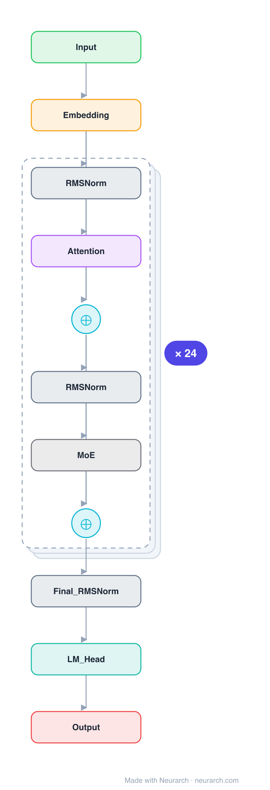

# Architecture: gpt-oss-20b

## Motivation

The 20B mixture-of-experts OpenAI released under Apache 2.0 in 2025. Small sliding windows, tiny heads, aggressive MoE sparsity: an inference-economics architecture through and through.

## Core Idea

The 20B mixture-of-experts OpenAI released under Apache 2.

## Architecture

### Overview

*Identical repeated blocks are folded into one representative block with a `× N` badge, so the whole architecture fits on screen. `model.json` uses a NAXS block template + `repeat` directive: the identical repeated layers are defined once and expand to all 149 nodes (open it in Neurarch to see and edit every layer). Vector: [diagram.svg](assets/diagram.svg).*

| Hyperparameter | Value |
|---|---|
| Type | Decoder-only transformer, sparse MoE (causal LM) |
| Parameters | 21B total, 3.6B active |
| Layers | 24 |
| Hidden size | 2880 |
| Attention | Grouped-query: 64 query heads, 8 KV heads |
| Head dim | 64 |
| FFN | MoE: 32 routed experts, top-4, expert dim 2,880 |
| Normalization | RMSNorm, pre-norm |
| Positions | RoPE + YaRN; layers alternate sliding-window (128) and full attention 1:1 |
| Vocabulary | 201,088 |
| Max context | 131,072 |

`model.json` is the full 24-layer graph (the repeated layers expressed via a NAXS block template + `repeat`), produced with the same import path the Neurarch app uses for "load from Hugging Face", with all hyperparameters from the official `config.json`.

### Design Notes

- OpenAI's first open-weight release since GPT-2: a 24-layer MoE with 32 experts, top-4 routed, no shared expert, 3.6B active of 21B total.
- Alternating attention: odd layers use a 128-token sliding window, even layers full attention (verified from config layer_types, 12 of each), plus learned attention-sink logits per head.
- Attention bias on, 64 small heads of dim 64 over a 2880 hidden size, and a 201088-token o200k_harmony vocabulary.
- Ships MXFP4-quantized so the 20B fits in 16GB; trained with the harmony response format for tool use and CoT.

### Parameter Check

Neurarch's per-layer parameter estimate over this graph: **20.91B**.
Hugging Face safetensors metadata reports **21.51B** for the real weights.
Deviation from the authoritative count (21.51B): **-2.8%**.

## Design Decisions

> **Analysis** — Observations derived from studying the architecture.

- OpenAI's first open-weight release since GPT-2: a 24-layer MoE with 32 experts, top-4 routed, no shared expert, 3.6B active of 21B total.
- Alternating attention: odd layers use a 128-token sliding window, even layers full attention (verified from config layer_types, 12 of each), plus learned attention-sink logits per head.
- Attention bias on, 64 small heads of dim 64 over a 2880 hidden size, and a 201088-token o200k_harmony vocabulary.
- Ships MXFP4-quantized so the 20B fits in 16GB; trained with the harmony response format for tool use and CoT.

## Implementation Notes

- `model.json` contains the full structural graph with real dimensions and parameters, using a NAXS block template + `repeat` for the identical repeated layers.
- Open in [Neurarch](https://www.neurarch.com/) to visualize, edit, or export training code.
- Diagrams fold repeated identical blocks with a `× N` badge; `model.json` defines each repeated layer once at real dimensions and expands to all nodes.

## Limitations

- This package focuses on the architectural structure. Training pipelines, 
dataset preparation, and production optimizations are out of scope.

## Evolution

> See `references/related/` for predecessor and successor architectures.

