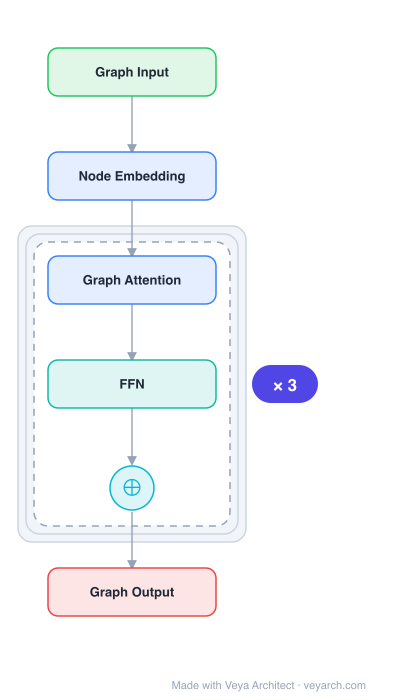

# Architecture: Graph Transformer

## Motivation

The Transformer architecture (Vaswani et al., 2017) achieved tremendous success in NLP by treating a sentence as a fully connected graph of words, where each word attends to every other word. However, this design assumes that no meaningful sparse interactions exist among words in a sentence and that the graph sizes are small (tens to hundreds of nodes). When applied to actual graph-structured datasets—which have arbitrary connectivity, node counts ranging to millions, and rich structural information—the fully connected attention model becomes computationally infeasible and discards the valuable inductive bias of graph topology.

Prior attempts at graph transformers either attended to all graph nodes globally (Li et al., 2019), sacrificing sparsity, or operated on specialized cases such as heterogeneous graphs (GTN, HGT), temporal networks, or linkless subgraphs (Graph-BERT). None provided a generic, simple, and competitive transformer for arbitrary homogeneous graphs. Additionally, most GNNs at the time (GCN, GAT) learned structural features that were invariant to node position—meaning nodes with identical local neighborhoods received identical representations regardless of their location in the graph. This positional ambiguity limited the expressiveness of attention-based GNNs like GAT.

The Graph Transformer fills this gap by combining two key inductive biases: **sparsity** (attention over local neighborhoods, not the full graph) and **positional encoding** (Laplacian eigenvectors that generalize the sinusoidal PEs from NLP to graphs). The result is a generic architecture that closes the gap between the original NLP transformer and graph neural networks, serving as a black-box model for future applications at the intersection of attention and graphs.

## Core Idea

Generalization of transformer attention to graph-structured data with Laplacian positional encoding.

## Architecture

### Overview

<b>Layer-by-layer (6 nodes)</b>

| # | Layer | Type | Params |
|---|---|---|---|
| 1 | Graph Input | `input` |  |
| 2 | Node Embedding | `embed` |  |
| 3 | Graph Attention | `attention` |  |
| 4 | FFN | `ffn` |  |
| 5 | ⊕ | `residual` |  |
| 6 | Graph Output | `output` |  |

The Graph Transformer closely follows the original Transformer architecture (Vaswani et al., 2017) but adapts it for arbitrary graph-structured data through four key modifications. First, the attention mechanism operates over each node's local neighborhood (sparse connectivity) rather than the full graph. Second, positional encoding is provided by Laplacian eigenvectors, which generalize the sinusoidal positional encodings used in NLP to graph-structured data by encoding distance-aware information (nearby nodes have similar positional features, distant nodes have dissimilar features). Third, layer normalization is replaced by batch normalization, which the authors found provides faster training and better generalization. Fourth, the architecture is extended to support edge features, which are critical for tasks like molecular chemistry (bond types) or knowledge graph link prediction (entity relationships).

The architecture consists of stacked Graph Transformer Layers, each containing multi-head attention, residual connections, normalization, and a feed-forward network (FFN). An extended variant maintains a separate edge feature pipeline that propagates edge representations layer by layer. Input node features are linearly projected to a hidden dimension, Laplacian positional encodings are added at the input layer only, and the final layer's node representations are passed to a task-specific MLP for downstream prediction.

### Components

- **Input Embedding Layer:** Linear projections map raw node features (α_i ∈ R^{d_n}) and edge features (β_{ij} ∈ R^{d_e}) to d-dimensional hidden representations h_i and e_{ij}. Laplacian positional encodings λ_i (the k smallest non-trivial eigenvectors of the graph Laplacian) are linearly projected and added to node features at the input layer only (not at intermediate layers).

- **Graph Transformer Layer (node-only):** Each layer performs multi-head attention over local neighborhoods. For each node i, attention scores are computed as ŵ_{ij} = (Q^k h_i · K^k h_j) / √d_k for neighbors j ∈ N_i, followed by softmax normalization. The attention output is passed through a feed-forward network (two linear layers with ReLU, expanding to 2d then compressing back to d), with residual connections and normalization (BatchNorm or LayerNorm) before and after the FFN.

- **Graph Transformer Layer with Edge Features:** An extended variant injects available edge information into the attention computation by multiplying the implicit attention score ŵ_{ij} with a projected edge embedding E^k e_{ij}. This ties the available edge features to the pairwise attention scores. The edge representations are maintained through a designated node-symmetric edge feature pipeline with its own FFN, residual connections, and normalization, propagating edge attributes from layer to layer.

- **Task-Specific MLP:** The node representations from the final Graph Transformer Layer are passed to a task-dependent MLP network for computing outputs (e.g., node classification, graph regression), which are then fed to a loss function.

- **Laplacian Positional Encoding (LapPE):** Pre-computed from the graph Laplacian matrix Δ = I − D^{−1/2} A D^{−1/2} = U^T ΛU. The k smallest non-trivial eigenvectors are used per node. Sign ambiguity is handled by randomly flipping eigenvector signs during training (following Dwivedi et al., 2020).

### Data Flow

1. **Pre-processing:** Compute the graph Laplacian eigenvectors for all graphs in the dataset offline. Extract the k smallest non-trivial eigenvectors per node as positional encodings.
2. **Input embedding:** Project raw node features α_i and edge features β_{ij} through linear layers to hidden dimension d. Project Laplacian PE λ_i through a linear layer and add to node features: h_i = ĥ_i + λ_i.
3. **Layer-wise propagation (×L layers):** For each layer ℓ, compute multi-head attention over local neighborhoods N_i: attention scores → softmax → weighted aggregation of value projections. Apply residual connection and normalization. Then apply FFN (expand to 2d, ReLU, compress to d), followed by another residual connection and normalization. For the edge-augmented variant, also update edge representations e_{ij} through their own FFN pipeline.
4. **Task output:** Pass final-layer node representations h_i^{(L)} to a task-specific MLP to produce predictions (node-level or graph-level).

### State / Memory

Stateless. The architecture is a feed-forward network with no recurrent or memory mechanisms. The only "state" is the pre-computed Laplacian eigenvectors, which are fixed positional encodings computed offline and added at the input layer. During inference, each graph is processed independently through the stacked layers without any cross-graph or temporal state.

## Design Decisions

- **Sparse (local) attention over full-graph attention:** The authors argue that graph datasets have meaningful sparse connectivity that serves as a rich inductive bias, and node counts can reach millions, making full-graph attention computationally infeasible. A node attends only to its local neighborhood, same as in GNNs. Experiments confirmed that sparse graph connectivity is a critical inductive bias—sparse models significantly outperformed full-graph variants.

- **Laplacian eigenvectors as positional encoding:** Most GNNs learn structural features invariant to node position, which limits expressiveness (e.g., GAT underperforms because it lacks positional information). Laplacian PEs generalize the sinusoidal PEs from NLP transformers to graphs: they encode distance-aware information where nearby nodes have similar positional features and distant nodes have dissimilar ones. The authors demonstrate LapPE outperforms Graph-BERT's combination of positional encoding schemes across all three benchmarks.

- **BatchNorm over LayerNorm:** The authors empirically found that replacing layer normalization with batch normalization provides faster training and better generalization across all three benchmark datasets (ZINC, PATTERN, CLUSTER). This is a departure from the standard Transformer which uses LayerNorm.

- **Edge feature injection via attention score multiplication:** Rather than concatenating or adding edge features, the architecture multiplies the implicit attention score ŵ_{ij} (from Q·K) with a projected edge embedding. This design directly ties edge information to the pairwise attention computation, which the authors note is not explored in NLP transformers (where no feature information exists between words) but is natural for graph datasets like molecular graphs.

- **LapPE added only at input layer:** Positional encodings are added to node features only at the input layer, not at intermediate Graph Transformer layers. This keeps the architecture simple and avoids redundant positional injection.

## Evolution

- **Predecessors:** The original Transformer (Vaswani et al., 2017) for NLP, which operates on fully connected graphs of words. GNNs including GCN (Kipf & Welling, 2017), GAT (Veličković et al., 2018), GatedGCN (Bresson & Laurent, 2017), and message-passing networks (Gilmer et al., 2017) established the foundation for graph-structured learning. Laplacian eigenmaps (Belkin & Niyogi, 2003) and the positional feature work of Dwivedi et al. (2020) provided the Laplacian PE basis.

- **Contemporaries:** Graph-BERT (Zhang et al., 2020) used subgraph batching and multiple PE schemes; GTN (Yun et al., 2019) for heterogeneous graphs; HGT (Hu et al., 2020) for heterogeneous information networks with temporal encoding; Nguyen et al. (2019) used coordinate embeddings for homogeneous graphs.

- **Successors:** The Graph Transformer became a foundational baseline for subsequent graph transformer research. Graphormer (Ying et al., 2021) used edge features as attention biases. EGT (Hussain et al., 2021) adopted dual-FFN for edge features. GPTrans (Chen et al., 2023) proposed graph propagation attention. SAN (Kreuzer et al., 2021) used spectral attention. GPS (Rampášek et al., 2022) generalized the framework.

## Characteristics

| Property | Value |
|----------|-------|
| Year | 2020 |
| Authors | Dwivedi & Bresson |
| Category | GNN/Architecture |
| Source Paper | `A_Generalization_of_Transformer_Networks_to_Graphs_Dwivedi_Bresson_2020.md` |
| PaperVault Path | `GNN/03-gnn-architectures/A_Generalization_of_Transformer_Networks_to_Graphs_Dwivedi_Bresson_2020.md` |

## Limitations

- **Laplacian eigenvector computation cost:** Pre-computing Laplacian eigenvectors for all graphs in a dataset can be expensive, especially for large graphs. The eigendecomposition of the graph Laplacian is O(n³) in the worst case, though approximate methods can reduce this.

- **Sign ambiguity of eigenvectors:** Laplacian eigenvectors have sign ambiguity (multiplicity due to arbitrary sign), which is handled by randomly flipping signs during training. This adds stochasticity and may require careful training procedures.

- **Fixed positional encoding:** LapPE is added only at the input layer and is not updated during training, meaning the positional information is static. The architecture does not learn or adapt positional representations.

- **Limited to homogeneous graphs:** The architecture is designed for arbitrary homogeneous graphs. Handling heterogeneous graphs with multiple node/edge types requires extensions (as in HGT or GTN).

- **Performance gap on ZINC:** While the architecture surpasses GCN and GAT baselines, it does not fully close the gap with the best-performing GNN (GatedGCN) on the ZINC molecular regression task, though the edge-augmented variant comes close.

- **Scalability:** Although sparse attention is more feasible than full-graph attention, the architecture was evaluated on relatively small benchmark graphs (ZINC 12K subset, PATTERN 14K graphs, CLUSTER 12K graphs). Scalability to very large graphs with millions of nodes is not demonstrated.

## Implementation Notes

See `implementation/` for a minimal runnable implementation.

## Information Layers

- **Evidence:** Source paper available in `references/papers/`
- **Analysis:** The Graph Transformer's key insight is that the two most important inductive biases for graph learning—sparsity (local neighborhood attention) and positional encoding (Laplacian eigenvectors)—can be directly ported from the NLP Transformer with minimal architectural changes. The BatchNorm substitution for LayerNorm is an empirical finding that contradicts standard Transformer practice but consistently helps across three diverse benchmarks. The edge-feature injection via attention score multiplication is a simple yet effective design that has no NLP analogue.
- **Hypothesis:** The LapPE's effectiveness may stem from its ability to encode multi-scale distance information (eigenvectors capture global graph structure at different frequencies). An open question is whether learnable positional encodings could outperform fixed LapPE, and whether the architecture would scale to very large graphs where eigendecomposition becomes prohibitive.
