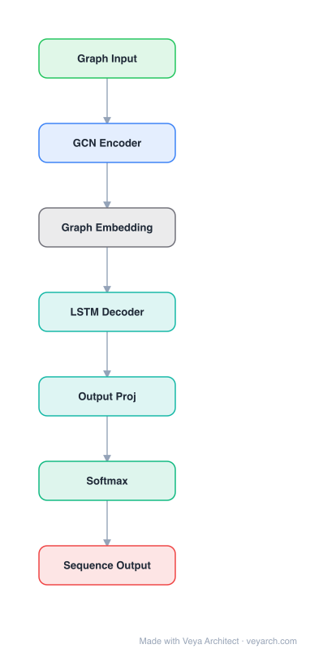

# Architecture: Graph2Seq

## Motivation

Abstract Meaning Representation (AMR) is a semantic formalism that encodes the meaning of a sentence as a rooted, directed graph, abstracting away from syntactic idiosyncrasies—sentences with the same basic meaning receive the same AMR graph. The task of AMR-to-text generation requires producing a natural language sentence that captures the meaning of a given AMR graph. This is a graph-to-sequence learning problem: given a graph, generate a sequence that captures the meaning of the graph.

Prior approaches to AMR-to-text generation serialized the input graph into a linear sequence (e.g., via depth-first search) and treated it as a standard sequence-to-sequence problem using a Bi-LSTM encoder with attention-based LSTM decoder (Konstas et al., 2017). However, serialization of graphs makes the representation challenging and hard for large graphs—it loses structural information, imposes an arbitrary linear ordering, and does not naturally capture the relational structure of the graph.

The Graph2Seq model addresses this gap by directly encoding the graph structure using a graph neural network (message-passing framework) rather than serializing it. This preserves the graph topology and allows nodes to aggregate information from their neighbors through iterative message passing, leading to richer structural representations. The model also incorporates a copy mechanism to handle the large proportion of dates, numbers, and named entities in the AMR corpus, which are difficult to generate from a fixed vocabulary.

## Core Idea

Graph-to-sequence model with attention-based encoder-decoder for structured input to sequence output.

## Architecture

### Overview

<b>Layer-by-layer (7 nodes)</b>

| # | Layer | Type | Params |
|---|---|---|---|
| 1 | Graph Input | `input` |  |
| 2 | GCN Encoder | `gcn_conv` |  |
| 3 | Graph Embedding | `custom` |  |
| 4 | LSTM Decoder | `lstm` |  |
| 5 | Output Proj | `linear` |  |
| 6 | Softmax | `softmax` |  |
| 7 | Sequence Output | `output` |  |

The Graph2Seq model is an encoder-decoder architecture for graph-to-sequence generation. The encoder is a Graph Neural Network based on the message-passing paradigm (Gilmer et al., 2017), which iteratively updates node representations by aggregating messages from neighboring nodes. The decoder is an attention-based LSTM that generates the output sequence token by token, conditioned on attention over the graph node states and the previously generated token. The model is trained end-to-end with cross-entropy loss over gold-standard output sequences.

The architecture replaces the traditional Bi-LSTM encoder (used in prior Seq2Seq AMR models) with a graph-structured encoder that directly operates on the AMR graph topology. This allows the model to capture both local and global structural information through multiple rounds of message passing. A copy mechanism (Gulcehre et al., 2016; Gu et al., 2016) is integrated into the decoder to copy rare words, numbers, and named entities directly from the input graph, addressing data sparsity and vocabulary coverage issues.

### Components

- **Graph Encoder (Message Passing Network):** Based on the Neural Message Passing framework (Gilmer et al., 2017). Given a graph G = (V, E), the encoder computes:
  - **Message function:** Calculates a message vector for each node pair (i, j), combining the hidden states of the source and target nodes and the edge features between them.
  - **Update function:** Updates each node's state by aggregating all incoming messages from its neighbors. An LSTM is used for gating the message passing updates, which reduces the probability of information diffusion and helps with long-range dependencies.
  - The two steps (message + update) are repeated for k iterations, allowing information to propagate across the graph. More iterations help when the distance between nodes is larger.

- **Attention-Based LSTM Decoder:** Generates the output sequence autoregressively. The initial decoder state is the average of the last states of all graph nodes. At each timestep, the decoder is conditioned on attention over the graph node states and the previously generated token. The decoder uses concatenation of the attention vector, embedding of the previously generated word, and a coverage vector.

- **Copy Mechanism:** Integrated into the decoder to handle dates, numbers, and named entities that account for a large portion of the AMR corpus. Rather than anonymizing these entities with placeholders (as some prior works do), the copy mechanism allows the decoder to copy tokens directly from the input graph nodes, which is very effective for generating accurate sequences.

- **Character LSTM (optional):** Alleviates data sparsity by sharing common substrings, enabling the model to handle out-of-vocabulary words through character-level composition.

### Data Flow

1. **Input:** An AMR graph G = (V, E) where nodes represent concepts/variables and edges represent relations (e.g., :arg0, :name, :op1).
2. **Graph encoding:** Initialize node hidden states. For k iterations: (a) compute message vectors for each node pair using the message function (MLP on concatenated node states and edge features); (b) update each node's state using the update function (LSTM gate) by aggregating incoming messages from neighbors.
3. **Decoding initialization:** Set the initial decoder state as the average of the final node states from the graph encoder.
4. **Autoregressive generation:** At each timestep t, compute attention over all graph node states, concatenate with the previous token embedding and coverage vector, feed to the LSTM decoder to produce the next token distribution. The copy mechanism allows copying tokens from the input graph.
5. **Training:** Cross-entropy loss over each gold-standard output sequence, with optional pre-training on augmented Gigaword data (parsed with JAMR) and fine-tuning on the AMR corpus.

### State / Memory

The architecture has stateful components:
- **Node hidden states:** Each node maintains a hidden state vector that is iteratively updated through message passing. An LSTM gate controls the update, providing memory of previous states and reducing information diffusion.
- **Decoder LSTM state:** The decoder maintains a recurrent hidden state across timesteps, conditioned on attention over graph states and previous tokens.
- **Coverage vector:** Tracks which graph nodes have been attended to, helping prevent repetition.

## Design Decisions

- **Graph encoder over linearized sequence:** The key design choice is to encode the AMR graph directly using message passing rather than serializing it to a sequence. This preserves the graph's structural information and avoids the arbitrary ordering imposed by linearization (e.g., depth-first search), which is particularly problematic for large graphs.

- **LSTM for node state updates:** Using an LSTM (rather than a simple MLP) for the update function provides gating that controls information flow during message passing. This reduces the probability of information diffusion—where node representations become overly smoothed after multiple propagation steps—and helps preserve distinct node identities.

- **Copy mechanism over anonymization:** Prior works replaced dates and named entities with predefined placeholders (anonymization). The copy mechanism is a more elegant solution that allows the decoder to directly copy input tokens, which the authors found to be very effective for generating accurate sequences, especially for the large proportion of dates, numbers, and named entities in the AMR corpus.

- **Character LSTM for data sparsity:** A character-level LSTM helps share common substrings across words, alleviating data sparsity and enabling the model to handle out-of-vocabulary words.

- **Pre-training on augmented data:** The model is pre-trained on Gigaword data (sentences parsed into AMR graphs using the JAMR parser) and then fine-tuned on the standard AMR corpus (LDC2015E86), leveraging additional data to improve generalization.

## Evolution

- **Predecessors:** The Seq2Seq model of Konstas et al. (2017), which used a Bi-LSTM encoder over linearized AMR graphs with an attention-based LSTM decoder and anonymization for entities. The Neural Message Passing framework (Gilmer et al., 2017) for quantum chemistry provided the graph encoder foundation. Copy mechanisms from Gulcehre et al. (2016) and Gu et al. (2016) for sequence-to-sequence learning.

- **Contemporaries:** Graph-to-sequence models were an active area, with various encoder-decoder architectures for structured input to text generation (e.g., Cai & Lam, 2020, who used explicit relation encoding in an encoder-decoder transformer for graph-to-sequence learning).

- **Successors:** The graph-to-sequence paradigm was extended by transformer-based approaches. Graph Transformer (Dwivedi & Bresson, 2020) generalized attention to graphs. Graphormer (Ying et al., 2021) achieved state-of-the-art on graph-level tasks. The AMR-to-text generation task itself continued to evolve with pre-trained language models.

## Characteristics

| Property | Value |
|----------|-------|
| Year | 2018 |
| Authors | Unknown |
| Category | GNN/Architecture |
| Source Paper | `A_Graph_to_Sequence_Model_for_AMR_to_Text_Generation_Graph_t_Unknown_2018.md` |
| PaperVault Path | `GNN/03-gnn-architectures/A_Graph_to_Sequence_Model_for_AMR_to_Text_Generation_Graph_t_Unknown_2018.md` |

## Limitations

- **Message passing iteration sensitivity:** The model's performance depends on the number of message passing iterations k. More iterations help when the distance between nodes is large, but finding the optimal k requires experimentation and may vary by graph size and structure.

- **Information diffusion risk:** Despite the LSTM gating mechanism, excessive message passing iterations can still lead to information diffusion where node representations become overly similar, losing distinctiveness.

- **Data augmentation dependency:** The model relies on pre-training on augmented Gigaword data (parsed with JAMR) to achieve good performance. The quality of the JAMR parser directly affects the quality of the augmented training data.

- **AMR-specific design:** The architecture is designed and evaluated specifically for AMR-to-text generation. Generalization to other graph-to-sequence tasks (e.g., code generation, knowledge graph-to-text) is not demonstrated in the source material.

- **Limited vocabulary handling:** While the copy mechanism addresses the entity/number problem, the model still relies on a fixed vocabulary for non-copyable tokens, which may limit performance on truly novel concepts.

- **Computational cost:** The message passing framework requires k full passes over all edges, which can be expensive for very large or dense graphs.

## Implementation Notes

See `implementation/` for a minimal runnable implementation.

## Information Layers

- **Evidence:** Source paper available in `references/papers/`
- **Analysis:** The Graph2Seq model's core contribution is replacing graph serialization with direct graph encoding via message passing, preserving structural information that linearization discards. The LSTM-based update function is a thoughtful choice over simple MLPs—its gating mechanism controls information diffusion during multi-round propagation. The copy mechanism is highly effective for the AMR domain where named entities and numbers constitute a large portion of the corpus.
- **Hypothesis:** The finding that more message passing iterations help for distant nodes suggests the model captures multi-hop relational reasoning implicitly. An open question is whether attention-based aggregation (as in GAT) would outperform the sum-based aggregation used here, and whether transformer-based graph encoders could replace the message-passing encoder more effectively.
