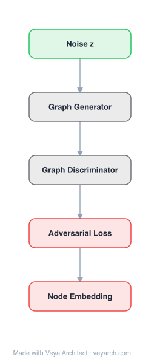

# Architecture: GraphGAN

## Motivation

Existing graph representation learning methods fall into two disjoint categories: generative models (DeepWalk, node2vec) that learn the underlying connectivity distribution by maximizing the likelihood of observed edges, and discriminative models (SDNE, PPNE) that directly predict edge existence by training a classifier on connected and disconnected vertex pairs. These two approaches capture complementary aspects of graph structure — generative models capture the distribution of connections, while discriminative models capture the decision boundary between edges and non-edges — yet no method unifies them. GraphGAN bridges this gap by introducing a generative adversarial framework where a generator tries to fit the true connectivity distribution and produce "fake" connected vertices, while a discriminator tries to distinguish real edges from generated ones. The adversarial training drives both models to improve iteratively, combining the strengths of both paradigms.

## Core Idea

Generative adversarial framework for graph representation learning: generator produces fake edges, discriminator distinguishes.

## Architecture

### Overview

<b>Layer-by-layer (5 nodes)</b>

| # | Layer | Type | Params |
|---|---|---|---|
| 1 | Noise z | `input` |  |
| 2 | Graph Generator | `custom` |  |
| 3 | Graph Discriminator | `custom` |  |
| 4 | Adversarial Loss | `loss` |  |
| 5 | Node Embedding | `output` |  |

GraphGAN adapts the GAN framework to graph representation learning. The generator G(v|v_c) models the true connectivity distribution p_true(v|v_c) for a given vertex v_c, producing vertices likely to be connected to v_c. The discriminator D(v, v_c) predicts the probability that an edge exists between v and v_c. The two models play a minimax game: the generator tries to fool the discriminator with realistic fake edges, while the discriminator tries to distinguish real from fake. A novel Graph Softmax replaces traditional softmax in the generator, making it structure-aware and computationally efficient. The two models are trained alternately, with each improving against the other.

### Components

1. **Generator G(v|v_c)** — Models the true connectivity distribution:
   - Input: a center vertex v_c
   - Output: probability distribution over all other vertices, representing likelihood of connection
   - Implementation: **Graph Softmax** — a novel alternative to standard softmax
   - The generator samples "fake" vertices v ~ G(·|v_c) to challenge the discriminator
   - Trained to maximize the probability of fooling the discriminator: max Σ G(v|v_c) log D(v, v_c)

2. **Graph Softmax** — Structure-aware probability distribution for the generator:
   - Defines connectivity probability based on graph structure rather than treating all vertices equally
   - Uses a spanning tree (BFS tree) rooted at v_c to define the probability decomposition
   - P_G(v|v_c) = Π_{node on path} p(node | parent), where the path is from v_c to v in the BFS tree
   - Each conditional probability p(v_i|parent(v_i)) = exp(α · d(v_c, v_i)) / Σ_{siblings} exp(α · d(v_c, sibling))
   - **Properties**: (1) Normalization — probabilities sum to 1; (2) Graph structure awareness — nearby vertices get higher probability; (3) Computational efficiency — only O(d) computation per step via random walk sampling

3. **Discriminator D(v, v_c)** — Binary classifier for edge existence:
   - Input: a vertex pair (v, v_c) and their embeddings
   - Output: probability that an edge exists between v and v_c
   - Implementation: D(v, v_c) = σ(d(v, v_c)) = σ(α · (d_v · d_{v_c} + b)) — sigmoid of inner product
   - Trained on positive samples (real edges) and negative samples (generator-produced fakes)
   - Objective: maximize log D(v, v_c) for real edges + log(1 - D(v, v_c)) for fake edges

4. **Adversarial Training Loop** — Alternating optimization:
   - **Step 1 (Train D)**: Fix G, sample real edges and fake edges from G, update D
   - **Step 2 (Train G)**: Fix D, sample from G, update G via policy gradient (REINFORCE)
   - Repeat until convergence (generator approximates true connectivity distribution)

5. **Online Generating Strategy** — Random-walk-based sampling for the generator:
   - Instead of computing G(v|v_c) for all v, sample via random walks on the BFS tree
   - Walk starts at v_c, moves to children with probability proportional to edge weights
   - The endpoint of the walk is a sample from G(·|v_c)
   - Reduces complexity from O(|V|) to O(d) per sample

### Data Flow

1. **Input**: Graph G = (V, E) with adjacency information
2. **Initialize**: Random embeddings for all vertices; initialize generator and discriminator parameters
3. **For each training iteration**:
   - **Discriminator step**: Sample real edges (v, v_c) from E; sample fake vertices from G(·|v_c) via random walk on BFS tree; update D to distinguish real from fake
   - **Generator step**: Sample vertices from G(·|v_c); compute policy gradient using D's feedback; update G to produce more realistic connections
4. **Convergence**: Generator's distribution approaches true connectivity distribution p_true
5. **Output**: Embeddings d_v for all vertices (from either G or D, typically D)

### State / Memory

- **Embedding matrices**: d_v for all vertices, |V| × d — shared or separate for G and D; persistent.
- **BFS trees**: One per center vertex v_c for graph softmax; computed on-the-fly or cached; O(|V| × avg_degree) per tree.
- **Generator parameters**: The graph softmax parameters (embedding vectors used in probability computation).
- **Discriminator parameters**: Embedding vectors and bias used in the sigmoid classifier.
- **Training state**: Current iteration, alternating between G and D updates; no recurrent memory.
- **Sampling buffer**: Real edges (positive samples) and generated vertices (negative samples) per batch; transient.

## Design Decisions

1. **Graph Softmax over standard softmax** — The key architectural innovation:
   - Standard softmax treats all vertices equally, ignoring graph structure and proximity
   - Standard softmax requires O(|V|) computation per evaluation — infeasible for large graphs
   - Graph softmax decomposes probability along the BFS tree, making it structure-aware and O(d) per sample
   - Provable properties: normalization, graph structure awareness, computational efficiency

2. **Policy gradient for generator training** — Using REINFORCE:
   - The generator's sampling process is non-differentiable (discrete vertex sampling)
   - Policy gradient provides unbiased gradient estimates through the sampling
   - The discriminator's output serves as the reward signal

3. **Alternating training** — GAN-style adversarial optimization:
   - Prevents the generator from collapsing to a trivial distribution
   - The discriminator provides increasingly challenging negative examples
   - Both models converge to better representations than either alone

4. **BFS tree for probability decomposition** — Using the graph's spanning tree:
   - Ensures the probability distribution respects graph proximity
   - Nearby vertices (short BFS paths) naturally get higher probability
   - The tree structure enables efficient sampling via random walks

5. **Shared embedding space** — G and D can share or use separate embeddings:
   - The paper uses separate embeddings for G and D, with D's embeddings as the final output
   - The discriminator learns to directly predict edge existence, making its embeddings more discriminative

## Evolution

**Predecessors:**
- **DeepWalk** (Perozzi et al., 2014) — Generative model via random walks + skip-gram; GraphGAN's generator generalizes this.
- **node2vec** (Grover & Leskovec, 2016) — Biased random walk generative model; GraphGAN unifies generative and discriminative.
- **SDNE** (Wang et al., 2016) — Discriminative model using autoencoders; GraphGAN's discriminator is a simpler discriminative model.
- **LINE** (Tang et al., 2015) — Implicitly combines 1st-order (generative) and 2nd-order (discriminative) proximity; GraphGAN makes the combination explicit and adversarial.
- **GAN** (Goodfellow et al., 2014) — Original generative adversarial networks; GraphGAN adapts the GAN framework to graph-structured data.

**Successors:**
- **NetGAN** (Bojchevski et al., 2018) — GAN-based graph generation via random walks.
- **ProGAN** / **GraphSGAN** — Extensions of adversarial graph representation learning.
- **GraphRNN** / **NetGAN** — Graph generation models inspired by the adversarial paradigm.

## Characteristics

| Property | Value |
|----------|-------|
| Year | 2018 |
| Authors | Wang, Wang, Wang, Zhao, Zhang, Zhang, Xie, Guo |
| Category | GNN/Embedding |
| Source Paper | `GraphGAN_Graph_Representation_Learning_with_Generative_Adver_Wang_Wang_Wang_etal_2018.md` |
| PaperVault Path | `GNN/02-network-embedding/GraphGAN_Graph_Representation_Learning_with_Generative_Adver_Wang_Wang_Wang_etal_2018.md` |

## Limitations

1. **Training instability** — Like all GAN-based methods, GraphGAN suffers from training instability (mode collapse, oscillation); requires careful tuning of G/D training ratio.
2. **BFS tree computation** — Building a BFS tree per center vertex is O(|V| + |E|); for large graphs, this is expensive and may need caching or approximation.
3. **Policy gradient variance** — REINFORCE has high variance; variance reduction techniques (baseline, actor-critic) are not explored in the original paper.
4. **Scalability concerns** — The adversarial training loop doubles the computation compared to single-model methods; each iteration requires both G and D updates.
5. **No node attributes** — GraphGAN uses only graph structure; cannot incorporate node features.
6. **Static graphs** — No mechanism for dynamic or temporal graphs.
7. **Generator-discriminator embedding gap** — G and D learn separate embeddings; the relationship between them is not well understood.

## Implementation Notes

See `implementation/` for a minimal runnable implementation. Key details:
- Input: graph G = (V, E)
- Initialize embeddings for generator and discriminator (d = 100)
- Build BFS tree per center vertex for graph softmax
- Alternating training: k_d discriminator steps per generator step
- Generator: graph softmax with random-walk-based online sampling
- Discriminator: sigmoid of inner product of embeddings
- Generator trained via policy gradient (REINFORCE)
- Evaluated on 5 datasets (BlogCatalog, YouTube, Protein-Protein, DBLP, wiki)
- Outperforms DeepWalk, node2vec, LINE, SDNE by 0.59–11.13% on link prediction, 0.95–21.71% on node classification
- 38.56%+ improvement in Precision@20 and 52.33%+ in Recall@20 for recommendation

## Information Layers

- **Evidence:** Source paper available in `references/papers/` (Wang et al., 2018, "GraphGAN: Graph Representation Learning with Generative Adversarial Nets," AAAI 2018)
- **Analysis:** GraphGAN's central contribution is unifying generative and discriminative graph embedding through adversarial training. The generator captures the connectivity distribution (which vertices should be connected), while the discriminator captures the decision boundary (which pairs are actually edges). The adversarial dynamic forces both to improve: the generator must produce increasingly realistic fake edges, and the discriminator must become increasingly discriminative. The Graph Softmax is the key technical innovation — it makes the generator tractable for graphs by decomposing the probability along the BFS tree, ensuring structure awareness and O(d) sampling. Without it, standard softmax would be both structure-blind and computationally infeasible. The empirical gains are substantial, particularly in recommendation, suggesting that the adversarial framework captures structural patterns missed by single-objective methods.
- **Hypothesis:** The success of GraphGAN suggests that graph structure contains both distributional (generative) and discriminative information that are complementary and mutually reinforcing. The adversarial training dynamic may be particularly suited to graph data because graph structure is inherently about connectivity patterns — the generator models what should connect, and the discriminator models what does connect. The gap between these two (captured by the discriminator's accuracy) measures how much structural information remains to be learned. This principle may extend to attributed and dynamic graphs, where the generator could model attribute-conditional connectivity and the discriminator could verify temporal edge predictions.
