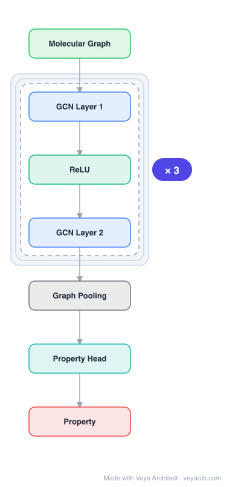

# Architecture: Graph Propagation Transformer

## Motivation

Graph representation learning has become a hot topic in pattern recognition and machine learning, with applications ranging from social network analysis to molecular property prediction. Existing methods fall into two categories: (1) Graph Neural Networks (GCN, GAT, GraphSage) that follow convolutional patterns with neighborhood aggregation, and (2) transformer-based models (Graphormer, EGT, GT) that use self-attention for graph learning. While transformer-based methods report promising performance, they suffer from two key problems.

First, recent transformer-based methods do not explicitly employ the relationship among nodes and edges in graph data. Methods like Graphormer only simply fuse node and edge information by using positional encodings or shared attention biases. Due to the complexity of graph structure, how to fully exploit the relationship among nodes and edges for graph representation learning remains understudied. Second, existing methods use an inefficient dual-FFN structure in the transformer block. For instance, the Edge-augmented Graph Transformer (EGT) adopts dual feed-forward networks to update edge embeddings, letting structural information evolve layer to layer. This paradigm learns edge and node information separately, introducing more calculations and leading to low model efficiency.

The Graph Propagation Transformer (GPTrans) addresses these issues with a novel Graph Propagation Attention (GPA) module that explicitly passes information among nodes and edges in three ways—node-to-node, node-to-edge, and edge-to-node—within a single attention mechanism. This design eliminates the need for a separate FFN module for edge embeddings, bringing higher efficiency than previous dual-FFN methods while achieving better performance.

## Core Idea

Transformer with graph propagation mechanism for graph representation learning.

## Architecture

### Overview

<b>Layer-by-layer (7 nodes)</b>

| # | Layer | Type | Params |
|---|---|---|---|
| 1 | Molecular Graph | `input` |  |
| 2 | GCN Layer 1 | `gcn_conv` |  |
| 3 | ReLU | `relu` |  |
| 4 | GCN Layer 2 | `gcn_conv` |  |
| 5 | Graph Pooling | `custom` |  |
| 6 | Property Head | `linear` |  |
| 7 | Property | `output` |  |

GPTrans takes a graph G = (V, E) as input and processes it through three parts: a graph embedding layer, L transformer blocks, and a prediction head. The graph embedding layer transforms the graph into node embeddings and edge embeddings, adding a virtual node to aggregate graph-level information. Each transformer block contains a Graph Propagation Attention (GPA) module and a single Feed-Forward Network (FFN)—notably, no separate FFN is needed for edge embeddings due to the GPA's design. The GPA explicitly constructs three information propagation paths: node-to-node (global self-attention), node-to-edge (attention map expansion), and edge-to-node (dynamic weight fusion). The prediction head uses two fully-connected layers for various graph tasks.

The key insight is that information propagation among nodes and edges must be fully considered when building the attention module. Unlike Graphormer which encodes edge attributes and spatial position as shared attention biases across all blocks, GPTrans optimizes edge embeddings in each transformer block via the GPA, allowing each block to adaptively learn different ways to exploit edge features and propagate information.

### Components

- **Graph Embedding Layer:** Transforms graph data into input embeddings for the transformer blocks.
  - **Node embeddings:** `x_node = x_node_attr + x_deg- + x_deg+` — combines node attributes, indegree, and outdegree statistics. Dimension: R^(1+n)×d1.
  - **Edge embeddings:** `x_edge = x_edge_attr + x_rel_pos` — combines edge attributes and relative positional encoding (shortest path distance by default). Dimension: R^(1+n)×(1+n)×d2.
  - **Virtual node:** A virtual node [v0] is added to aggregate graph-level features, following Graphormer's practice.

- **Graph Propagation Attention (GPA):** The core innovation, replacing vanilla self-attention with three propagation paths:
  - **Node-to-Node:** Standard global self-attention. Projects node embeddings to Q, K, V via parameter matrices WQ, WK, WV. Computes attention map A = QK^T/√d_head + ϕ, where ϕ are layer-specific attention biases projected from edge embeddings via W_reduce. Output: `x'_node = softmax(A)V`.
  - **Node-to-Edge:** Propagates node features to edges by expanding the attention map. Computes `x'_edge = (A + softmax(A))W_expand` — adds raw attention A with its softmax confidence and expands dimension to match edge embeddings. This performs explicit high-order spatial interactions without an additional FFN.
  - **Edge-to-Node:** Generates dynamic weights from edge embeddings and fuses them into node embeddings. Applies softmax to x'_edge, computes element-wise product with itself, sums along one dimension, and applies FC: `x''_node = FC(sum(x'_edge · softmax(x'_edge), dim=1))`. Final node update: `x'''_node = (x'_node + x''_node)W_O`.

- **Transformer Block:** Combines GPA with FFN and layer normalization:
  - `x̂^l_node, x^l_edge += GPA(LN(x^{l-1}_node), x^{l-1}_edge)` — pre-norm residual connection.
  - `x^l_node = FFN(LN(x̂^l_node)) + x̂^l_node` — FFN with expansion ratio α=1.

- **Prediction Head:** Two fully-connected layers. For graph-level tasks, applied on the virtual node's output embedding. For node-level tasks, on output node embeddings. For edge-level tasks, on output edge embeddings.

### Data Flow

1. **Input:** A graph G = (V, E) with nodes and edges, optionally with node/edge attributes.
2. **Graph embedding:** Add virtual node [v0]. Encode nodes into x_node (attributes + degree statistics) and edges into x_edge (attributes + shortest-path relative positional encoding).
3. **Transformer blocks (L layers):** For each block l:
   - (a) Apply layer normalization to node embeddings.
   - (b) **Node-to-Node:** Compute Q, K, V from node embeddings. Compute attention biases ϕ = x_edge · W_reduce. Form attention map A = QK^T/√d_head + ϕ. Compute x'_node = softmax(A)V.
   - (c) **Node-to-Edge:** Compute x'_edge = (A + softmax(A)) · W_expand, updating edge embeddings from node attention.
   - (d) **Edge-to-Node:** Compute x''_node = FC(sum(x'_edge · softmax(x'_edge), dim=1)), fusing edge information back to nodes.
   - (e) Combine: x'''_node = (x'_node + x''_node) · W_O.
   - (f) Apply FFN with residual: x^l_node = FFN(LN(x̂^l_node)) + x̂^l_node.
4. **Prediction head:** Apply two FC layers on the appropriate output (virtual node for graph-level, node embeddings for node-level, edge embeddings for edge-level).

### State / Memory

- **Layer-wise edge embedding evolution:** Unlike Graphormer which shares edge features as static attention biases across all blocks, GPTrans maintains and updates edge embeddings x_edge in every transformer block. Each block receives the updated edge embeddings from the previous block, allowing adaptive, layer-specific exploitation of edge features.
- **Virtual node as graph memory:** The virtual node [v0] collects and propagates graph-level features across all blocks, serving as a global memory of the entire graph.
- **No recurrent state:** The architecture is feed-forward (L stacked transformer blocks) with no recurrent connections. State is purely the layer-wise embeddings passed between blocks.

## Design Decisions

- **Three-way information propagation:** The GPA explicitly models node-to-node, node-to-edge, and edge-to-node propagation. Ablation studies show all three paths contribute, with node-to-node propagation providing the most significant improvement (thanks to layer-specific attention biases rather than shared ones). Collectively, GPA brings 8.0% relative MAE decline on PCQM4Mv2 compared to Graphormer.

- **Layer-specific attention biases over shared biases:** Unlike Graphormer which encodes edge attributes and spatial position as attention biases shared across all blocks, GPTrans projects edge embeddings to layer-specific biases ϕ = x_edge · W_reduce. This allows each block to adaptively learn different ways to exploit edge features.

- **Single FFN over dual-FFN:** GPTrans eliminates the separate FFN module for edge embeddings used in EGT and GT. The node-to-edge and edge-to-node paths within GPA handle edge updates, bringing higher efficiency with comparable or better performance. This reduces computational overhead.

- **Attention map for node-to-edge propagation:** The design uses A + softmax(A) (raw attention plus its confidence) expanded via W_expand. This captures both local and global connections for edge embedding updates, performing explicit high-order spatial interactions.

- **Self-product for edge-to-node propagation:** Using softmax(x'_edge) · softmax(x'_edge) (element-wise product of softmax with itself) provides a computationally efficient way to generate dynamic weights without additional attention operations.

- **Depth over width:** Ablation shows that deeper models outperform wider models with similar parameter counts. Increasing depth from 6 to 12 layers while decreasing width from 512 to 384 dimensions improved MAE from 0.0854 to 0.0835, leading to the preference for large model depth in architecture configurations.

- **FFN expansion ratio α=1:** Uses a smaller expansion ratio than typical transformers (usually α=4), reducing parameters while maintaining performance for graph data.

## Evolution

- **Predecessors:** Graph Convolutional Network (GCN, Kipf & Welling 2016) established the convolutional pattern for graph learning. Graph Attention Network (GAT, Veličković et al. 2017) and Graph Transformer (GT, Dwivedi & Bresson 2020) introduced self-attention for local neighborhoods. Graph-BERT (Zhang et al. 2020) introduced global self-attention on sampled subgraphs. Cai & Lam (2020) used explicit relation encoding for graph-to-sequence. Graphormer (Ying et al. 2021) achieved SOTA by transforming graph structure and edge features into attention biases. EGT (Hussain et al. 2021) used dual-FFN for edge embeddings. GPS (Rampášek et al. 2022) and GRPE (Park et al. 2022) are other transformer-based graph models.

- **Contemporaries:** TokenGT (Kim et al. 2022), SAN (Kreuzer et al. 2021) — other transformer-based graph methods benchmarked against. GPTrans outperforms all of these on PCQM4M, PCQM4Mv2, ZINC, PATTERN, CLUSTER, TSP, MolPCBA, and MolHIV benchmarks.

- **Successors:** GPTrans's GPA module design—particularly the elimination of dual-FFN through three-way propagation—provides an efficient template for future graph transformers. The code is released at `https://github.com/czczup/GPTrans`.

## Characteristics

| Property | Value |
|----------|-------|
| Year | 2023 |
| Authors | Unknown |
| Category | GNN/Architecture |
| Source Paper | `Graph_Propagation_Transformer_for_Graph_Representation_Learn_Unknown_2023.md` |
| PaperVault Path | `GNN/03-gnn-architectures/Graph_Propagation_Transformer_for_Graph_Representation_Learn_Unknown_2023.md` |

## Limitations

- **O(n²) attention complexity:** The global self-attention mechanism in the node-to-node path has O(n²) complexity with respect to the number of nodes, limiting applicability to very large graphs without sparse attention approximations.

- **Edge embedding tensor size:** The edge embeddings x_edge ∈ R^(1+n)×(1+n)×d2 require O(n²) memory, which can be prohibitive for dense or large graphs. While the shortest-path encoding helps, the full pairwise edge tensor is maintained.

- **Limited evaluation on very large graphs:** All benchmark datasets used (ZINC, PATTERN, CLUSTER, TSP, PCQM4M, MolHIV, MolPCBA) contain relatively small individual graphs (molecular graphs, synthetic SBM graphs). Scalability to graphs with thousands or millions of nodes is not demonstrated.

- **Pre-training dependency:** Best results on MolHIV and MolPCBA require pre-training on PCQM4Mv2. Without pre-training, performance on small molecular datasets may be limited.

- **FFN expansion ratio trade-off:** Using α=1 (vs. typical α=4) reduces parameters but may limit the model's capacity for complex transformations. The trade-off between efficiency and expressiveness is not fully explored.

- **No explicit graph sparsity exploitation:** Unlike GT (Dwivedi & Bresson 2020) which uses sparse local neighborhood attention, GPTrans uses full global self-attention. For graphs where local structure is the primary signal, this may be less efficient than sparse alternatives.

- **Depth sensitivity:** The finding that deeper models outperform wider ones suggests the model benefits from many layers, but very deep models may face optimization challenges (vanishing gradients, over-smoothing) not addressed in the paper.

## Implementation Notes

See `implementation/` for a minimal runnable implementation.

## Information Layers

- **Evidence:** Source paper available in `references/papers/`
- **Analysis:** GPTrans's key contribution is the GPA module's three-way propagation design that eliminates the need for dual-FFN while achieving better performance. The ablation studies clearly show each propagation path contributes, with node-to-node (layer-specific biases) providing the largest gain. The depth-over-width finding is consistent with transformer scaling laws in NLP/CV. The efficiency analysis shows GPTrans is faster than EGT in both training and inference at similar parameter counts, validating the single-FFN design.
- **Hypothesis:** The self-product mechanism in edge-to-node propagation (softmax(x'_edge) · softmax(x'_edge)) acts as a confidence sharpening—squaring softmax probabilities emphasizes strong connections. Whether more sophisticated edge-to-node fusion (e.g., learned gating) would help is an open question. The O(n²) complexity may be addressable through sparse attention or linear attention approximations without significant performance loss, given that graph data often has inherent sparsity.
