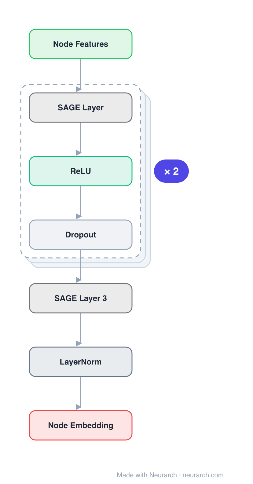

# Architecture: GraphSAGE

## Motivation

Low-dimensional vector embeddings of nodes in large graphs have proved extremely useful as feature inputs for prediction and graph analysis tasks such as node classification, clustering, and link prediction. The basic idea is to use dimensionality reduction to distill high-dimensional information about a node's graph neighborhood into a dense vector embedding. However, previous approaches focused on embedding nodes from a single fixed graph and were inherently **transductive**—they directly optimize embeddings for each node using matrix-factorization-based objectives and do not naturally generalize to unseen data.

Many real-world applications require embeddings to be quickly generated for unseen nodes or entirely new (sub)graphs. This inductive capability is essential for high-throughput production machine learning systems that operate on evolving graphs and constantly encounter unseen nodes (e.g., posts on Reddit, users and videos on YouTube). An inductive approach also facilitates generalization across graphs with the same form of features—for example, training an embedding generator on protein-protein interaction graphs from a model organism, then producing embeddings for data collected on new organisms.

The inductive node embedding problem is especially difficult compared to the transductive setting because generalizing to unseen nodes requires "aligning" newly observed subgraphs to the node embeddings the algorithm has already optimized on. An inductive framework must learn to recognize structural properties of a node's neighborhood that reveal both the node's local role in the graph and its global position. GraphSAGE (SAmple and aggreGatE) fills this gap by learning a function that generates embeddings by sampling and aggregating features from a node's local neighborhood, rather than training individual embeddings per node.

## Core Idea

Inductive representation learning via neighbor sampling and aggregation (mean/LSTM/pool) for unseen nodes.

## Architecture

### Overview

<b>Layer-by-layer (10 nodes)</b>

| # | Layer | Type | Params |
|---|---|---|---|
| 1 | Node Features | `input` | shape: [128] |
| 2 | SAGE Layer 1 | `graphSAGE` | inChannels: 128, outChannels: 256, aggregator: mean |
| 3 | ReLU | `relu` |  |
| 4 | Dropout | `dropout` | p: 0.2 |
| 5 | SAGE Layer 2 | `graphSAGE` | inChannels: 256, outChannels: 256, aggregator: mean |
| 6 | ReLU | `relu` |  |
| 7 | Dropout | `dropout` | p: 0.2 |
| 8 | SAGE Layer 3 | `graphSAGE` | inChannels: 256, outChannels: 128, aggregator: mean |
| 9 | LayerNorm | `layerNorm` | normalizedShape: [128] |
| 10 | Node Embedding | `output` |  |

GraphSAGE is a general inductive framework that leverages node feature information (e.g., text attributes, node degrees, molecular markers) to efficiently generate node embeddings for previously unseen data. Instead of training a distinct embedding vector for each node (as in matrix-factorization approaches), GraphSAGE trains a set of **aggregator functions** that learn to aggregate feature information from a node's local neighborhood. Each aggregator function aggregates information from a different number of hops, or search depth, away from a given node.

At inference time, the trained system generates embeddings for entirely unseen nodes by applying the learned aggregation functions—no re-training or additional gradient descent is needed. The algorithm is conceptually inspired by the Weisfeiler-Lehman (WL) isomorphism test: if one uses an appropriate hash function as the aggregator with identity weight matrices and no nonlinearity, GraphSAGE reduces to the WL test. GraphSAGE is a continuous approximation to this test, replacing the hash function with trainable neural network aggregators.

The framework supports both unsupervised training (via a graph-based loss function that encourages nearby nodes to have similar representations and disparate nodes to have distinct ones) and supervised training (via task-specific objectives such as cross-entropy). It was evaluated on three inductive node-classification benchmarks: evolving citation and Reddit post graphs, and a multi-graph protein-protein interaction dataset, outperforming strong transductive baselines by significant margins despite those baselines taking ~100× longer to run on unseen nodes.

### Components

- **Embedding generation algorithm (Algorithm 1)**: The forward propagation algorithm that generates embeddings assuming parameters are already learned. It iterates over `K` search depths; at each depth `k`, every node `v` aggregates representations of its immediate neighbors from the previous iteration `k-1`, concatenates the aggregated neighborhood vector with the node's own current representation, and applies a fully connected layer with nonlinear activation `σ` to produce the next-depth representation. The `k=0` ("base case") representations are the input node features. Final representations at depth `K` are L2-normalized.

- **Neighborhood sampler**: To keep the computational footprint of each batch fixed, GraphSAGE uniformly samples a fixed-size set of neighbors (rather than using the full neighborhood). Using overloaded notation, `N(v)` is defined as a fixed-size uniform draw from `{u ∈ V : (u,v) ∈ E}`, with different uniform samples drawn at each iteration `k`. Without this sampling, the memory and expected runtime of a single batch is unpredictable and worst-case `O(|V|)`. With sampling, per-batch space and time complexity is fixed at `O(∏_{i=1}^K S_i)` where `S_i` are user-specified sample sizes.

- **Mean aggregator**: Takes the elementwise mean of the vectors `{h_u^{k-1}, ∀u ∈ N(v)}`. Nearly equivalent to the transductive GCN propagation rule; the inductive "convolutional" variant replaces concatenation with `h_v^k ← σ(W · MEAN({h_v^{k-1}} ∪ {h_u^{k-1}, ∀u ∈ N(v)}))`. This variant does not perform the concatenation skip connection.

- **LSTM aggregator**: Uses an LSTM architecture applied to a random permutation of the node's neighbors. Has larger expressive capability than the mean aggregator, but LSTMs are not inherently permutation-invariant (they process inputs sequentially). The authors adapt LSTMs to unordered sets by applying them to random permutations of neighbors.

- **Pooling aggregator**: Each neighbor's vector is independently fed through a fully-connected neural network (`W_pool h_u + b`), then elementwise max-pooling aggregates across the neighbor set: `AGGREGATE_k^{pool} = max({σ(W_pool h_{u_i} + b), ∀u_i ∈ N(v)})`. Symmetric and trainable; inspired by PointNet (Qi et al., 2017) for learning over point sets. The MLP computes features for each neighbor and max-pooling captures different aspects of the neighborhood.

- **Graph-based unsupervised loss**: `J_G(z_u) = -log σ(z_uᵀ z_v) - Q · E_{v_n ~ P_n(v)} log σ(-z_uᵀ z_{v_n})`, where `v` is a node co-occurring near `u` on fixed-length random walk, `σ` is sigmoid, `P_n` is a negative sampling distribution, and `Q` defines the number of negative samples. Unlike previous approaches, the representations fed into this loss are generated from neighborhood features, not from per-node embedding lookups.

### Data Flow

1. **Input**: Graph `G = (V, E)`, input node features `{x_v, ∀v ∈ V}`, depth `K`, learned weight matrices `{W_k, ∀k ∈ {1,...,K}}`, learned aggregator functions `{AGGREGATE_k, ∀k ∈ {1,...,K}}`, neighborhood function `N(v)` (fixed-size uniform sample).
2. **Initialization (base case)**: Set `h_v^0 ← x_v` for all `v ∈ V` (the `k=0` representations are the raw input features).
3. **For each depth `k = 1...K`** (outer loop over search depth):
   - **For each node `v ∈ V`** (or, in minibatch mode, only the nodes necessary to satisfy the recursion):
     - **Sample neighbors**: Draw a fixed-size uniform sample `N(v)` from `{u ∈ V : (u,v) ∈ E}`.
     - **Aggregate**: `h_{N(v)}^k ← AGGREGATE_k({h_u^{k-1}, ∀u ∈ N(v)})` — aggregate the previous-depth representations of sampled neighbors into a single vector, using the learned aggregator (mean, LSTM, or pooling).
     - **Concatenate and transform**: `h_v^k ← σ(W^k · CONCAT(h_v^{k-1}, h_{N(v)}^k))` — concatenate the node's own previous representation with the aggregated neighborhood vector, then apply a fully connected layer with nonlinearity `σ`.
   - **Normalize**: `h_v^k ← h_v^k / ||h_v^k||_2` for all `v` (L2 normalization at each depth).
4. **Output**: `z_v ← h_v^K, ∀v ∈ V` — the final representation at depth `K` is the node embedding.
5. **Training (parameter learning)**: Feed `z_u` into either the unsupervised graph-based loss (Eq. 1) or a supervised task-specific objective; tune `W_k` and aggregator parameters via stochastic gradient descent and backpropagation.
6. **Inference on unseen nodes/graphs**: Apply the learned aggregators and weight matrices to new nodes—no re-training required.

### State / Memory

Stateless at inference. GraphSAGE's forward propagation (Algorithm 1) is a deterministic feed-forward computation: each depth `k` produces representations from the previous depth `k-1`'s representations and learned parameters, with no recurrent state, memory cells, or iterative equilibrium propagation. The only state carried between iterations is the intermediate node representations `{h_v^k}` at each search depth, which are recomputed fresh on each forward pass. The LSTM aggregator variant contains internal LSTM cell state, but only transiently during a single aggregation step—not persisted across nodes or time steps. At inference, embeddings for unseen nodes are generated in a single forward pass through the `K` layers.

## Design Decisions

- **Learn aggregation functions instead of per-node embeddings**: The central design choice. Rather than training a distinct embedding vector for each node (as in DeepWalk, node2vec, GraRep, LINE, SDNE), GraphSAGE trains aggregator functions that generate embeddings from node features. This is what enables inductive generalization to unseen nodes—no embedding lookup is needed, and the learned function applies to any node with features.

- **Leverage node feature information**: By incorporating node features (text attributes, node degrees, molecular markers), GraphSAGE simultaneously learns the topological structure of each node's neighborhood and the distribution of node features. For feature-less graphs, structural features like node degrees can be used, so the algorithm still applies.

- **Fixed-size uniform neighborhood sampling**: Without sampling, the memory and expected runtime of a single batch is unpredictable and worst-case `O(|V|)`. Uniform sampling keeps per-batch space and time complexity fixed at `O(∏ S_i)`. The authors found high performance with `K=2` and `S_1 · S_2 ≤ 500`.

- **Concatenation of self with aggregated neighborhood (skip connection)**: The node's own previous-layer representation is concatenated with the aggregated neighborhood vector before the linear transformation. This acts as a simple form of skip connection between search depths/layers, leading to significant performance gains. The "convolutional" (mean) aggregator variant omits this concatenation and underperforms.

- **Multiple symmetric aggregator architectures**: Because a node's neighbors have no natural ordering, aggregator functions must be symmetric (permutation-invariant) while remaining trainable and expressive. The three candidates—mean, LSTM (applied to random permutations), and pooling (max over MLP-transformed neighbors)—offer different expressivity/cost tradeoffs. The pooling aggregator was found to provide the best performance, and theoretical analysis shows it can approximate clustering coefficients to arbitrary precision (Theorem 1).

- **Unsupervised graph-based loss with negative sampling**: The loss `J_G(z_u) = -log σ(z_uᵀ z_v) - Q · E[...]` encourages nearby nodes (co-occurring on random walks) to have similar representations while enforcing distinct representations for disparate nodes. This allows training without task-specific supervision, emulating the scenario where node features are provided to downstream applications as a service.

## Evolution

**Predecessors:**
- **Factorization-based embedding approaches** — DeepWalk (Perozzi et al., 2014), node2vec (Grover & Leskovec, 2016), GraRep (Cao et al., 2015), LINE (Tang et al., 2015), SDNE (Wang et al., 2016). These learn low-dimensional embeddings using random walk statistics and matrix factorization, but directly train per-node embeddings and are inherently transductive. They require expensive additional gradient descent to make predictions on new nodes, and their objective functions are invariant to orthogonal transformations (embedding spaces don't naturally generalize between graphs and can drift during re-training).
- **Planetoid-I** (Yang et al., 2016) — a notable inductive exception, but it does not use graph structural information during inference; it uses graph structure only as regularization during training.
- **Graph convolutional networks (GCN)** (Kipf & Welling, 2017) — designed for semi-supervised learning in a transductive setting; requires the full graph Laplacian during training. A simple variant of GraphSAGE (the "convolutional" mean aggregator) extends GCN to the inductive setting.
- **Spectral graph convolutions** — Bruna et al. (2014), Henaff et al. (2015), Defferrard et al. (2016). These learn whole-graph feature representations but don't scale to large graphs or focus on individual node representations.
- **Weisfeiler-Lehman isomorphism test** — GraphSAGE is conceptually inspired by this classic algorithm; with identity weights, a hash aggregator, and no nonlinearity, Algorithm 1 reduces to the WL test (naive vertex refinement).
- **PointNet** (Qi et al., 2017) — inspired the pooling aggregator's design for learning over unordered point sets.

**Successors:**
- The paper notes extending GraphSAGE to directed and multi-modal graphs, and exploring non-uniform (even learned) neighborhood sampling functions as future work. Subsequent architectures (e.g., FastGCN, GAT) built on the inductive sampling idea with different sampling strategies.

## Characteristics

| Property | Value |
|----------|-------|
| Year | 2017 |
| Authors | Hamilton et al. |
| Category | GNN/Architecture |
| Source Paper | `GraphSage_17_Leskovec_2017.md` |
| PaperVault Path | `GNN/03-gnn-architectures/GraphSage_17_Leskovec_2017.md` |

## Limitations

- **Uniform sampling is suboptimal**: The paper uses uniform neighborhood sampling to keep the computational footprint fixed, but acknowledges that "exploring non-uniform samplers is an important direction for future work." Uniform sampling treats all neighbors equally during sampling, potentially missing high-value neighbors and including low-value ones.

- **Sampling discards full neighborhood information**: Because a fixed-size subset of neighbors is sampled, the model does not have access to the entirety of the neighborhood during inference. GAT (Veličković et al., 2018) later showed that attending to the full neighborhood can yield substantial gains (20.5% improvement on PPI over the best GraphSAGE result).

- **LSTM aggregator lacks permutation invariance**: The LSTM aggregator is not inherently symmetric—it processes inputs sequentially. The authors adapt it by applying the LSTM to a random permutation of neighbors, but this is a workaround that introduces stochasticity and does not fully resolve the ordering sensitivity.

- **Recursive neighborhood expansion still incurs cost**: Although sampling fixes per-batch complexity, the expanded neighborhood size is the product of sample sizes across layers (`∏ t_l`). For deep networks on dense graphs, this product can still be large. FastGCN (Chen et al., 2018) later showed that sampling vertices rather than neighbors reduces the total involved vertices to the sum (not product) of per-layer sample sizes.

- **Limited to undirected, homogeneous graphs (in original formulation)**: The paper notes that extending GraphSAGE to directed and multi-modal graphs is future work.

- **Performance depends on feature availability**: While the algorithm can use structural features (e.g., node degrees) for graphs without rich node features, the strongest results come from feature-rich graphs (citation data with text attributes, biological data with molecular markers). On feature-poor graphs, the inductive advantage may be diminished.

- **DeepWalk embedding space incompatibility across graphs**: For the multi-graph PPI setting, DeepWalk cannot be applied because embedding spaces generated on different disjoint graphs can be arbitrarily rotated with respect to each other. GraphSAGE resolves this, but the limitation highlights the general challenge of cross-graph generalization.

## Implementation Notes

See `implementation/` for a minimal runnable implementation.

## Information Layers

- **Evidence:** Source paper available in `references/papers/`
- **Analysis:** GraphSAGE's key innovation is reframing node embedding as learning an aggregation *function* rather than training per-node embedding vectors. This single shift enables inductive generalization—embeddings for unseen nodes are generated by applying learned aggregators in a forward pass, with no re-training. The concatenation skip connection (self + neighborhood) is a deceptively simple but impactful design choice: the "convolutional" mean aggregator that omits it underperforms the pooling aggregator by 7.4% on average. The theoretical connection to the Weisfeiler-Lehman test provides principled grounding—GraphSAGE is a continuous, trainable approximation of a well-known isomorphism test. Empirically, `K=2` depths with `S_1·S_2 ≤ 500` suffices, suggesting most useful neighborhood information is local.
- **Hypothesis:** The pooling aggregator's superiority may stem from max-pooling's ability to select distinct features from different neighbors (like a set of learned filters), effectively capturing multiple aspects of the neighborhood simultaneously. Whether learned (non-uniform) sampling could further improve performance by prioritizing structurally or semantically important neighbors remains an open question. The theoretical result (Theorem 1) showing GraphSAGE can approximate clustering coefficients suggests the framework has strong structural learning capacity, but the practical depth (`K=2`) may be insufficient for capturing higher-order structural motifs.
