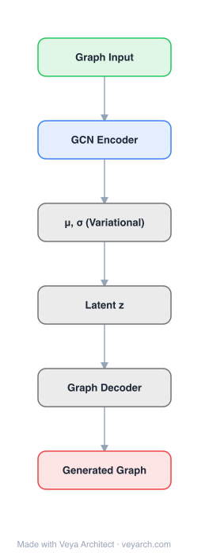

# Architecture: GraphVAE

## Motivation

Graph generation has long been an open problem: while graph *embedding* methods are well developed, learning to generate graphs directly — rather than embedding or retrieving them — remained largely unaddressed. The authors want a generative model that outputs a complete graph "at once" from a continuous latent space, enabling search and interpolation over graphs in that continuous space.

For molecular data specifically, the dominant prior approach uses the SMILES string representation. SMILES syntax is brittle: small perturbations can yield invalid or drastically different molecules, and string-based generative models must learn both the syntax and the inherent order ambiguity of a linearized graph. Generating graphs directly removes this overhead and guarantees that outputs are valid graphs (though not necessarily valid molecules).

The key technical gap GraphVAE targets is that, unlike images or sequences, graphs have no natural linear ordering of nodes. Sequential graph construction lacks stepwise supervision and involves non-differentiable steps, and comparing two graphs for a reconstruction loss requires solving a graph matching problem. GraphVAE addresses this by restricting generation to small graphs (tens of nodes) and outputting a probabilistic fully-connected graph in one shot, with an approximate graph-matching procedure to compute the reconstruction loss against the ground truth.

## Core Idea

Variational autoencoder for graph generation using graph-level encoder and edge-by-edge decoder.

## Architecture

### Overview

<b>Layer-by-layer (6 nodes)</b>

| # | Layer | Type | Params |
|---|---|---|---|
| 1 | Graph Input | `input` |  |
| 2 | GCN Encoder | `gcn_conv` |  |
| 3 | μ, σ (Variational) | `custom` |  |
| 4 | Latent z | `custom` |  |
| 5 | Graph Decoder | `custom` |  |
| 6 | Generated Graph | `output` |  |

GraphVAE is a variational autoencoder for small graphs. A graph `G = (A, E, F)` is represented by an adjacency matrix `A`, an edge-attribute tensor `E`, and a node-attribute matrix `F`. The encoder maps a graph to a latent distribution, and the decoder produces a probabilistic fully-connected graph of a fixed maximum size `k`, from which a discrete graph is extracted.

The decoder is a simple MLP with three parallel output heads giving: (1) edge probabilities (whether an edge exists), (2) edge-class probabilities (edge type), and (3) node-class probabilities (node type). Because the decoder outputs a graph in a canonical node ordering while the ground-truth graph can be in any ordering, the reconstruction loss requires aligning the two via a graph-matching step that produces a binary assignment matrix `X` between predicted and ground-truth nodes.

The whole model is a standard VAE trained by maximizing the evidence lower bound (ELBO): a KL-divergence term regularizes the latent distribution toward a prior, and a reconstruction term measures the likelihood of the ground-truth graph under the matched probabilistic output. Both encoder and decoder can additionally be conditioned on a label vector `y`, enabling class-conditional generation.

### Components

- **Encoder** — A feed-forward network built on edge-conditioned graph convolutions (ECC; Simonovsky & Komodakis, 2017). The encoder consumes `(A, E, F)` and produces the parameters of the approximate posterior `q(z|G)`. The authors note that "any other graph embedding method is applicable" — ECC is a design choice, not a requirement.
- **Latent space** — A continuous latent vector `z` drawn from a Gaussian; the VAE prior is a standard normal. The KL term pulls `q(z|G)` toward the prior, enabling sampling and interpolation.
- **Decoder** — A simple MLP with three parallel output heads producing, for a graph of up to `k` nodes:
  - edge probabilities (per node pair),
  - edge-class probabilities (per edge, categorical over edge types),
  - node-class probabilities (per node, categorical over node types).
  The output is a probabilistic fully-connected graph.
- **Graph matching module** — Computes a binary assignment matrix `X` between the predicted and ground-truth node sets, based on a similarity function over node pairs and edge pairs. It uses max-pooling matching (MPM; Cho et al., 2014). `X` is what allows the reconstruction likelihood to be computed despite the node-ordering mismatch between output and target.
- **Optional label conditioning** — Both encoder and decoder can be conditioned on a label vector `y` for class-conditional generation.

### Data Flow

1. **Input graph** — A molecule/graph is encoded as `G = (A, E, F)`: adjacency matrix, edge-attribute tensor, node-attribute matrix.
2. **Encode** — The ECC-based encoder maps `G` to the parameters of `q(z|G)`; a latent `z` is sampled via reparameterization.
3. **Decode** — The decoder MLP maps `z` (optionally concatenated with a label `y`) to a probabilistic fully-connected graph of up to `k` nodes: edge-existence probabilities, edge-type probabilities, and node-type probabilities.
4. **Graph matching** — Approximate graph matching (MPM, ~75 iterations on QM9) computes the assignment matrix `X` that aligns the predicted node set to the ground-truth node set.
5. **Reconstruction loss** — Using `X` to map information between `G` and the decoded graph, the maximum-likelihood estimates of the ground-truth edges/nodes are computed under the predicted categorical/edge probabilities, yielding the reconstruction term of the ELBO.
6. **Training objective** — ELBO = reconstruction loss + KL divergence between `q(z|G)` and the prior; backprop updates encoder, decoder, and (implicitly) the matching is run as an inner routine.
7. **Generation / interpolation** — At inference, sample `z ~ N(0, I)` (optionally with a label `y`), decode to a probabilistic graph, discretize, and (for molecules) validate with RDKit. Linear interpolation in latent space yields graphs with smoothly varying structure.

### State / Memory

Stateless. The encoder and decoder are feed-forward (the decoder is explicitly a "simple MLP"). No recurrent state, memory, or learned persistent history is maintained across samples. The only "memory-like" element is the latent vector `z` per sample, which is sampled fresh each generation and discarded after decoding. The graph-matching step is an inner optimization routine run per training example, not a learned state.

## Design Decisions

- **One-shot, non-sequential generation.** Rather than build a graph node-by-node (which requires stepwise supervision and involves non-differentiable steps), GraphVAE outputs the entire graph at once from the latent vector. This makes the decoder a simple MLP and avoids sequential ambiguity, at the cost of restricting output to a fixed maximum size `k` (in the order of tens of nodes).
- **Probabilistic fully-connected output.** The decoder emits probabilities for every node pair and every node/edge type, giving a fully-connected probabilistic graph that is discretized post-hoc. This keeps the decoder differentiable and lets the reconstruction loss be a likelihood.
- **Approximate graph matching for the reconstruction loss.** Comparing two graphs directly is hard; GraphVAE sidesteps the combinatorial explosion by using MPM (max-pooling matching, Cho et al. 2014) to compute a binary assignment matrix between predicted and ground-truth nodes, then computing maximum-likelihood estimates through that alignment.
- **Edge-conditioned graph convolutions (ECC) for the encoder.** ECC is chosen for the encoder but the authors explicitly state "any other graph embedding method is applicable," signaling that the encoder is a replaceable component.
- **Optional label conditioning.** Both encoder and decoder can take a label vector `y`, enabling class-conditional generation and class-conditional interpolation.
- **Implicit node probabilities variant.** An improvement where node probabilities are assumed to be a function of edge probabilities, which empirically improved results on QM9.
- **Restriction to small graphs.** The number of decoder parameters is O(k²) and graph matching is O(k⁴), so the method is explicitly limited to small graphs (QM9: up to 9 heavy atoms; ZINC: up to 38).

## Evolution

**Predecessors:**
- **VAE (Kingma & Welling 2013; Rezende et al. 2014)** — the variational autoencoder framework GraphVAE instantiates for graph data.
- **Edge-Conditioned Graph Convolution / ECC (Simonovsky & Komodakis 2017)** — the encoder backbone; the authors note any graph embedding method would do.
- **Max-pooling matching / MPM (Cho et al. 2014)** — the approximate graph-matching algorithm used to compute the assignment matrix for the reconstruction loss.
- **SMILES-based generative models** (Gómez-Bombarelli et al. 2016; Kusner et al. 2017; Dai et al. 2018) — the string-based molecular generators GraphVAE positions itself against, arguing that direct graph generation removes SMILES brittleness and order ambiguity.
- **Graph autoencoders for link prediction** (Kipf & Welling 2016b; Grover et al. 2017) — earlier graph-based autoencoders that learned node embeddings rather than generating whole graphs.

**Successors / contemporaries (noted by MolGAN, which cites GraphVAE):**
- **Junction Tree VAE (Jin et al. 2018)** and **NeVAE (Samanta et al. 2018)** — other VAE-based graph generators for molecules that appeared alongside GraphVAE.
- **MolGAN (De Cao & Kipf 2018)** — an implicit (GAN) successor that explicitly targets GraphVAE's permutation/graph-matching bottleneck by dropping the likelihood entirely.
- The authors describe GraphVAE as "an important initial step towards more powerful decoders," foreshadowing sequential and implicit successors.

## Characteristics

| Property | Value |
|----------|-------|
| Year | 2018 |
| Authors | Simonovsky & Komodakis |
| Category | GNN/Architecture |
| Source Paper | `GraphVAE_Towards_Generation_of_Small_Graphs_Using_Variationa_Variational_Autoencoders_2018.md` |
| PaperVault Path | `GNN/03-gnn-architectures/GraphVAE_Towards_Generation_of_Small_Graphs_Using_Variationa_Variational_Autoencoders_2018.md` |

## Limitations

- **Restricted to small graphs.** The decoder has O(k²) parameters and graph matching is O(k⁴), so the method is feasible only for graphs of tens of nodes. On QM9 (≤9 heavy atoms) ~50% valid molecules are produced; on ZINC (≤38 heavy atoms) validity drops to ~13.5%, and the implicit-node-probabilities trick yields no improvement — the size of the generated graph matters a lot.
- **Graph matching is a bottleneck and a scalability risk.** Matching robustness experiments (adding Gaussian noise and re-matching) confirm that matching cost grows steeply with `k`, which is the structural reason for the small-graph restriction.
- **Node ordering is not handled by the model itself.** The decoder outputs a canonical ordering and relies on the external graph-matching routine to align with the ground truth, which is both expensive and approximate.
- **Low validity on larger graphs.** On ZINC, baselines also fail, but GraphVAE's ~13.5% validity indicates the one-shot probabilistic decoder struggles to enforce chemical validity as graph size grows.
- **No explicit validity optimization.** As a VAE maximizing the ELBO, there is no explicit or implicit optimization of output validity (unlike GAN+RL methods), so novelty and validity depend entirely on the learned decoder distribution.
- **Valid graph ≠ valid molecule.** Operating directly on graphs guarantees valid graphs but not valid molecules; RDKit validation is applied post-hoc.

## Implementation Notes

See `implementation/` for a minimal runnable implementation.

## Information Layers

- **Evidence:** Source paper available in `references/papers/`
- **Analysis:** GraphVAE is the VAE counterpart to SMILES-based molecular generators, reframing generation as one-shot decoding of a probabilistic fully-connected graph. Its central design tension is between differentiability (one-shot MLP decoder, probabilistic output) and the node-ordering invariance that graphs require — resolved by an external approximate graph-matching routine that computes the reconstruction loss. The matching step is both the enabler (makes a graph likelihood tractable) and the scalability ceiling (O(k⁴) cost, hence the small-graph restriction). The implicit-node-probabilities variant, which treats node probabilities as a function of edge probabilities, improves results on QM9, suggesting the decoder's separate node/edge heads are somewhat redundant. The steep validity drop from QM9 (~50%) to ZINC (~13.5%) confirms that one-shot decoding does not scale gracefully with graph size.
- **Hypothesis:** The graph-matching bottleneck may be avoidable with a permutation-invariant likelihood (e.g., a set-based or GAN objective), which is exactly what later implicit methods like MolGAN explore. The implicit-node-probabilities improvement hints that a decoder which jointly reasons about edges and nodes (rather than emitting them from separate heads) could both reduce parameters and improve validity. It is also plausible that the ECC encoder is not the binding constraint — the authors' own remark that "any other graph embedding method is applicable" suggests the decoder and matching, not the encoder, are the bottleneck.
