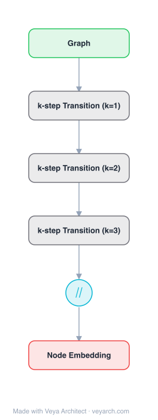

# Architecture: GraRep

## Motivation

Learning graph representations — mapping each vertex to a low-dimensional vector that captures semantic, relational, and structural information — is essential for tasks such as clustering, classification, and visualization on graph-structured data. Existing methods like DeepWalk use truncated random walks combined with the skip-gram model, but the exact loss function defined over the graph is not well understood, and the approach projects all k-step relational information into a common subspace. LINE captures only 1-step and 2-step local relationships and cannot easily extend to higher-order proximities. GraRep addresses these gaps by explicitly capturing different k-step relational information (for k = 1, 2, 3, …) between vertices in distinct subspaces, integrating global structural information into the learning process without slow random-walk sampling.

## Core Idea

Global structure representation learning via k-step transition matrices capturing different proximity orders.

## Architecture

### Overview

<b>Layer-by-layer (6 nodes)</b>

| # | Layer | Type | Params |
|---|---|---|---|
| 1 | Graph | `input` |  |
| 2 | k-step Transition (k=1) | `custom` |  |
| 3 | k-step Transition (k=2) | `custom` |  |
| 4 | k-step Transition (k=3) | `custom` |  |
| 5 | ∥ | `concat` |  |
| 6 | Node Embedding | `output` |  |

GraRep learns vertex representations by computing k-step transition matrices derived from the graph's probabilistic transition matrix. For each transition step k, a separate loss function is defined and optimized via matrix factorization (truncated SVD). The final vertex representation concatenates the representations learned from different k values, yielding a global representation that captures multi-order structural relationships. The approach avoids random-walk sampling entirely, instead operating directly on global transition matrices.

### Components

1. **Transition Matrix Construction** — Given a graph G = (V, E) with |V| vertices:
   - Compute the degree-normalized transition matrix A = D⁻¹W, where W is the weighted adjacency matrix and D is the diagonal degree matrix
   - Aᵏ gives the k-step transition probabilities between all vertex pairs
   - Each k captures a different order of proximity: k=1 captures direct neighbors, k=2 captures two-hop neighbors, etc.

2. **k-Step Loss Function** — For each k, GraRep defines a loss function based on the shifted positive Pointwise Mutual Information (PPMI) matrix:
   - The k-step transition matrix Aᵏ is transformed into a log-likelihood matrix
   - A shifted PMI matrix captures the statistical association between vertices at k-step distance
   - The loss function: L = Σᵢ Σⱼ Xᵢⱼ log(1/(1+e^(-uᵢᵀvⱼ))) + λXᵢⱼ log(1/(1+e^(uᵢᵀvⱼ)))
   - Each k-step model is optimized independently

3. **Matrix Factorization (SVD)** — Each k-step loss is optimized via truncated SVD:
   - The PPMI matrix is factorized into low-rank matrices U and V
   - SVD provides a closed-form solution, avoiding iterative gradient descent
   - The d-dimensional representation for k-step is: Wᵏ = UₖΣₖ^(1/2)

4. **Representation Concatenation** — The final vertex representation combines all k-step representations:
   - W = [W¹; W²; ...; Wᴷ], where K is the maximum transition step
   - Each subspace captures a different order of structural proximity
   - Concatenation preserves the distinct information from each k value

### Data Flow

1. **Input**: Weighted graph G = (V, E) with adjacency matrix W
2. **Degree Normalization**: Compute D⁻¹W → transition matrix A
3. **k-Step Computation**: For each k = 1, 2, ..., K:
   - Compute Aᵏ (k-step transition probabilities)
   - Construct the PPMI matrix from Aᵏ
   - Apply truncated SVD to obtain d-dimensional representation Wᵏ
4. **Concatenation**: Combine W¹, W², ..., Wᴷ into the final representation W
5. **Output**: |V| × (K×d) matrix of vertex embeddings

### State / Memory

- **No iterative training state**: GraRep uses matrix factorization (SVD) rather than gradient descent, so there is no optimizer state or convergence trajectory.
- **Transition matrices**: A, A², ..., Aᴷ are computed and stored during the process; each is |V| × |V|, requiring O(K|V|²) memory.
- **PPMI matrices**: One per k value, also |V| × |V|, transient and discarded after factorization.
- **Final embeddings**: Persistent output — |V| × (K×d) matrix stored for downstream tasks.

## Design Decisions

1. **Distinct subspaces per k-step** — Unlike DeepWalk which projects all k-step information into a common subspace, GraRep preserves different k-step relational information in separate subspaces:
   - Prevents interference between different proximity orders
   - Allows the model to capture both local (small k) and global (large k) structure

2. **Matrix factorization over random walks** — GraRep directly manipulates global transition matrices instead of sampling random walks:
   - Avoids the stochasticity and sampling overhead of DeepWalk
   - Provides a well-defined, explicit loss function
   - Trivially parallelizable since each k-step model is independent

3. **PPMI matrix** — Using shifted Positive Pointwise Mutual Information connects GraRep to the theoretical analysis showing skip-gram with negative sampling is implicitly factorizing a PMI matrix:
   - Provides a principled connection to word2vec/SGNS theory
   - Captures statistical association rather than raw co-occurrence

4. **Weighted graph support** — GraRep extends naturally to weighted graphs by using the weighted adjacency matrix:
   - More general than unweighted methods like DeepWalk
   - Captures edge strength in the transition probabilities

5. **SVD optimization** — Truncated SVD provides a closed-form solution:
   - No hyperparameter tuning for learning rate, batch size, etc.
   - Deterministic results unlike stochastic sampling methods
   - Efficient for moderate-sized graphs

## Evolution

**Predecessors:**
- **DeepWalk** (Perozzi et al., 2014) — Random walk + skip-gram; GraRep formalizes its implicit loss function and extends to global structure.
- **LINE** (Tang et al., 2015) — Captures 1st and 2nd order proximity; GraRep generalizes to arbitrary k-step.
- **word2vec / SGNS** (Mikolov et al., 2013) — Skip-gram with negative sampling; GraRep shows its connection to PMI matrix factorization.
- **LSA / Matrix Factorization** — Classical latent semantic analysis; GraRep applies similar factorization to graph transition matrices.

**Successors:**
- **node2vec** (Grover & Leskovec, 2016) — Flexible random walk strategy; complements GraRep's matrix approach.
- **HARP** (Chen et al., 2017) — Hierarchical graph coarsening; meta-strategy applicable to GraRep.
- **GraphGAN** (Wang et al., 2018) — Adversarial framework for graph embedding; alternative paradigm to matrix factorization.

## Characteristics

| Property | Value |
|----------|-------|
| Year | 2015 |
| Authors | Cao, Lu, Xu |
| Category | GNN/Embedding |
| Source Paper | `GraRep_Learning_Graph_Representations_with_Global_Structural_Cao_2015.md` |
| PaperVault Path | `GNN/02-network-embedding/GraRep_Learning_Graph_Representations_with_Global_Structural_Cao_2015.md` |

## Limitations

1. **Quadratic memory complexity** — Each k-step transition matrix is |V| × |V|, making GraRep memory-intensive for large graphs (millions of nodes).
2. **SVD scalability** — Truncated SVD on large matrices is computationally expensive; does not scale as well as online sampling methods (DeepWalk, node2vec) for very large graphs.
3. **Fixed maximum transition step K** — The choice of K is a hyperparameter; too small misses global structure, too large increases computation and noise.
4. **No node attributes** — GraRep uses only graph structure; cannot incorporate node features or attributes.
5. **Static graphs only** — No mechanism for dynamic or temporal graphs where edges change over time.
6. **No directed graph support** — The original formulation assumes undirected graphs; directed graphs require modifications to the transition matrix.

## Implementation Notes

See `implementation/` for a minimal runnable implementation. Key details:
- Input: weighted graph as adjacency matrix W
- Compute transition matrix A = D⁻¹W
- For each k = 1..K: compute Aᵏ, build PPMI matrix, apply truncated SVD to get d-dimensional embedding
- Concatenate K embeddings → final |V| × (K×d) representation
- Typical parameters: K = 3–5, d = 50–200 per k-step
- Evaluated on language network (clustering), social network (multi-label classification), citation network (visualization)
- Outperforms DeepWalk, LINE, and baselines on these tasks
- Trivially parallelizable across k values

## Information Layers

- **Evidence:** Source paper available in `references/papers/` (Cao, Lu, Xu, 2015, "GraRep: Learning Graph Representations with Global Structural Information," CIKM 2015)
- **Analysis:** GraRep's key insight is that the skip-gram model with negative sampling implicitly factorizes a PMI matrix, and that different k-step transition matrices capture distinct orders of structural proximity. By separating these into distinct subspaces, GraRep avoids the information loss that occurs when DeepWalk projects all k-step relationships into a single embedding space. The matrix factorization approach provides a principled, deterministic alternative to random-walk sampling, with a well-defined loss function. The trade-off is scalability: SVD on |V|×|V| matrices limits applicability to graphs with tens of thousands of nodes, whereas sampling-based methods scale to millions.
- **Hypothesis:** The distinct-subspace approach suggests that graph structure contains multi-scale information that is fundamentally irreducible — different proximity orders encode different structural patterns that cannot be collapsed without loss. This principle may extend to attributed and heterogeneous graphs, where different relation types should also occupy distinct subspaces. The PMI connection implies that graph embedding and word embedding share a common mathematical foundation, and advances in one domain may transfer to the other.
