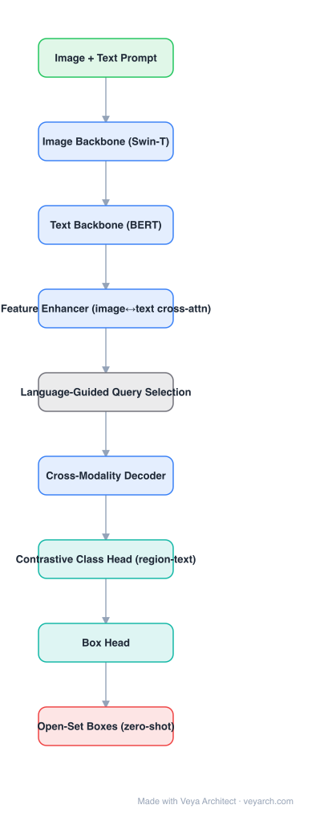

# Architecture: Grounding DINO

## Motivation

Closed-set detectors can only predict categories seen in training. Open-set detection needs the detector to accept **arbitrary text** as the category definition and still produce accurate boxes. Naively appending a text encoder to a detector gives weak grounding, because the two modalities only interact at the very end. Grounding DINO's claim is that fusion must happen at **three** stages — neck, query initialization, and head.

## Core Idea

Take DINO (a strong closed-set DETR-family detector) and insert language at three points: a **feature enhancer** that does bidirectional image↔text cross-attention, **language-guided query selection** that initializes decoder queries from image features most relevant to the text, and a **cross-modality decoder** whose queries attend to both image and text. Class prediction becomes a **region-text contrastive** problem.

## Architecture

### Overview

<b>Layer-by-layer (9 nodes)</b>

| # | Layer | Type | Params |
|---|---|---|---|
| 1 | Image + Text Prompt | `input` |  |
| 2 | Image Backbone (Swin-T) | `conv2d` |  |
| 3 | Text Backbone (BERT) | `embed` |  |
| 4 | Feature Enhancer (image↔text cross-attn) | `attention` |  |
| 5 | Language-Guided Query Selection | `custom` |  |
| 6 | Cross-Modality Decoder | `attention` |  |
| 7 | Contrastive Class Head (region-text) | `linear` |  |
| 8 | Box Head | `linear` |  |
| 9 | Open-Set Boxes (zero-shot) | `output` |  |

### Components

1. **Image backbone (Swin Transformer)** — multi-scale visual features.
2. **Text backbone (BERT)** — sub-sentence level text features: features for each phrase/word, not just a whole-sentence vector, which is what makes long prompts and referring expressions work.
3. **Feature enhancer** — several fusion layers: deformable self-attention on image features, then **image-to-text** and **text-to-image** cross-attention, then FFN. This is the "tight fusion" neck.
4. **Language-guided query selection** — decoder queries are picked from image features by their relevance to the input text, so the decoder starts from regions the prompt actually refers to.
5. **Cross-modality decoder** — each layer: query self-attention, **image cross-attention** (deformable, multi-scale), **text cross-attention**, FFN.
6. **Heads** — a contrastive class head computing region-text similarity over sub-sentence features, and a standard box head.
7. **Training** — grounded pre-training with detection, grounding, and caption data; losses mirror DINO (matching, box, and a contrastive classification loss).

### Data Flow

Image + text prompt → image backbone + text backbone → feature enhancer (bidirectional cross-attention) → language-guided query selection → cross-modality decoder → contrastive class head + box head → boxes with text-conditioned scores.

### State / Memory

No recurrent state; the text embedding is per-query conditioning that is recomputed for each prompt.

## Design Decisions

- **Fusion at three stages, not one** — the design's central claim; late fusion alone loses the ability of text to steer region proposals.
- **Sub-sentence grounding** — each phrase is a separate class embedding, so "the person on the left" behaves differently from "person".
- **Contrastive classification** — class scores are region-text similarities, so new categories need no new parameters.
- **DINO as the base detector** — inherits deformable multi-scale attention, contrastive denoising, and fast convergence.

## Evolution

- **DETR / Deformable DETR / DINO** (predecessors): the closed-set detection spine.
- **GLIP** (sibling and conceptual parent of tight fusion): phrase grounding as a pretext task.
- **Grounding DINO**: DINO + tight vision-language fusion; widely used as the open-set detector.
- **Grounding DINO 1.5 / 1.6**: improved efficiency and efficiency-accuracy trade-offs.
- **Downstream**: Grounded SAM (Grounding DINO boxes → SAM masks), open-vocabulary segmentation, VLM agent perception stacks; successors include OWL-ViT, DetCLIP, Grounding DINO-based open-vocabulary trackers.

## Characteristics

| Property | Value |
|---|---|
| Task | open-set / zero-shot detection, referring expression comprehension |
| Image backbone | Swin Transformer (T/B/L variants) |
| Text backbone | BERT |
| Fusion | feature enhancer + query selection + cross-modality decoder (3 stages) |
| Class head | contrastive region-text similarity |
| Post-processing | none (DETR-style set prediction) |

## Limitations

- Two encoders plus a multi-modal decoder: significantly heavier than a closed-set detector of the same resolution.
- Accuracy on common classes can lag a specialized closed-set detector; prompting quality matters.
- Long or compositional prompts are handled by sub-sentence features but still degrade with complex spatial reasoning.
- Zero-shot transfer quality depends on the domain overlap of the grounding pre-training data.

## Implementation Notes

Critical details: (1) keep sub-sentence text features — do not pool the whole prompt before grounding, (2) bidirectional cross-attention in the enhancer, (3) select queries by image-text relevance, (4) the class head must be contrastive (region-text dot product) rather than a fixed-size linear layer. For real-time use, the usual pattern is to cache text embeddings per prompt and to run the detector at a fixed resolution.
