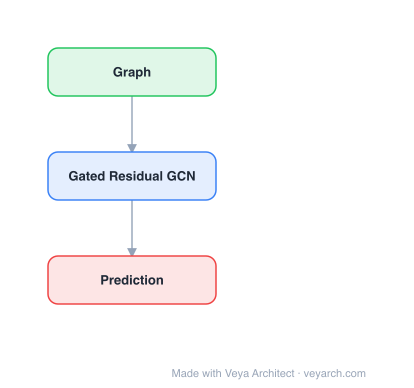

# Architecture: Gated Residual Recurrent GNN

## Motivation

The paper addresses **traffic prediction** on directed road networks — forecasting future traffic states (speed, flow) from historical observations. Traffic prediction is critical for Intelligent Transportation Systems (ITS) but is challenging due to three factors: (1) **Spatial dependencies on directed road networks** — traffic on a road segment depends on upstream/downstream segments in a directional manner; CNN-based methods capture grid-structured spatial features but cannot represent the non-Euclidean, directional topology of road networks. (2) **Multiple temporal dependencies** — traffic involves a mixture of repeating patterns (recent, daily, weekly periodicity); standard RNNs suffer from vanishing gradients and struggle to capture periodic temporal correlations. (3) **External factors** — accidents, weather, and events affect traffic conditions.

Prior GCN+RNN combinations (e.g., DCRNN, STGCN) address spatial structure but face vanishing/exploding gradient problems when graph convolutions become complicated, are less sensitive to large linear scale changes due to non-linear operations, and consider only near-past conditions without capturing periodic patterns. The paper proposes Res-RGNN (residual recurrent graph neural network) to address these limitations.

## Core Idea

Gated residual recurrent GNN for traffic prediction with temporal and spatial gating.

## Architecture

### Overview

<b>Layer-by-layer (3 nodes)</b>

| # | Layer | Type | Params |
|---|---|---|---|
| 1 | Graph | `input` |  |
| 2 | Gated Residual GCN | `gcn_conv` |  |
| 3 | Prediction | `output` |  |

The proposed framework, MRes-RGNN (Multiple Residual Recurrent Graph Neural Networks), is an end-to-end architecture with two parallel branches: (1) **Res-RGNN** — a residual recurrent graph neural network that jointly captures graph-based spatial dependencies and recent temporal dynamics using graph convolution combined with recurrent units and residual connections; (2) **Hop Res-RGNN** — an extension that incorporates a novel hop scheme to capture periodic temporal dependencies (daily/weekly patterns). The outputs of both branches are combined with dynamic weights to produce the final traffic prediction, considering spatial, multiple temporal, and external factors.

### Components

- **Res-RGNN (recent temporal branch):** Combines graph convolution (for spatial dependency on the directed road network) with recurrent neural network units (for temporal dynamics). Residual connections are added to facilitate training of deeper networks, addressing the vanishing gradient problem. The graph convolution operates on the directed adjacency matrix of the road network, capturing directional spatial dependencies that CNNs miss.
- **Hop Res-RGNN (periodic temporal branch):** Extends Res-RGNN with a hop scheme that feeds historical observations from periodic time lags (e.g., data from one day ago, one week ago) into the recurrent graph network. This captures repeating/periodic temporal patterns that the recent-only branch misses. The hop connections bypass intermediate time steps, directly connecting periodic observations to the current prediction.
- **Dynamic weight fusion:** The outputs of Res-RGNN and Hop Res-RGNN are combined using dynamic (learned) weights, allowing the model to adaptively balance recent vs. periodic temporal patterns depending on the traffic state.
- **External factor integration:** External factors (weather, events, holidays) are incorporated as additional input features to the fusion layer.

### Data Flow

1. **Input:** Historical traffic time series `X = {x_1, ..., x_t}` across all road segments/sensors, plus external factors.
2. **Res-RGNN branch:** Process recent observations through graph convolution (spatial) + recurrent units (temporal) with residual connections, producing recent-temporal features.
3. **Hop Res-RGNN branch:** Process periodic observations (from daily/weekly lags) through the same graph convolution + recurrent architecture with hop connections, producing periodic-temporal features.
4. **Dynamic fusion:** Combine the two branches' outputs with learned dynamic weights, balancing recent and periodic patterns.
5. **External factor integration:** Incorporate external factors into the fused representation.
6. **Output:** Predict future traffic states `Y = {y_{t+1}, ...}` for all road segments.

### State / Memory

The recurrent units in both Res-RGNN and Hop Res-RGNN maintain hidden states across time steps, providing temporal memory. Residual connections preserve information across layers, mitigating gradient vanishing. The hop scheme provides a form of long-range temporal memory by directly connecting periodic past observations to the present, bypassing the sequential recurrence. External factors modulate the final fusion but are not stateful.

## Design Decisions

- **Graph convolution over CNN for spatial modeling:** Road networks are non-Euclidean and directional; graph convolution naturally captures the directed topology, while CNNs are limited to regular grid structures.
- **Residual connections (Res-RGNN):** Address the vanishing/exploding gradient problem that plagues deep GCN+RNN combinations, enabling deeper and more expressive models.
- **Hop scheme for periodic patterns:** RNNs struggle with long-range periodic dependencies due to gradient decay; hop connections directly link periodic observations (daily/weekly lags) to the current step, bypassing the sequential bottleneck.
- **Dual-branch architecture (MRes-RGNN):** Separating recent and periodic temporal modeling into parallel branches with dynamic fusion allows the model to adaptively weight different temporal patterns depending on the traffic regime (e.g., incident vs. normal periodic flow).
- **External factor integration:** Traffic is heavily influenced by external events; incorporating them as additional features addresses a real limitation of structure-only models.

## Evolution

**Predecessors:**
- STGCN (Yu et al., 2017) — spatio-temporal GCN; undirected graph, no periodic temporal modeling.
- DCRNN (Li et al., 2018) — diffusion convolutional RNN; bidirectional random walks, no periodic patterns.
- ChebNet (Defferrard et al., 2016) — graph convolutional neural networks for non-Euclidean data.
- ResNet (He et al., 2016) — residual connections for deep network training.

**Successors:**
- MTGNN (Wu et al., 2020) — learned adjacency + dilated inception for temporal patterns.
- Models incorporating attention-based periodic pattern selection and dynamic graph structure.
- Spatio-temporal transformers that replace recurrent units with attention for temporal modeling.

## Characteristics

| Property | Value |
|----------|-------|
| Year | 2019 |
| Authors | Chen et al. |
| Category | GNN/TimeSeries |
| Source Paper | `Gated_Residual_Recurrent_Graph_Neural_Networks_for_Traffic_P_Chen_Zou_2019.md` |
| PaperVault Path | `GNN/06-gnn-for-time-series/Gated_Residual_Recurrent_Graph_Neural_Networks_for_Traffic_P_Chen_Zou_2019.md` |

## Limitations

- **Pre-defined directed graph:** The road network adjacency is pre-defined from the physical road topology; the model does not learn latent spatial dependencies that may not correspond to physical connections.
- **RNN gradient issues persist:** While residual connections mitigate vanishing gradients, the underlying recurrent units still face training difficulties on very long sequences compared to attention-based temporal models.
- **Fixed periodic lags:** The hop scheme uses pre-specified lag periods (daily, weekly); discovering the relevant periodicities automatically could improve adaptability.
- **External factors as static features:** External factors are injected as additional input features without dynamic interaction with the spatial-temporal graph, limiting their expressive integration.
- **Dual-branch complexity:** Maintaining two parallel branches increases model size and training cost; the dynamic fusion weights add hyperparameters.

## Implementation Notes

See `implementation/` for a minimal runnable implementation.

## Information Layers

- **Evidence:** Source paper available in `references/papers/`
- **Analysis:** MRes-RGNN's contributions address three genuine limitations of prior GCN+RNN traffic models: gradient instability (via residual connections), inability to capture periodic patterns (via the hop scheme), and the need to balance recent vs. periodic temporal signals (via dynamic dual-branch fusion). The directed graph convolution correctly models the directional nature of road networks.
- **Hypothesis:** The fixed periodic lags may miss non-standard periodicities (e.g., bi-weekly, event-driven). Attention-based temporal modeling could replace both the recurrent units and the hop scheme with a unified mechanism that learns relevant time lags automatically. The static road-network graph could be augmented with learned latent edges to capture non-physical spatial correlations (e.g., traffic synchronization between distant but functionally similar roads).
