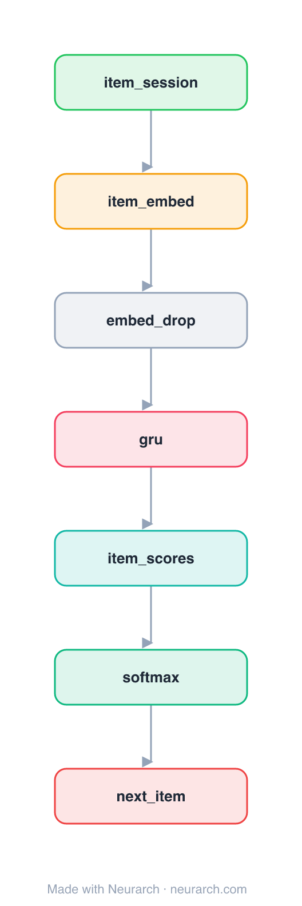

# Architecture: GRU4Rec

## Motivation

The paper that brought recurrent networks to session-based recommendation: a GRU consumes the sequence of clicks in an anonymous session and scores the next item. The RNN baseline every later sequential-recsys model compares against.

## Core Idea

The paper that brought recurrent networks to session-based recommendation: a GRU consumes the sequence of clicks in an anonymous session and scores the next item.

## Architecture

### Overview

*The full graph, all 7 nodes. Vector: [diagram.svg](assets/diagram.svg).*

| Hyperparameter | Value |
|---|---|
| Type | Session-based recommendation |
| Embedding | Item embedding |
| Backbone | GRU over the click sequence |
| Head | Linear to item catalogue → softmax |
| Key idea | RNN for anonymous session sequences |

`model.json` is the full graph, hand-built against the official config.json.

### Design Notes

- Built for session data (no long-term user profile): the GRU's hidden state is the running session intent.
- Introduced session-parallel mini-batching and a ranking loss (BPR / TOP1) tailored to recommendation.
- The recurrent counterpart to the attention-based [sasrec](../sasrec/) and [bert4rec](../bert4rec/).

### Parameter Check

Neurarch's per-layer parameter estimate over this graph: **10.1M**.

## Design Decisions

> **Analysis** — Observations derived from studying the architecture.

- Built for session data (no long-term user profile): the GRU's hidden state is the running session intent.
- Introduced session-parallel mini-batching and a ranking loss (BPR / TOP1) tailored to recommendation.
- The recurrent counterpart to the attention-based [sasrec](../sasrec/) and [bert4rec](../bert4rec/).

## Implementation Notes

- `model.json` contains the full structural graph with real dimensions and parameters.
- Open in [Neurarch](https://www.neurarch.com/) to visualize, edit, or export training code.
- Diagrams fold repeated identical blocks with a `× N` badge; `model.json` holds all nodes at real dimensions.

## Limitations

- This package focuses on the architectural structure. Training pipelines, 
dataset preparation, and production optimizations are out of scope.

## Evolution

> See `references/related/` for predecessor and successor architectures.

