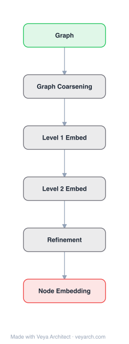

# Architecture: HARP

## Motivation

State-of-the-art graph embedding methods (DeepWalk, LINE, node2vec) share two critical weaknesses. First, they are local approaches — DeepWalk and node2vec use short random walks to explore only the immediate neighborhood of each node, while LINE considers at most two-hop relationships. This focus on local structure implicitly ignores long-distance global relationships, causing learned representations to miss important global structural patterns (e.g., rings, grids, community-level topology). Second, they all rely on non-convex optimization solved via stochastic gradient descent, which can become stuck in local minima due to poor initialization. HARP addresses both problems by introducing a hierarchical, multi-level paradigm: it recursively coarsens the graph into a series of progressively smaller graphs that preserve global structure, learns embeddings on the coarsest (smallest, easiest) graph, and then refines them level by level back to the original graph. This provides good initializations that avoid local minima and captures global structure.

## Core Idea

Hierarchical representation learning via graph coarsening: learns embeddings at multiple resolutions.

## Architecture

### Overview

<b>Layer-by-layer (6 nodes)</b>

| # | Layer | Type | Params |
|---|---|---|---|
| 1 | Graph | `input` |  |
| 2 | Graph Coarsening | `custom` |  |
| 3 | Level 1 Embed | `custom` |  |
| 4 | Level 2 Embed | `custom` |  |
| 5 | Refinement | `custom` |  |
| 6 | Node Embedding | `output` |  |

HARP is a meta-strategy that wraps around existing graph embedding methods (DeepWalk, LINE, node2vec) rather than being a standalone embedding algorithm. It works by: (1) coarsening the input graph into a hierarchy of progressively smaller graphs G₀(=G), G₁, ..., G_L, where each coarser graph preserves the global structure of the original; (2) learning embeddings on the coarsest graph G_L from scratch (with random initialization), which is easier because the graph is small and its global structure is more accessible; (3) refining the embeddings level by level — embeddings from G_{i+1} serve as initialization for learning embeddings on G_i — until reaching the original graph G₀. The coarsening step uses structure-preserving techniques (star merging, edge collapsing, and their combination) to ensure the coarsened graphs retain the essential topology.

### Components

1. **Graph Coarsening** — Creates a hierarchy of smaller graphs G₀, G₁, ..., G_L:
   - **Star Clustering**: Identifies star structures (a center node with all its neighbors) and merges each star into a single supernode. Preserves community structure but can over-coarsen high-degree hubs.
   - **Edge Collapse (Random Matching)**: Selects a random matching (set of non-adjacent edges) and collapses each matched edge into a single node. Preserves local structure well and reduces graph size by ~50% per level.
   - **Hybrid Approach**: First applies star clustering to handle hubs, then edge collapse for finer coarsening. Combines the strengths of both.
   - Each coarsened graph G_{i+1} has fewer nodes and edges than G_i while approximately preserving global topology.

2. **Embedding Learning (Base Algorithm)** — Any graph embedding method f:
   - HARP is agnostic to the base embedding algorithm
   - Supports DeepWalk (random walk + skip-gram), LINE (1st/2nd order proximity), and node2vec (biased random walk + skip-gram)
   - The base algorithm f takes a graph G and initial embeddings θ, and produces refined embeddings: f(G, θ) → Φ_G

3. **Representation Refinement** — Hierarchical initialization:
   - Start at the coarsest level: Φ_{G_L} = f(G_L, ∅) — learn from scratch on the smallest graph
   - For each level i from L-1 down to 0: Φ_{G_i} = f(G_i, Φ_{G_{i+1}})
   - Embeddings from the coarser graph serve as initialization for the finer graph
   - The initialization is "uncoarsened" by mapping supernode embeddings back to constituent nodes

4. **Star Merging / Uncoarsening** — Maps embeddings from coarser to finer graphs:
   - For edge collapse: the collapsed node's embedding initializes both constituent nodes
   - For star clustering: the supernode's embedding initializes the center and all leaf nodes
   - This provides a warm start that captures global structure from the coarser level

### Data Flow

1. **Input**: Graph G = (V, E) and base embedding algorithm f (e.g., DeepWalk, LINE, node2vec)
2. **Coarsening Phase**: Recursively coarsen G into G₀, G₁, ..., G_L using star clustering, edge collapse, or hybrid
3. **Base Embedding**: Learn embeddings on G_L from random initialization: Φ_L = f(G_L, ∅)
4. **Refinement Loop** (for i = L-1 down to 0):
   - Uncoarsen: Map Φ_{i+1} embeddings from G_{i+1} to G_i (supernode → constituent nodes)
   - Refine: Φ_i = f(G_i, uncoarsened Φ_{i+1})
5. **Output**: Φ₀ — embeddings for the original graph G, with global structure preserved

### State / Memory

- **Graph hierarchy**: G₀, G₁, ..., G_L — L coarsened graphs, each progressively smaller; stored as adjacency lists. Total memory is O(|V| + |E|) across all levels (geometric decrease).
- **Coarsening mapping**: For each level, a mapping from supernodes to constituent nodes; enables uncoarsening. O(|V|) per level.
- **Embedding matrices**: One per level, |V_i| × d; the coarsest is smallest, finest is largest. Only current and previous level needed at any time during refinement.
- **Base algorithm state**: Whatever state the wrapped method (DeepWalk, LINE, node2vec) maintains — typically just the embedding matrix and optimizer state.
- **No persistent state across levels**: Each level's embedding is computed, uncoarsened, and passed to the next level; no backpropagation across levels.

## Design Decisions

1. **Meta-strategy over new algorithm** — HARP improves existing methods rather than replacing them:
   - Applicable to any graph embedding method that accepts initial embeddings
   - Demonstrated improvements on DeepWalk, LINE, and node2vec
   - The gains come from better initialization, not a new objective function

2. **Graph coarsening for structure preservation** — Two coarsening strategies:
   - Star clustering handles hub-dominated graphs (social networks, web graphs) by collapsing star neighborhoods
   - Edge collapse (random matching) provides uniform ~50% reduction per level, preserving local structure
   - Hybrid approach combines both for robustness across graph types

3. **Coarse-to-fine learning** — Learning on the coarsest graph first:
   - The coarsest graph has the fewest pairwise relationships → smoother objective function → easier optimization
   - Smaller graph diameter → local methods (random walks) can access global structure
   - The coarse embedding captures global topology (rings, communities, grids) that local methods miss on the full graph

4. **Warm-start initialization** — Using coarser embeddings to initialize finer levels:
   - Avoids random initialization that can lead to local minima
   - The global structure learned at coarse levels guides fine-level optimization
   - Analogous to multigrid methods in numerical linear algebra

5. **Fixed number of coarsening levels** — L is a hyperparameter:
   - Too few levels: insufficient global structure capture
   - Too many levels: over-coarsening loses too much detail
   - Typically L = 3–5, chosen based on graph size

## Evolution

**Predecessors:**
- **DeepWalk** (Perozzi et al., 2014) — Random walk + skip-gram; HARP(DW) improves it via hierarchical initialization.
- **LINE** (Tang et al., 2015) — 1st/2nd order proximity; HARP(LINE) improves it.
- **node2vec** (Grover & Leskovec, 2016) — Biased random walks; HARP(N2V) improves it.
- **Multigrid methods** (numerical linear algebra) — Coarse-to-fine paradigm for solving PDEs; HARP adapts this idea to graph embedding.
- **Graph drawing** (Fruchterman-Reingold, 1991) — Force-directed layout with multilevel coarsening; HARP draws inspiration from multilevel graph drawing.

**Successors:**
- **GraphSAINT** (Zeng et al., 2019) — Graph sampling for scalable GNN training; different approach to scalability.
- **Cluster-GCN** (Chiang et al., 2019) — Clustering-based graph coarsening for GNN training.
- **Graph pooling methods** (e.g., DiffPool, AS-GCN) — Learned graph coarsening within GNN architectures.

## Characteristics

| Property | Value |
|----------|-------|
| Year | 2017 |
| Authors | Chen, Perozzi, Hu, Skiena |
| Category | GNN/Embedding |
| Source Paper | `HARP_Hierarchical_Representation_Learning_for_Networks_Chen_Perozzi_Hu_etal_2017.md` |
| PaperVault Path | `GNN/02-network-embedding/HARP_Hierarchical_Representation_Learning_for_Networks_Chen_Perozzi_Hu_etal_2017.md` |

## Limitations

1. **Coarsening quality dependency** — The effectiveness depends on how well coarsening preserves global structure; poor coarsening (e.g., over-merging communities) can degrade rather than improve embeddings.
2. **Overhead** — Coarsening and multiple embedding passes add computational overhead; the total cost is higher than running the base algorithm once.
3. **Star clustering limitations** — In graphs with very high-degree hubs, star clustering can over-coarsen, collapsing too many nodes into one and losing structural detail.
4. **No learned coarsening** — Coarsening is heuristic (star clustering, edge collapse); a learned coarsening strategy could be more adaptive.
5. **Fixed coarsening strategy** — The same coarsening is applied regardless of the base embedding method; different methods may benefit from different coarsening.
6. **Transductive** — Like its base methods, HARP is transductive; new nodes require re-coarsening and re-training.
7. **Limited to shallow methods** — HARP wraps random-walk/proximity-based methods; its applicability to deep GNNs (GCN, GAT) is not explored in the original paper.

## Implementation Notes

See `implementation/` for a minimal runnable implementation. Key details:
- Input: graph G = (V, E) and base embedding method (DeepWalk, LINE, or node2vec)
- Coarsening: hybrid of star clustering + edge collapse, L = 3–5 levels
- Each level reduces graph size by ~50%
- Learn embeddings on coarsest graph from scratch
- Refine level by level, using uncoarsened embeddings as initialization
- Evaluated on DBLP, BlogCatalog, CiteSeer, PPI, Wikipedia
- Improvements: up to 14% Macro F1 over original methods on classification
- HARP(DW), HARP(LINE), HARP(N2V) all consistently outperform their base methods
- Visualization shows HARP recovers global structure (rings, grids) that base methods miss

## Information Layers

- **Evidence:** Source paper available in `references/papers/` (Chen, Perozzi, Hu, Skiena, 2017, "HARP: Hierarchical Representation Learning for Networks," AAAI 2018)
- **Analysis:** HARP's key insight is that the optimization landscape of graph embedding methods depends on graph scale. On the full graph, local methods (random walks, 2-hop proximity) cannot access global structure, and the non-convex objective has many local minima. By coarsening the graph, HARP creates a smoother, smaller optimization landscape where global structure is accessible, learns a good solution there, and then transfers it to finer levels as initialization. This is directly analogous to multigrid methods in numerical computation, where coarse-grid solutions accelerate fine-grid convergence. The visualization of ring and grid embeddings is particularly compelling: LINE completely fails to recover these global structures, but HARP(LINE) recovers them clearly. The meta-strategy design is elegant — it requires no changes to the base algorithm, only providing better initializations.
- **Hypothesis:** The success of HARP suggests that the primary failure mode of local graph embedding methods is not their objective function but their optimization — they get stuck in local minima that miss global structure. This implies that graph embedding is fundamentally a multi-scale problem: local and global structure must be captured at different resolutions and combined. The coarsening strategy could be improved with learned, task-adaptive coarsening (e.g., preserving specific structural properties relevant to the downstream task). The principle extends beyond embedding: any graph learning method with non-convex optimization (GNNs, graph autoencoders) could benefit from hierarchical initialization.
