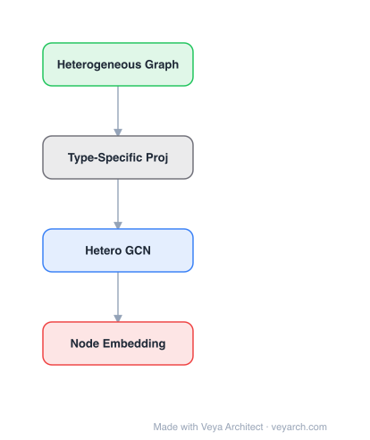

# Architecture: Hyperbolic Graph Embeddings

## Motivation

Graph embedding aims to encode nodes so that distance in the embedding space approximates similarity in the original graph/network. The standard practice is to use Euclidean space with a distance function. However, many real-world networks exhibit hierarchical or tree-like structures that are not naturally suited for Euclidean geometry.

In Euclidean space, grids are naturally embedded, but trees are not. Hyperbolic geometry, with its constant negative curvature, is naturally suited for trees and hierarchies: parallel lines diverge, and distances grow exponentially towards the boundary of the hyperbolic space. This means hyperbolic space can capture hierarchical relationships more efficiently than Euclidean space, especially in low dimensions.

The paper (based on Nickel & Kiela, Poincaré Embeddings, NIPS 2017) proposes replacing Euclidean distances with hyperbolic distances in standard node embedding algorithms, demonstrating significant gains in low dimensions for tree-structured taxonomies and hierarchical social networks.

## Core Idea

Graph embeddings in hyperbolic space, naturally suited for hierarchical and tree-like structures.

## Architecture

### Overview

<b>Layer-by-layer (4 nodes)</b>

| # | Layer | Type | Params |
|---|---|---|---|
| 1 | Heterogeneous Graph | `input` |  |
| 2 | Type-Specific Proj | `custom` |  |
| 3 | Hetero GCN | `gcn_conv` |  |
| 4 | Node Embedding | `output` |  |

Hyperbolic graph embeddings replace the Euclidean embedding space with the Poincaré ball model of hyperbolic geometry. The approach is straightforward in concept: take a standard node embedding algorithm (e.g., node2vec, DeepWalk) and replace Euclidean distances with hyperbolic distances. However, the optimization becomes non-trivial because standard SGD does not work directly on Riemannian manifolds.

The key insight is that hyperbolic distance naturally captures graph distance for trees and hierarchies. As nodes move towards the boundary of the Poincaré disk, the "distance ratio" d(x,y) / (d(x,O) + d(y,O)) approaches the graph distance ratio, whereas Euclidean distance ratios remain constant. Nodes closer to the origin are "higher up" in the hierarchy and close to a larger number of other nodes.

### Components

- **Poincaré ball model**: Points are embedded within a closed unit sphere where distances grow towards the boundary and become infinite at the boundary. The Poincaré ball is conformal to Euclidean space (angles are preserved), with the metric tensor scaled relative to Euclidean.

- **Lorenz model**: An alternative representation where points are embedded on the surface of a hyperboloid. Both models represent the same hyperbolic space.

- **Embedding lookup**: The encoder is a simple embedding-lookup (one embedding per node), with no GCN. The embedding matrix Z has one column per node.

- **Edge likelihood**: Edge probability P((u,v)=1) = 1 / (e^{d(u,v)} + 1), where d(u,v) is the distance in the embedding space (Euclidean or hyperbolic).

- **Riemannian SGD**: Generalizes SGD to Riemannian manifolds. The Riemannian gradient on the Poincaré ball is obtained by scaling the Euclidean gradient by the inverse of the metric tensor: r_H L(θ) = g_θ^{-1} · r_E L(θ). A "natural gradient" retraction projects back to the unit ball when necessary.

### Data Flow

1. **Input**: Graph with nodes to embed, with a training set of observed edges.
2. **Embedding initialization**: Initialize node embeddings on the Poincaré ball (within the unit sphere).
3. **Distance computation**: For each edge (u, v), compute the hyperbolic distance d(u, v) using the Poincaré ball metric.
4. **Edge likelihood**: Compute edge probability P((u,v)=1) = 1 / (e^{d(u,v)} + 1).
5. **Loss computation**: Optimize via cross-entropy with negative sampling (comparing observed/training relations against negative samples).
6. **Riemannian gradient**: Compute the Euclidean gradient, then scale by the inverse metric tensor to obtain the Riemannian gradient.
7. **Retraction**: Apply natural gradient retraction and project back to the unit ball.
8. **SGD update**: Update embeddings using Riemannian SGD.
9. **Output**: Hyperbolic embeddings where distances encode hierarchical relationships.

### State / Memory

Stateless—each node has a fixed embedding vector that is updated via Riemannian SGD. No recurrent or memory mechanism is used. The embedding space itself (the Poincaré ball) encodes the hierarchical structure through the radial position of each node.

## Design Decisions

- **Poincaré ball model**: Chosen because it is conformal to Euclidean space (angles preserved), making the Riemannian gradient a simple scaling of the Euclidean gradient. This simplifies optimization compared to other hyperbolic models.

- **Riemannian SGD over standard SGD**: Required because the Poincaré ball is a bounded space with different curvature—standard Euclidean SGD would not respect the manifold's geometry. The metric tensor scaling and retraction ensure updates stay on the manifold.

- **Simple embedding lookup encoder**: Deliberately avoids GCN architectures to isolate the effect of the embedding space. This allows clean comparison between Euclidean and hyperbolic distances.

- **Negative sampling**: Used for scalability, following the DeepWalk/node2vec paradigm, but with hyperbolic distances replacing Euclidean ones.

- **Low-dimensional embeddings**: The primary motivation is that hyperbolic space can represent hierarchies in far fewer dimensions than Euclidean space, as distances grow exponentially rather than linearly.

## Evolution

**Predecessors:**
- DeepWalk (Perozzi et al., 2014) — random walk-based network embedding with word2vec
- node2vec (Grover & Leskovec, 2016) — biased random walks for flexible network embedding
- TransE (Bordes et al., 2013) — translation-based embeddings for knowledge graphs
- Laplacian Eigenmaps (Belkin & Niyogi, 2003) — dimensionality reduction preserving local structure

**Successors:**
- Nickel & Kiela (2018) — Lorentz model of hyperbolic geometry for more stable optimization
- Hyperbolic GNNs — extending hyperbolic embeddings to graph neural network architectures
- Poincaré GloVe — hyperbolic word embeddings for hierarchical NLP tasks
- Spherical embeddings — for cyclic structures (complementary to hyperbolic for trees)

## Characteristics

| Property | Value |
|----------|-------|
| Year | 2019 |
| Authors | Hamilton et al. |
| Category | GNN/Embedding |
| Source Paper | `Poincare_Embeddings_for_Learning_Hierarchical_Representations_Nickel_Kiela_2017.md` |
| Supplementary Source | `Hyperbolic_graph_embeddings_Graph_embedding_setup_Hamilton_Hamilton_2019.md` (Hamilton lecture slides, PaperVault `GNN/02-network-embedding/`) |

## Limitations

- Optimization on Riemannian manifolds is more complex than standard SGD; numerical stability issues arise near the boundary of the Poincaré ball where distances become infinite.
- The approach is most beneficial for tree-structured or hierarchical data; for general graphs without clear hierarchical structure, Euclidean embeddings may perform comparably.
- The Poincaré ball model requires careful initialization and learning rate tuning to avoid embeddings collapsing to the origin or diverging to the boundary.
- The simple embedding-lookup encoder (no GCN) limits the ability to incorporate node features.
- The curvature of the hyperbolic space is fixed; learning the optimal curvature is not addressed in the original approach.
- For non-hierarchical social networks, the gains over Euclidean embeddings are less significant than for taxonomies like WordNet.

## Implementation Notes

See `implementation/` for a minimal runnable implementation.

## Information Layers

- **Evidence:** Source paper available in `references/papers/`
- **Analysis:** The key insight is that the geometry of the embedding space should match the structure of the data—trees naturally fit hyperbolic space just as grids naturally fit Euclidean space. The exponential growth of distances in hyperbolic space means hierarchical relationships can be encoded in far fewer dimensions.
- **Hypothesis:** The significant gains in low dimensions suggest that many real-world networks have latent hierarchical structure that Euclidean embeddings fail to capture efficiently. The choice of embedding geometry may be as important as the embedding algorithm itself.
