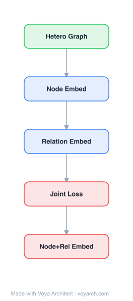

# Architecture: HIN2Vec

## Motivation

Heterogeneous information networks (HINs) — networks with multiple node types and edge types — contain rich semantic information encoded in the diverse relationships between nodes. A meta-path (e.g., Author-Paper-Author for collaboration, Author-Paper-Venue-Paper-Author for shared venue) describes a specific semantic relationship between node pairs. Existing HIN embedding methods either capture only limited relationship types (e.g., one-hop or two-hop neighborhoods) or aggregate all relationships without distinguishing their different semantics. Some methods require user-specified meta-path weights, which is labor-intensive and domain-dependent. HIN2Vec addresses these gaps by designing a neural network model that jointly learns node embeddings and meta-path (relationship) embeddings through multi-task binary classification — predicting whether a specific relationship exists between a node pair — thereby capturing the distinct semantics of different meta-paths without manual weight tuning.

## Core Idea

Heterogeneous information network embedding via meta-path exploration with a neural attention mechanism.

## Architecture

### Overview

<b>Layer-by-layer (5 nodes)</b>

| # | Layer | Type | Params |
|---|---|---|---|
| 1 | Hetero Graph | `input` |  |
| 2 | Node Embed | `embed` |  |
| 3 | Relation Embed | `embed` |  |
| 4 | Joint Loss | `loss` |  |
| 5 | Node+Rel Embed | `output` |  |

HIN2Vec is a two-phase framework. Phase 1 (Training Data Preparation) generates training data by performing random walks on the HIN following user-specified meta-paths, combined with negative sampling to produce positive and negative (node, node, relationship) triples. Phase 2 (Representation Learning) trains a neural network model — a logistic binary classifier — that takes a node pair and a relationship (meta-path) as input and predicts whether the relationship holds. The model jointly learns latent vectors for all nodes and all targeted relationships. The multi-task nature (predicting multiple relationships simultaneously) allows the model to embed rich structural and semantic information into the node vectors. Key design issues addressed include meta-path vector regularization, node-type-aware negative sampling, and cycle handling in random walks.

### Components

1. **Random Walk Generator** — Produces meta-path-constrained walks:
   - Given a set of target meta-paths, perform random walks that follow each meta-path's node-type sequence
   - Walks generate (node, context_node, relationship) triples where the relationship corresponds to the meta-path being walked
   - **Cycle handling**: Random walks may revisit nodes (cycles); HIN2Vec addresses this by treating cycles as valid structural patterns (a node can have a relationship with itself)
   - Walk length and number of walks control data coverage

2. **Negative Sampling** — Generates negative training examples:
   - For each positive triple (u, v, r), generate negative triples by replacing v with a random node v'
   - **Node-type-aware sampling**: Negative nodes are sampled from the same type as the positive node, ensuring the model learns to distinguish within-type rather than trivially across types
   - Negative examples for relationships: replace r with a different relationship r'
   - Ratio of negative to positive samples controls the training signal

3. **HIN2Vec Neural Network Model** — Logistic binary classifier:
   - **Input**: Three one-hot vectors — node u, node v, and relationship r (meta-path)
   - **Hidden layer**: Embedding lookup — converts one-hot vectors to dense d-dimensional vectors W_u, W_v, W_r
   - **Combination**: The three vectors are combined to produce a single scalar prediction
     - The paper uses element-wise multiplication: h = W_u ⊙ W_v ⊙ W_r (Hadamard product)
     - Alternative: concatenation + dense layer
   - **Output**: Sigmoid activation → binary prediction (does relationship r hold between u and v?)
   - **Loss**: Binary cross-entropy over all (positive + negative) triples

4. **Meta-Path Vector Regularization** — L2 regularization on relationship vectors:
   - Without regularization, relationship vectors can grow unbounded, dominating the prediction
   - L2 regularization on W_r keeps relationship vectors bounded
   - Ensures node vectors carry meaningful information, not just relationship vectors

5. **Asynchronous SGD** — Scalable training:
   - Uses asynchronous stochastic gradient descent for parallel training
   - Multiple workers update shared embedding matrices concurrently
   - Enables training on large-scale HINs (millions of nodes)

### Data Flow

1. **Input**: HIN G = (V, E, T) with node types, edge types, and a set of target meta-paths R
2. **Phase 1 — Data Preparation**:
   - For each meta-path r ∈ R, perform random walks following r's type sequence
   - Extract positive triples (u, v, r) from walk sequences
   - Generate negative triples via type-aware negative sampling
3. **Phase 2 — Representation Learning**:
   - Initialize node vectors W_u (|V| × d) and relationship vectors W_r (|R| × d)
   - For each training triple (u, v, r, label):
     - Look up W_u, W_v, W_r
     - Compute h = W_u ⊙ W_v ⊙ W_r
     - Predict y = σ(h)
     - Compute loss = BCE(y, label), backpropagate, update embeddings
   - Apply L2 regularization on W_r
4. **Output**: |V| × d node embedding matrix and |R| × d relationship embedding matrix

### State / Memory

- **Node embedding matrix**: W_u, |V| × d — the primary output; persistent, shared across all training workers.
- **Relationship embedding matrix**: W_r, |R| × d — also an output; provides insights into meta-path semantics (e.g., clustering meta-paths by similarity).
- **Training data triples**: (u, v, r, label) pairs generated in Phase 1; can be stored on disk or generated on-the-fly.
- **Random walk state**: Walks are generated independently; no persistent walk state needed.
- **Asynchronous SGD**: Lock-free or lock-based updates to shared embedding matrices; workers maintain local gradient buffers.
- **No recurrent state**: Each triple is processed independently; the model is a feedforward classifier.

## Design Decisions

1. **Multi-task learning via joint relationship prediction** — Training one model to predict multiple relationships:
   - Each relationship (meta-path) is a separate binary classification task
   - Shared node embeddings across tasks allow cross-relationship information transfer
   - A node that is correctly predicted for multiple relationships has a richer, more discriminative embedding
   - Avoids the need to train separate models per relationship

2. **Hadamard product for vector combination** — W_u ⊙ W_v ⊙ W_r:
   - Element-wise multiplication captures feature-wise interactions between node and relationship
   - Each dimension of the embedding can encode a specific aspect of node-relationship compatibility
   - Alternative (concatenation + dense layer) would require more parameters and may overfit
   - The product form ensures that each dimension of W_r acts as a "gate" selecting which node dimensions matter for that relationship

3. **Relationship vector regularization** — L2 on W_r:
   - Without it, the model can achieve low loss by making W_r large, making node vectors irrelevant
   - Regularization forces node vectors to carry meaningful information
   - The regularization strength controls the balance between node and relationship information

4. **Type-aware negative sampling** — Sampling negatives from the same node type:
   - Prevents the model from trivially separating node types (which is easy) and forces it to learn within-type structure
   - Same principle as metapath2vec++'s heterogeneous negative sampling
   - Critical for producing embeddings where same-type nodes are distinguishable

5. **Cycle handling in random walks** — Treating cycles as valid:
   - In meta-path walks, nodes may revisit themselves (e.g., Author-Paper-Author-Paper-Author starting and ending at the same author)
   - HIN2Vec explicitly handles these cycles rather than discarding them
   - Cycles capture self-relationships (e.g., an author's collaboration with themselves through different papers)

6. **Asynchronous SGD for scalability** — Lock-free parallel training:
   - Enables training on networks with millions of nodes
   - Trade-off: slight inconsistency in gradient updates, but empirically negligible
   - Follows the Hogwild paradigm for asynchronous SGD

## Evolution

**Predecessors:**
- **DeepWalk** (Perozzi et al., 2014) — Homogeneous network embedding; HIN2Vec extends to heterogeneous.
- **LINE** (Tang et al., 2015) — 1st/2nd order proximity for homogeneous networks.
- **node2vec** (Grover & Leskovec, 2016) — Flexible homogeneous walks.
- **PTE** (Tang et al., 2015) — Predictive text embedding for semi-supervised heterogeneous text networks; HIN2Vec is unsupervised and outputs multi-type embeddings.
- **ESim** (He et al., 2016) — Embedding for short texts with meta-path guidance; HIN2Vec generalizes to HINs.
- **HINE** (Chen et al., 2017) — Heterogeneous information network embedding; HIN2Vec improves by jointly learning relationship vectors.

**Successors:**
- **metapath2vec / metapath2vec++** (Dong et al., 2017) — Meta-path-based random walks with heterogeneous skip-gram; concurrent work with similar ideas.
- **HERec** (Shi et al., 2018) — Heterogeneous network embedding for recommendation.
- **R-HGNN** / **HGT** — Heterogeneous graph neural networks that learn type-specific attention.

## Characteristics

| Property | Value |
|----------|-------|
| Year | 2017 |
| Authors | Fu, Lee, Lei |
| Category | GNN/Embedding |
| Source Paper | `HIN2Vec_Explore_Meta_paths_in_Heterogeneous_Information_Netw_Fu_Lei_2017.md` |
| PaperVault Path | `GNN/02-network-embedding/HIN2Vec_Explore_Meta_paths_in_Heterogeneous_Information_Netw_Fu_Lei_2017.md` |

## Limitations

1. **Requires user-specified meta-paths** — The target relationships (meta-paths) must be specified by the user; the model does not discover them automatically. Poor meta-path selection leads to suboptimal embeddings.
2. **Hadamard product assumption** — The element-wise multiplication assumes that node-relationship interactions are feature-wise; this may not hold for all relationship types. More expressive combination functions (e.g., attention) could improve performance.
3. **Binary classification limitation** — Each (node, node, relationship) triple is predicted as binary (exists/doesn't exist); does not capture relationship strength or frequency.
4. **Scalability of random walks** — Generating walks for all meta-paths can be expensive for very large networks or many meta-paths; the number of walks grows with |R| × |V| × walk_length.
5. **Transductive** — Cannot generate embeddings for unseen nodes without retraining; the embedding matrix is fixed to the training graph.
6. **No node attributes** — HIN2Vec uses only network structure and types; cannot incorporate node features (e.g., text, images).
7. **Relationship vector interpretability** — While relationship vectors are claimed to provide analytical insights, their semantic interpretation is not always clear.

## Implementation Notes

See `implementation/` for a minimal runnable implementation. Key details:
- Input: HIN with typed nodes and edges; set of target meta-paths R
- Phase 1: Random walk per meta-path (walk length ~10, 10 walks per node); type-aware negative sampling (ratio 5:1 negative:positive)
- Phase 2: Neural network with embedding lookup (d = 100–200), Hadamard product combination, sigmoid output, BCE loss
- L2 regularization on relationship vectors (λ = 0.001)
- Asynchronous SGD with multiple workers for large-scale training
- Evaluated on BlogCatalog, Yelp, DBLP, U.S. Patents
- Outperforms DeepWalk, LINE, node2vec, PTE, HINE, ESim by 6.6–23.8% micro-F1 on node classification and 5–70.8% MAP on link prediction
- Relationship vectors can be clustered to group meta-paths with similar semantics

## Information Layers

- **Evidence:** Source paper available in `references/papers/` (Fu, Lee, Lei, 2017, "HIN2Vec: Explore Meta-paths in Heterogeneous Information Networks for Representation Learning," CIKM 2017)
- **Analysis:** HIN2Vec's key innovation is jointly learning node and relationship (meta-path) embeddings through multi-task binary classification. Unlike metapath2vec, which uses meta-paths only to guide random walks and then applies standard skip-gram, HIN2Vec makes the relationship itself a first-class learnable entity. The relationship vector W_r acts as a learned "gate" (via Hadamard product) that selects which dimensions of node embeddings are relevant for that relationship. This means different meta-paths activate different aspects of the node representation, enabling richer, multi-faceted embeddings. The regularization of relationship vectors is critical — without it, the model trivially achieves low loss by inflating W_r, making node vectors irrelevant. The type-aware negative sampling (same principle as metapath2vec++) is essential for within-type discrimination. The empirical gains are substantial (up to 23.8% on classification, 70.8% on link prediction), suggesting that explicitly modeling relationship semantics provides significant value beyond structural proximity alone.
- **Hypothesis:** The success of HIN2Vec implies that heterogeneous network semantics cannot be fully captured by walk-based context alone — the relationship type must be an explicit, learned variable. The Hadamard product's effectiveness suggests that different meta-paths operate on orthogonal subspaces of the node embedding, and the relationship vector selects the relevant subspace. This principle may generalize to multi-relational graphs (e.g., knowledge graphs), where TransE and similar models use translation operations; the product operation may be a complementary or superior alternative. The reliance on user-specified meta-paths is a limitation that could be addressed by automatic meta-path discovery (e.g., via reinforcement learning or evolutionary search), making the framework fully unsupervised.
