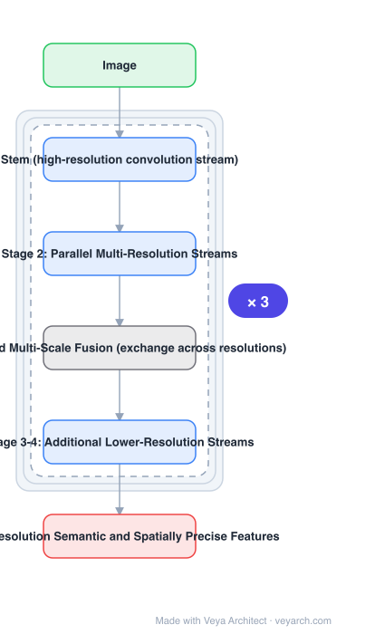

# Architecture: HRNet

## Motivation

Classification networks (LeNet → AlexNet → VGG → ResNet) reduce spatial resolution in series and end with a low-resolution representation. Position-sensitive tasks — pose, segmentation, detection — need high resolution, so they bolt on a recovery stage (deconv, upsampling, dilated convolutions, hourglass). HRNet's argument: recovering resolution after throwing it away is the wrong order; keep high resolution from the start and let low-resolution streams run **in parallel** to supply semantics.

## Core Idea

Two rules: (i) connect high-to-low resolution convolution streams **in parallel** rather than in series, and (ii) **repeatedly exchange information across resolutions** (repeated multi-scale fusion), so every resolution is informed by all others at every stage.

## Architecture

### Overview

<b>Layer-by-layer (6 nodes)</b>

| # | Layer | Type | Params |
|---|---|---|---|
| 1 | Image | `input` |  |
| 2 | Stem (high-resolution convolution stream) | `conv2d` |  |
| 3 | Stage 2: Parallel Multi-Resolution Streams | `conv2d` |  |
| 4 | Repeated Multi-Scale Fusion (exchange across resolutions) | `custom` |  |
| 5 | Stage 3-4: Additional Lower-Resolution Streams | `conv2d` |  |
| 6 | High-Resolution Semantic and Spatially Precise Features | `output` |  |

### Components

1. **Stem** — a high-resolution convolution stream (stride-2 convolutions) forming stage 1.
2. **Parallel multi-resolution streams** — starting at stage 2, streams at decreasing resolutions run side by side; new lower-resolution streams are added stage by stage.
3. **Repeated multi-scale fusion** — at every stage, each stream receives information from all others: higher resolutions are downsampled (strided convs) and lower resolutions upsampled (bilinear + 1×1 conv) before summation.
4. **Representation head** — the task head uses the concatenated multi-resolution representations (for pose: the highest-resolution representation).
5. **Variants** — width and number of streams define HRNet-W32/W40/W48 etc.

### Data Flow

Image → stem (high-resolution stream) → stage 2 with two parallel streams + fusion → stage 3 with three streams + fusion → stage 4 with four streams + fusion → multi-resolution representation → task head.

### State / Memory

No recurrent state. The distinguishing structure is the set of **parallel streams held simultaneously** — the model carries multiple resolutions at once rather than storing one and reconstructing the rest.

## Design Decisions

- **Parallel, not serial** — the structural inversion of ResNet/FPN-style backbones.
- **Fuse at every stage** — one fusion at the end (FPN-style) is not enough for spatially precise output.
- **Keep the highest resolution to the end** — no decode stage, so spatial precision does not depend on upsampling quality.
- **Backbone, not task model** — validated on pose, segmentation and detection to show the representation itself is better.

## Evolution

- **ResNet / FPN / U-Net / Hourglass / SimpleBaseline** (predecessors): serial high→low then recover.
- **HRNet (2019)**: parallel streams + repeated fusion.
- **Variants**: HRNet-OCR (object-contextual representations), HigherHRNet (bottom-up pose), Lite-HRNet (efficient version).
- **Successors**: HRFormer (transformer version), ViTPose (plain ViT displaces HRNet for pose), RTMPose (real-time pose).
- **Status**: the standard backbone for top-down 2D pose for several years.

## Characteristics

| Property | Value |
|---|---|
| Task | position-sensitive vision: pose, segmentation, detection |
| Structure | parallel multi-resolution convolution streams |
| Fusion | repeated multi-scale exchange at every stage |
| Resolution | high resolution maintained throughout |
| Typical input | 256×192 (pose) |
| Variants | W32 / W40 / W48 by stream width |

## Limitations

- Keeping full high resolution throughout costs compute and memory versus a serial backbone of similar depth.
- Convolutional, fixed input size; less suited to global context than transformer backbones.
- Fusion is hand-designed (downsample/upsample + sum), not learned attention.
- Largely superseded for pose by ViT-based backbones at large scale, though still strong at small/medium scale and in real-time variants.

## Implementation Notes

Essentials: (1) start from a high-resolution stem and add one lower-resolution stream per stage — do not build a serial chain, (2) implement the fusion unit so every stream aggregates from all others (strided convs down, bilinear + 1×1 up), (3) repeat fusion at every stage, not only at the end, (4) use the highest-resolution representation for keypoint-style heads, (5) check that the multi-resolution output is actually consumed — HRNet's value is the representation, and collapsing it to one scale early throws the design away.
