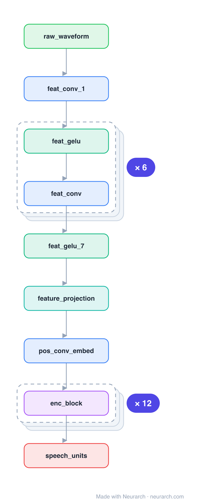

# Architecture: HuBERT base

## Motivation

Architecturally a twin of Wav2Vec2 (conv feature extractor + Transformer), but pretrained differently: instead of contrastive masking it predicts the cluster ID (from offline k-means on features) of masked frames, a BERT-style masked-prediction objective for speech.

## Core Idea

Architecturally a twin of Wav2Vec2 (conv feature extractor + Transformer), but pretrained differently: instead of contrastive masking it predicts the cluster ID (from offline k-means on features) of masked frames, a BERT-style masked-prediction objective for speech.

## Architecture

### Overview

*Identical repeated blocks are folded into one representative block with a `× N` badge, so the whole architecture fits on screen. `model.json` uses NAXS block templates + `repeat` directives and expands back to all 30 nodes (open it in Neurarch to see and edit every layer). Vector: [diagram.svg](assets/diagram.svg).*

| Hyperparameter | Value |
|---|---|
| Type | Self-supervised speech encoder |
| Parameters | 95M |
| Feature extractor | 7 Conv1D layers (raw waveform) |
| Encoder | 12 Transformer blocks, 768 hidden |
| Pretraining | Predict offline k-means cluster IDs of masked frames |

`model.json` is the full graph, hand-built against the official config.json.

### Design Notes

- Same backbone as [wav2vec2-base](../wav2vec2-base/); the contribution is the training target, a discrete unit from iterative k-means clustering rather than a contrastive loss.
- That "predict the masked unit" recipe (closer to masked-LM) ended up underpinning a lot of modern speech and audio-LLM systems.

### Parameter Check

Neurarch's per-layer parameter estimate over this graph: **165.7M**.

## Design Decisions

> **Analysis** — Observations derived from studying the architecture.

- Same backbone as [wav2vec2-base](../wav2vec2-base/); the contribution is the training target, a discrete unit from iterative k-means clustering rather than a contrastive loss.
- That "predict the masked unit" recipe (closer to masked-LM) ended up underpinning a lot of modern speech and audio-LLM systems.

## Implementation Notes

- `model.json` contains the full structural graph with real dimensions and parameters, using NAXS block templates + `repeat` for repeated units.
- Open in [Neurarch](https://www.neurarch.com/) to visualize, edit, or export training code.
- Diagrams fold repeated identical blocks with a `× N` badge; `model.json` defines each repeated unit once at real dimensions and expands to all nodes.

## Limitations

- This package focuses on the architectural structure. Training pipelines, 
dataset preparation, and production optimizations are out of scope.

## Evolution

> See `references/related/` for predecessor and successor architectures.

