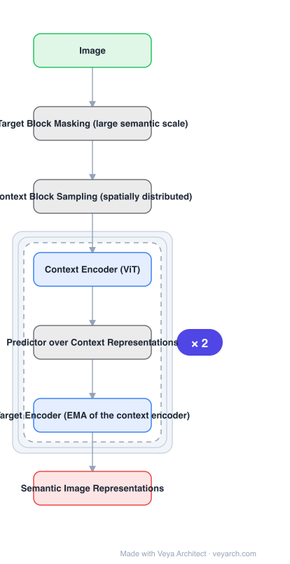

# Architecture: I-JEPA

## Motivation

Two families dominate self-supervised image learning, and each has a structural weakness. **Invariance-based** methods need hand-crafted augmentations and bake in their biases, which can hurt downstream tasks needing different abstraction levels — and those image-specific augmentations do not transfer to modalities like audio. **Generative** methods reconstruct pixels, spending capacity on low-level detail. I-JEPA wants semantic representations without either cost.

## Core Idea

A **non-generative** objective: from a single context block, predict the **representations** of various target blocks in the same image. Crucially, the **masking strategy** is what steers the model toward semantics — targets must be sampled at sufficiently large scale (semantic), and the context block must be sufficiently informative and spatially distributed.

## Architecture

### Overview

<b>Layer-by-layer (7 nodes)</b>

| # | Layer | Type | Params |
|---|---|---|---|
| 1 | Image | `input` |  |
| 2 | Target Block Masking (large semantic scale) | `custom` |  |
| 3 | Context Block Sampling (spatially distributed) | `custom` |  |
| 4 | Context Encoder (ViT) | `attention` |  |
| 5 | Predictor over Context Representations | `custom` |  |
| 6 | Target Encoder (EMA of the context encoder) | `attention` |  |
| 7 | Semantic Image Representations | `output` |  |

### Components

1. **Target block masking** — targets sampled with sufficiently large scale so they carry semantic content rather than texture.
2. **Context block sampling** — a single, spatially distributed, informative context block.
3. **Context encoder** — a ViT encoding the visible context.
4. **Predictor** — maps context representations to predicted target representations; it is the part that must do the work in representation space.
5. **Target encoder** — produces the prediction targets; standard JEPA practice is an EMA of the context encoder, so targets do not collapse.
6. **Prediction loss in representation space** — no pixel reconstruction anywhere.

### Data Flow

Image → mask: sample one large context block and several large target blocks → context encoder over the context → predictor outputs target-block representations → compared against target-encoder outputs for those blocks. At inference only the context encoder is kept.

### State / Memory

No recurrent state. The target encoder is a slowly-updated (EMA) copy of the context encoder, which is the mechanism preventing collapse — representation targets must not be produced by the same rapidly-changing weights being optimized.

## Design Decisions

- **Predict representations, not pixels** — avoids the generative cost of reconstructing low-level detail, which is not what semantic downstream tasks need.
- **Make masking carry the semantics** — the two conditions (large-scale targets, informative distributed context) are stated as the *core design choice*, not a detail.
- **Avoid augmentation-induced bias** — invariance-based methods force choice of invariances, and image classification and instance segmentation need different ones.
- **Keep it scalable** — demonstrated with ViT-Huge/14 on 16 A100 GPUs in under 72 hours.

## Evolution

- **Invariance-based SSL** (contrast): augmentation-dependent, introduces task-specific biases.
- **Generative / mask-denoising methods, MAE** (contrast): reconstruct pixels or tokens.
- **I-JEPA (2023)**: joint-embedding predictive architecture, non-generative.
- **Siblings**: V-JEPA, V-JEPA 2 (video extension, in catalog), VideoMAE.
- **Contrast**: MAE-family methods that reconstruct masked content.

## Characteristics

| Property | Value |
|---|---|
| Task | self-supervised image representation learning |
| Objective | predict target-block representations from a context block |
| Generative? | no — representation space only |
| Key design choice | masking: large-scale targets + informative distributed context |
| Scale | ViT-H/14 on ImageNet, 16 A100 GPUs, under 72 h |
| Transfer | linear classification, object counting, depth prediction |

## Limitations

- Requires choosing a masking scale — too small and targets are not semantic, which is the stated failure condition.
- Representation collapse is a real risk; it is managed by the target encoder, so that component is not optional.
- Semantic bias is still introduced by the masking strategy, just less than augmentation-based methods.
- Evaluated with ViT encoders; behaviour with convnet or hybrid backbones is not the subject.

## Implementation Notes

Essentials: (1) predict in representation space — adding a pixel reconstruction head returns the method to the generative family it is distinguished from, (2) sample targets at large scale and the context block as one spatially distributed region; these two conditions are what make the representations semantic, (3) keep a separate target encoder updated by EMA of the context encoder — without it the prediction target drifts with the model and collapse is likely, (4) drop the predictor and target encoder at inference and keep only the context encoder, (5) evaluate on more than classification (e.g. object counting, depth prediction), since the claim is semantic generality.
