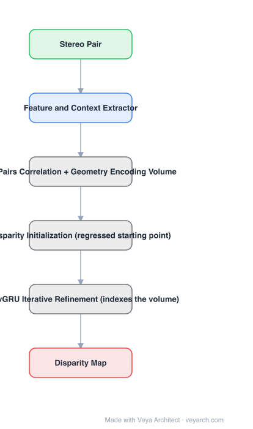

# Architecture: IGEV-Stereo

## Motivation

RAFT brought all-pairs correlation and iterative refinement to stereo and worked well, but all-pairs correlations have a specific weakness: they **lack non-local geometry knowledge** and therefore struggle with local ambiguities in ill-posed regions — textureless surfaces, repetitive patterns, occlusions. Local matching details alone cannot disambiguate those.

## Core Idea

Build a **Geometry Encoding Volume (GEV)** that encodes geometry and context information *together with* local matching details, then use it twice: once to **regress an accurate starting disparity** (so the iterations begin near the answer), and then as the volume indexed iteratively by ConvGRUs.

## Architecture

### Overview

<b>Layer-by-layer (6 nodes)</b>

| # | Layer | Type | Params |
|---|---|---|---|
| 1 | Stereo Pair | `input` |  |
| 2 | Feature and Context Extractor | `conv2d` |  |
| 3 | All-Pairs Correlation + Geometry Encoding Volume | `custom` |  |
| 4 | Disparity Initialization (regressed starting point) | `custom` |  |
| 5 | ConvGRU Iterative Refinement (indexes the volume) | `custom` |  |
| 6 | Disparity Map | `output` |  |

### Components

1. **Feature and context extractor** — per-image features plus a context map, as in RAFT.
2. **All-pairs correlation** — the local matching details.
3. **Geometry encoding volume** — combines the all-pairs correlation with geometry and context information into one volume encoding non-local structure.
4. **Disparity initialization** — GEV is used to regress an accurate starting disparity rather than starting the iterations from zero; this is the convergence speedup.
5. **ConvGRU iterative refinement** — indexes the GEV and updates the disparity map.
6. **MVS extension** — the same GEV formulation is applied to multi-view stereo.

### Data Flow

Stereo pair → features + context → all-pairs correlation → geometry encoding volume → initial disparity (regressed) → ConvGRU iterations indexing the GEV → disparity map.

### State / Memory

The ConvGRU hidden state and current disparity are the per-iteration state; the GEV is the persistent structure that carries the geometry and context the iterations read from.

## Design Decisions

- **Add non-local geometry to the volume** — the direct response to what all-pairs correlation lacks.
- **Regress the starting point from the GEV** — convergence speed, not just final accuracy, is the target.
- **Keep the RAFT-style iterative update** — the refinement operator was working; the volume was what needed enriching.
- **Reuse the volume for MVS** — the encoding idea is not stereo-specific.

## Evolution

- **PSMNet / GA-Net** (predecessors): 3D convolution cost filtering.
- **RAFT-Stereo (2021)**: recurrent field transforms, all-pairs correlation, no 3D convs.
- **IGEV-Stereo (2023)**: geometry encoding volume + regressed initialization.
- **Siblings**: CREStereo, FoundationStereo (zero-shot foundation model).
- **Contrast with RAFT-Stereo**: both iterate with GRUs, but IGEV adds an explicit geometry/context volume and a regressed starting disparity.

## Characteristics

| Property | Value |
|---|---|
| Task | stereo matching |
| Volume | geometry encoding volume (geometry + context + local matching) |
| Initialization | disparity regressed from GEV |
| Refinement | ConvGRU iterations indexing the GEV |
| Results | 1st on KITTI 2015 and KITTI 2012 (Reflective); fastest among top-10 |
| Extension | multi-view stereo |

## Limitations

- Iterative: latency scales with iteration count.
- Volume construction costs memory at high resolution.
- Cross-dataset generalization is strong but not zero-shot-in-the-wild (FoundationStereo targets that).
- Requires rectified stereo pairs and calibration.

## Implementation Notes

Essentials: (1) build the GEV so it contains geometry and context alongside the all-pairs correlation — correlation alone reproduces RAFT-Stereo's weakness, (2) regress the initial disparity from the GEV instead of initializing at zero and check iteration count drops, (3) index the same volume during ConvGRU refinement, (4) evaluate on ill-posed regions specifically (textureless, occluded), since that is the claimed improvement, (5) report runtime, not only EPE — "fastest among top-10" is part of the result.
