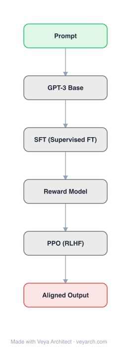

# Architecture: InstructGPT

## Motivation

Making language models bigger does not inherently make them better at following a user's intent. Large language models can generate outputs that are untruthful, toxic, or simply not helpful — they are not **aligned** with their users. The language modeling objective (predicting the next token on a webpage) is different from the objective "follow the user's instructions helpfully and safely." This misalignment is especially problematic for models deployed in hundreds of applications.

InstructGPT addresses this by fine-tuning GPT-3 with human feedback (RLHF) to align it with user intent: being **helpful** (helping the user solve their task), **honest** (not fabricating or misleading), and **harmless** (not causing physical, psychological, or social harm).

## Core Idea

Three-step RLHF pipeline: (1) supervised fine-tuning (SFT) on human demonstrations, (2) reward model (RM) training on human preference rankings, (3) reinforcement learning via PPO on the reward model. A 1.3B InstructGPT model is preferred over 175B GPT-3 despite having 100× fewer parameters.

## Architecture

### Overview

<b>Layer-by-layer (6 nodes)</b>

| # | Layer | Type | Params |
|---|---|---|---|
| 1 | Prompt | `input` |  |
| 2 | GPT-3 Base | `custom` |  |
| 3 | SFT (Supervised FT) | `custom` |  |
| 4 | Reward Model | `custom` |  |
| 5 | PPO (RLHF) | `custom` |  |
| 6 | Aligned Output | `output` |  |

InstructGPT uses the same GPT-3 architecture (decoder-only Transformer with alternating dense and sparse attention). The innovation is not in the base architecture but in the three-step training pipeline that aligns the model with human intent. Three model sizes were trained: 1.3B, 6B, and 175B parameters.

### Components

1. **Base model (GPT-3)** — Pre-trained GPT-3 with 1.3B, 6B, or 175B parameters. Same architecture as GPT-3 (decoder-only Transformer, alternating dense/sparse attention, pre-LN, 2048 context window).

2. **Supervised fine-tuning (SFT) model** — GPT-3 fine-tuned on human-written demonstrations of desired output behavior. Labelers write demonstrations for prompts submitted to the OpenAI API and labeler-written prompts. Trained for 2 epochs with cosine learning rate decay.

3. **Reward model (RM)** — A model that predicts which output human labelers would prefer. Initialized from the SFT model (with the final unembedding layer removed). Takes a prompt and a response as input, outputs a scalar reward. Trained on a dataset of human-labeled comparisons between model outputs. Multiple outputs (A–D) are sampled, ranked by labelers, and used to train the RM via pairwise ranking loss.

4. **PPO model** — The SFT model further fine-tuned via Proximal Policy Optimization (PPO) using the reward model as the reward function. The PPO objective maximizes the reward from the RM while staying close to the SFT model (via KL penalty) to avoid over-optimization. A pretraining mix (pretraining data mixed in) prevents performance regression on public NLP datasets.

### Data Flow

1. **Step 1 — SFT**: Labelers write demonstrations → fine-tune GPT-3 via supervised learning on prompt-response pairs.
2. **Step 2 — RM training**: Sample multiple responses from SFT model on API prompts → labelers rank responses → train reward model to predict human preferences via pairwise ranking loss.
3. **Step 3 — PPO**: Use RM as reward function → fine-tune SFT model via PPO → KL penalty keeps PPO model close to SFT → pretraining mix prevents regression on public NLP tasks.
4. **Inference**: User provides a prompt → PPO model generates a response aligned with human preferences.

### State / Memory

- **Same as GPT-3**: 2048 token context window, no recurrent state, parameters encode knowledge.
- **Reward model as implicit memory**: The RM encodes human preferences learned from comparison data, guiding the PPO model's behavior.
- **No online learning**: The model does not learn from interactions at inference time.

## Design Decisions

1. **Human feedback over scale** — Demonstrates that alignment via human feedback is more effective than simply scaling model size: 1.3B InstructGPT is preferred over 175B GPT-3.

2. **Three-step pipeline** — SFT → RM → PPO. Each step builds on the previous, progressively aligning the model.

3. **Reward model from SFT initialization** — The RM is initialized from the SFT model, ensuring it has good representations of the task distribution.

4. **KL penalty in PPO** — A KL divergence penalty keeps the PPO model close to the SFT distribution, preventing reward over-optimization (where the model exploits the RM's weaknesses).

5. **Pretraining mix** — Mixing in pretraining data during PPO fine-tuning mitigates performance regressions on public NLP datasets (SQuAD, DROP, HellaSwag, WMT).

6. **Three model sizes (1.3B, 6B, 175B)** — Demonstrates that alignment improvements scale across model sizes.

7. **40 labeler team** — Hired and trained based on performance on screening tests, with high agreement rates on preference rankings.

## Evolution

**Predecessors:**
- **GPT-3** (Brown et al., 2020) — Base model architecture and pre-training.
- **RLHF** (Christiano et al., 2017; Stiennon et al., 2020) — The reinforcement learning from human feedback methodology.
- **PPO** (Schulman et al., 2017) — The optimization algorithm used for the final fine-tuning step.

**Successors:**
- **ChatGPT** (2022) — Applied the InstructGPT methodology to GPT-3.5, achieving widespread adoption.
- **GPT-4** (2023) — Continued the RLHF alignment approach with a multimodal model.

## Characteristics

| Property | Value |
|----------|-------|
| Year | 2022 |
| Authors | Ouyang et al. (OpenAI) |
| Category | DL/Transformer |
| Source Paper | `InstructGPT_Unknown_Zhang_Agarwal_Slama_etal_2025.md` |
| PaperVault Path | `DL-Architectures/01-transformers/InstructGPT_Unknown_Zhang_Agarwal_Slama_etal_2025.md` |

## Limitations

1. **Simple mistakes** — InstructGPT still makes simple mistakes, including following instructions incorrectly.
2. **Alignment to labelers, not universal values** — The model is aligned to the stated preferences of a specific group (labelers and researchers), not a broader notion of "human values."
3. **Performance regressions on some NLP tasks** — RLHF causes regressions on some public NLP datasets (SQuAD, DROP, HellaSwag, WMT), partially mitigated by the pretraining mix.
4. **Toxicity improvements limited** — Small improvements in toxicity over GPT-3, no significant improvement on bias benchmarks (Winogender, CrowSPairs).
5. **Sensitive to prompt phrasing** — The model's behavior varies with how instructions are phrased.
6. **Over-optimization risk** — The PPO model can exploit weaknesses in the reward model, producing outputs that score high on the RM but are not actually preferred by humans.
7. **English-only** — Training data and evaluation are primarily in English.

## Implementation Notes

See `implementation/` for a minimal runnable implementation. Key implementation details:
- Three-step pipeline: SFT → RM → PPO
- SFT: fine-tune GPT-3 on prompt-response demonstrations, 2 epochs, cosine LR decay
- RM: initialize from SFT model, remove unembedding layer, train on pairwise comparisons
- PPO: maximize RM reward with KL penalty to SFT distribution, mix in pretraining data
- 40 trained labelers for data collection

## Information Layers

- **Evidence:** Source paper available in `references/papers/` (Ouyang et al., 2022, "Training language models to follow instructions with human feedback")
- **Analysis:** InstructGPT demonstrates that alignment is more parameter-efficient than scale: a 1.3B aligned model outperforms a 175B unaligned model. The three-step RLHF pipeline (SFT → RM → PPO) became the standard alignment recipe for subsequent LLMs. The KL penalty and pretraining mix are key engineering choices that prevent reward over-optimization and capability regression.
- **Hypothesis:** The authors note that the model is aligned to labeler preferences, not universal values, raising the question of how to align to broader or pluralistic notions of human values — an open problem in AI alignment.
