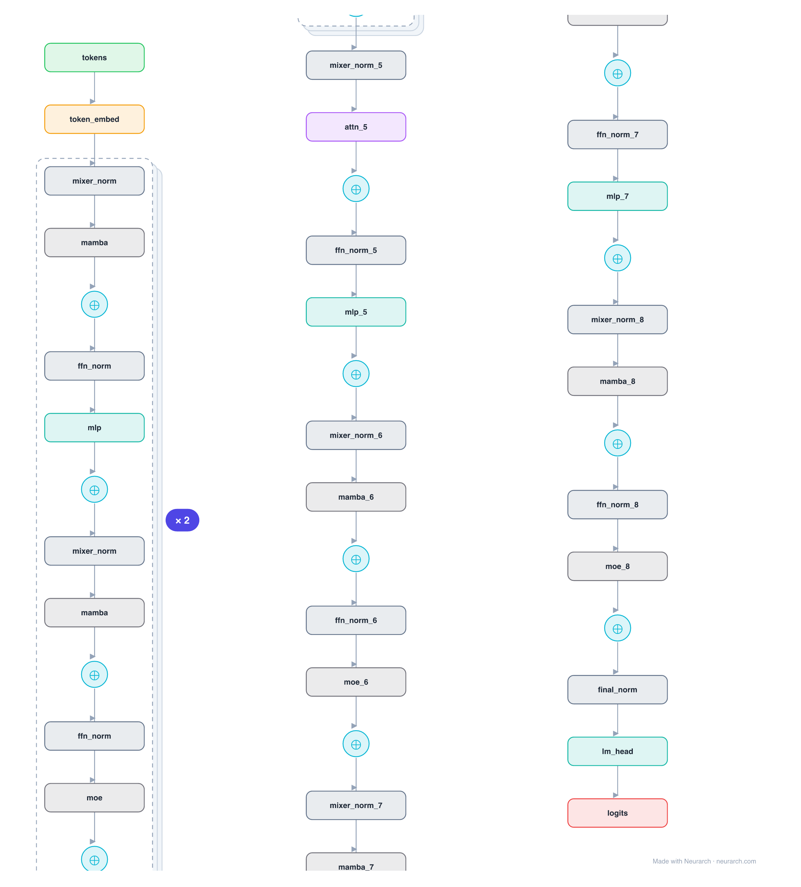

# Architecture: Jamba

## Motivation

AI21's 2024 hybrid: the first production-scale model to interleave Mamba state-space mixers with Transformer attention, plus MoE. Most layers are Mamba (linear-time, no KV cache); one in eight is attention (for in-context recall); MoE replaces every other MLP. The result fits a 256K context on a single 80GB GPU.

## Core Idea

AI21's 2024 hybrid: the first production-scale model to interleave Mamba state-space mixers with Transformer attention, plus MoE.

## Architecture

### Overview

*Identical repeated blocks are folded into one representative block with a `× N` badge, so the whole architecture fits on screen. `model.json` keeps all 53 nodes (open it in Neurarch to see and edit every layer). Vector: [diagram.svg](assets/diagram.svg).*

| Hyperparameter | Value |
|---|---|
| Type | Hybrid SSM-Transformer-MoE decoder (causal LM) |
| Parameters | 52B total / 12B active |
| Layers | 32 (4 blocks of 8) |
| Hidden size | 4,096 |
| Mixers | 7 Mamba (SSM) + 1 attention per 8-layer block |
| Attention | GQA: 32 query heads, 8 KV heads (1 in every 8 layers) |
| FFN | MoE on odd layers (16 experts, top-2); single MLP on even layers |
| Normalization | RMSNorm, pre-norm |
| Positions | None; Mamba mixers carry order through the SSM recurrence |
| Max context | 256K |

`model.json` is the full graph, hand-built against the official config.json.

### Design Notes

- Hybrid mixer stack: 7 Mamba SSM layers per 1 attention layer, so the KV cache and quadratic cost only appear on 1/8 of layers.
- MoE every other layer: 16 experts, top-2 routing, giving 52B total but ~12B active per token.
- Shown as a structural reference: the SSM + MoE parameter mix is documented (52B / 12B) rather than recomputed by the per-layer estimator, so this entry carries no param-gate deviation.

### Parameter Check

This entry is a **structural reference**: its parameter mix is not recomputed by the per-layer estimator, so it carries no deviation gate. See the hyperparameter table above for the authoritative total / active parameter counts.

## Design Decisions

> **Analysis** — Observations derived from studying the architecture.

- Hybrid mixer stack: 7 Mamba SSM layers per 1 attention layer, so the KV cache and quadratic cost only appear on 1/8 of layers.
- MoE every other layer: 16 experts, top-2 routing, giving 52B total but ~12B active per token.
- Shown as a structural reference: the SSM + MoE parameter mix is documented (52B / 12B) rather than recomputed by the per-layer estimator, so this entry carries no param-gate deviation.

## Implementation Notes

- `model.json` contains the full structural graph with real dimensions and parameters.
- Open in [Neurarch](https://www.neurarch.com/) to visualize, edit, or export training code.
- Diagrams fold repeated identical blocks with a `× N` badge; `model.json` holds all nodes at real dimensions.

## Limitations

- This package focuses on the architectural structure. Training pipelines, 
dataset preparation, and production optimizations are out of scope.

## Evolution

> See `references/related/` for predecessor and successor architectures.

