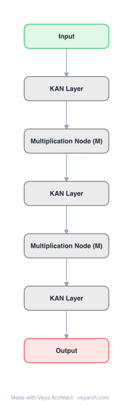

# Architecture: KAN-2

## Motivation

A major challenge of AI + Science is the inherent incompatibility between today's AI (based on connectionism) and science (based on symbolism). KAN 1.0 showed promise for science-related tasks but had a narrow definition of interpretability, equating it almost exclusively with the ability to extract symbolic formulas. This limited scope restricts KANs' applicability, as symbolic formulas are not always necessary or feasible in chemistry and biology, where modular structures and key features may suffice.

KAN 2.0 addresses this by proposing a **bidirectional synergy** framework: incorporating scientific knowledge into KANs (science → KAN) and extracting scientific insights from KANs (KAN → science), across three levels of scientific explanation: important features, modular structures, and symbolic formulas.

## Core Idea

KAN 2.0 augments original KANs with multiplication nodes (MultKAN), a KAN compiler (kanpiler) that compiles symbolic formulas into KANs, and a tree converter. This enables bidirectional synergy between KANs and science: embedding scientific inductive biases (features, modules, formulas) into KANs, and extracting scientific knowledge (conserved quantities, Lagrangians, symmetries, constitutive laws) from KANs.

## Architecture

### Overview

<b>Layer-by-layer (7 nodes)</b>

| # | Layer | Type | Params |
|---|---|---|---|
| 1 | Input | `input` |  |
| 2 | KAN Layer | `custom` |  |
| 3 | Multiplication Node (M) | `custom` |  |
| 4 | KAN Layer | `custom` |  |
| 5 | Multiplication Node (M) | `custom` |  |
| 6 | KAN Layer | `custom` |  |
| 7 | Output | `output` |  |

KAN 2.0 extends the original KAN with three major new components:
1. **MultKAN** — KANs with explicit multiplication nodes, augmenting the addition-only nodes of original KANs.
2. **kanpiler** — A KAN compiler that converts symbolic formulas into KAN architectures.
3. **tree converter** — Converts KANs (or any neural networks) to tree graphs for structural analysis.

The MultKAN architecture interleaves multiplication layers M with standard KAN layers, enabling the network to explicitly represent multiplicative relationships rather than approximating them through additions and univariate functions.

### Components

1. **MultKAN (Multiplication-augmented KAN)** — Extends the KAN architecture with multiplication nodes. The original Kolmogorov-Arnold representation theorem states that addition is the only true multivariate operation (multiplication can be expressed as `xy = exp(log(x) + log(y))`). However, given the prevalence of multiplications in science, MultKAN explicitly includes multiplication layers M between KAN layers. This enhances both interpretability and capacity.

2. **kanpiler (KAN Compiler)** — Compiles a symbolic formula into a KAN:
   - Parses the symbolic expression into an abstract syntax tree (AST)
   - Maps each univariate function node to a KAN edge
   - Maps addition/multiplication nodes to KAN/MultKAN nodes
   - Initializes the KAN with the exact symbolic function
   - Can be used to inject prior scientific knowledge into the network

3. **tree converter** — Converts trained KANs into tree graphs:
   - Extracts the computational graph structure
   - Identifies modular components
   - Enables structural analysis and comparison with known scientific structures

4. **Symbolic extraction pipeline** — Methods to extract symbolic formulas from trained KANs:
   - Train KAN on data
   - Prune insignificant edges
   - Symbolify remaining edge functions (match to symbolic library)
   - Convert to tree graph
   - Simplify using algebraic rules

### Data Flow

**Science → KAN (Embedding knowledge):**
1. Start with a symbolic formula or scientific structure
2. Use kanpiler to compile the formula into a KAN/MultKAN architecture
3. Initialize the KAN with the known function
4. Fine-tune on data (the KAN starts from a scientifically meaningful initialization)

**KAN → Science (Extracting knowledge):**
1. Train a MultKAN on scientific data
2. Identify important features (which inputs matter)
3. Reveal modular structures (which inputs interact independently)
4. Extract symbolic formulas (symbolify edge functions)
5. Use tree converter to analyze the computational structure
6. Discover conserved quantities, Lagrangians, symmetries

### State / Memory

- **No hidden state**: Like KAN, MultKAN is feedforward with no recurrent mechanisms.
- **Spline coefficients**: Learnable parameters on edges (same as KAN).
- **Multiplication node parameters**: The multiplication layers introduce additional parameters for combining KAN outputs.
- **Tree graph state**: The tree converter produces a structural representation that can be analyzed independently of the numerical parameters.

## Design Decisions

1. **Explicit multiplication nodes** — While the KA theorem shows multiplication can be expressed through additions and univariate functions, explicitly including multiplication nodes enhances both interpretability (clearer computational structure) and capacity (easier to learn multiplicative relationships).

2. **Bidirectional framework** — Rather than only extracting knowledge from KANs (KAN 1.0's approach), KAN 2.0 also embeds knowledge into KANs via kanpiler. This bidirectional synergy enables iterative scientific discovery: embed hypotheses, train, extract refined understanding.

3. **Three levels of explanation** — Recognizing that scientific understanding exists on a spectrum (features → modules → formulas), KAN 2.0 provides tools for each level, not just symbolic regression.

4. **Tree graph representation** — Converting KANs to tree graphs enables structural comparison with known scientific structures, going beyond symbolic formula extraction.

5. **Modular decomposition** — The divide-and-conquer approach decomposes complex problems into simpler subproblems that can be fitted by simpler KANs, improving both accuracy and interpretability.

## Evolution

**Predecessors:**
- **KAN** (Liu et al., 2024) — Original Kolmogorov-Arnold Networks with learnable activation functions on edges.
- **AI Feynman** (Udrescu & Tegmark, 2019) — Physics-inspired simplification strategies for symbolic regression.
- **Neural Controlled Differential Equations** — For modeling dynamic systems.

**Successors:**
- **KAN-SR** (Bühler & Guillén-Gosálbez, 2025) — KAN-guided symbolic regression framework building on KAN 2.0's ideas.
- Future KAN variants with more sophisticated scientific discovery tools.

## Characteristics

| Property | Value |
|----------|-------|
| Year | 2024 |
| Authors | Liu, Ma, Wang, Matusik, Tegmark |
| Category | DL/KAN |
| Source Paper | `KAN_2_0_Ma_Wang_Matusik_2025.md` |
| PaperVault Path | `DL-Architectures/06-gan-kan/KAN_2_0_Ma_Wang_Matusik_2025.md` |

## Limitations

1. **Still small-scale** — Like KAN 1.0, KAN 2.0 is primarily validated on small-scale scientific discovery tasks, not large-scale language or vision benchmarks.
2. **Multiplication node complexity** — Adding multiplication layers increases the architectural complexity and may introduce training instabilities.
3. **Symbolic library dependence** — The symbolic extraction pipeline depends on a predefined library of univariate functions, which may not cover all possible relationships.
4. **Manual intervention** — The scientific discovery workflow often requires human inspection and interpretation of tree graphs, limiting full automation.
5. **Domain specificity** — The framework is designed for AI + Science applications and may not generalize to all deep learning tasks.

## Implementation Notes

See `implementation/` for a minimal runnable implementation. Key details:
- MultKAN: interleaves multiplication layers M with KAN layers
- kanpiler: compiles symbolic formulas → KAN architectures
- tree converter: KAN → tree graph for structural analysis
- Available at `pip install pykan` (github.com/KindXiaoming/pykan), version 0.2.x
- Implemented in Python with Jax, Equinox, Optimistix, Optax

## Information Layers

- **Evidence:** Source paper available in `references/papers/` (Liu et al., 2024, "KAN 2.0: Kolmogorov-Arnold Networks Meet Science")
- **Analysis:** KAN 2.0's key contribution is the bidirectional framework — not just extracting knowledge from trained KANs, but also embedding scientific knowledge into KANs before training. The addition of multiplication nodes addresses a practical limitation: while theoretically unnecessary (per the KA theorem), multiplications are so prevalent in science that explicit representation improves both interpretability and capacity. The three-level explanation hierarchy (features → modules → formulas) provides a more nuanced view of scientific understanding than pure symbolic regression.
- **Hypothesis:** The kanpiler's ability to compile symbolic formulas into KANs suggests that KANs could serve as a bridge between symbolic AI and connectionist AI, potentially enabling hybrid systems that combine the strengths of both paradigms.
