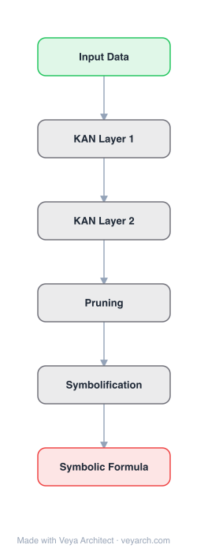

# Architecture: KAN-SR

## Motivation

Symbolic regression (SR) aims to recover closed-form mathematical expressions that accurately model a given dataset, jointly inferring both the functional form and parameters. Classical SR methods based on genetic programming (GP) are sample-inefficient, computationally expensive, and face scalability difficulties. Neural-symbolic systems often rely on discrete symbolic representations that are difficult to train end-to-end.

KAN-SR addresses these limitations by using Kolmogorov-Arnold Networks (KANs) as the backbone for symbolic regression, combining differentiable KAN training with symbolic simplification strategies inspired by AI Feynman. The goal is to recover ground-truth equations from the Feynman Symbolic Regression for Scientific Discovery (SRSD) dataset and extend to dynamic system modeling.

## Core Idea

A KAN-guided symbolic regression framework following a divide-and-conquer approach: use KANs' learnable univariate functions on edges to fit data, then decompose the trained network into modular algebraic components matched to a symbolic library via non-linear least squares. Symbolic simplifications (symmetries, separabilities) decompose complex problems into simpler subproblems fittable by single-layer KANs.

## Architecture

### Overview

<b>Layer-by-layer (6 nodes)</b>

| # | Layer | Type | Params |
|---|---|---|---|
| 1 | Input Data | `input` |  |
| 2 | KAN Layer 1 | `custom` |  |
| 3 | KAN Layer 2 | `custom` |  |
| 4 | Pruning | `custom` |  |
| 5 | Symbolification | `custom` |  |
| 6 | Symbolic Formula | `output` |  |

KAN-SR is a hybrid pipeline combining differentiable KAN training with symbolic extraction and simplification. The workflow is flexible and configurable, consisting of sequential steps that can be enabled or skipped depending on the problem. The framework uses KANs' unique property — learnable univariate functions on edges — to fit data differentiably, then extracts symbolic formulas from the trained network.

### Components

1. **Preprocessing** — Normalize or scale input variables to improve numerical stability and convergence.

2. **Brute-force symbolic matching** — Optionally perform an exhaustive search over simple expressions to quickly identify trivial relationships.

3. **Single-layer KANs with single unit** — Attempt symbolic approximation using minimal architectures with a single summation or multiplication unit.

4. **Single-layer KANs with multiple units** — Expand the search space by allowing multiple units within a single-layer KAN architecture.

5. **Simplification and subproblem decomposition** — Identify structural simplifications (translational symmetries, separabilities) inspired by AI Feynman, and recursively restart the procedure on subproblems.

6. **Output transformation** — Optionally apply transformations to the output (e.g., logarithmic, exponential) to simplify the functional form and rerun the symbolic search on the transformed target.

7. **Deep KAN fitting** — If simpler models fail, employ deeper KAN architectures to capture more complex or hierarchical functional relationships.

8. **Symbolic extraction** — After fitting a KAN, decompose the network into modular algebraic components and match them to a symbolic library via non-linear least squares regression.

### Data Flow

1. **Input data** → Preprocessing (normalization/scaling)
2. **Brute-force matching** → If simple expression fits, return; else continue
3. **Single-layer KAN fitting** → Train KAN with single unit → check fit
4. **Multi-unit KAN fitting** → Train KAN with multiple units → check fit
5. **Simplification** → Identify symmetries/separabilities → decompose into subproblems → recursively solve each
6. **Output transformation** → Apply log/exp transformation → refit
7. **Deep KAN** → Train deep KAN if simpler models fail
8. **Symbolic extraction** → Prune KAN edges → symbolify remaining functions → match to symbolic library → assemble final formula
9. **Output** → Closed-form mathematical expression

### State / Memory

- **No hidden state**: KAN-SR uses feedforward KANs with no recurrent mechanisms.
- **Spline coefficients**: Learnable parameters on KAN edges, trained via gradient descent.
- **Symbolic library**: A predefined library of univariate functions (sin, cos, exp, log, polynomial, etc.) used for matching during symbolic extraction.
- **Neural controlled differential equations**: For dynamic systems, the framework integrates with neural CDEs (via Diffrax) to model time-dependent processes.

## Design Decisions

1. **KAN as backbone** — KANs' learnable univariate functions on edges are naturally suited for symbolic regression: each edge function can be independently symbolified, making extraction straightforward.

2. **Divide-and-conquer** — Instead of fitting a single complex KAN, the framework decomposes problems using symmetries and separabilities, fitting simpler subproblems with single-layer KANs.

3. **Simplification strategies from AI Feynman** — Translational symmetries and separabilities reduce the search space dramatically, making symbolic regression tractable.

4. **Non-linear least squares for symbolic matching** — Rather than discrete enumeration or brute-force search, KAN-SR uses differentiable non-linear least squares to match learned functions to symbolic library entries.

5. **Flexible workflow** — The pipeline is configurable: steps can be enabled or skipped based on problem characteristics, since no single KAN architecture fits all target functions.

6. **Extension to dynamic systems** — By combining with neural controlled differential equations, KAN-SR can model time-dependent processes, recovering kinetic rate equations in bioprocess systems.

## Evolution

**Predecessors:**
- **Genetic Programming (GP)** — Classical symbolic regression using evolutionary algorithms on expression trees. Sample-inefficient and computationally expensive.
- **AI Feynman** (Udrescu & Tegmark, 2019) — Physics-inspired simplification strategies for symbolic regression.
- **KAN** (Liu et al., 2024) — Kolmogorov-Arnold Networks with learnable activation functions on edges.
- **KAN 2.0** (Liu et al., 2024) — Extended KANs with multiplication nodes, kanpiler, and tree converter.
- **SRSD benchmark** (Matsubara et al.) — 240 datasets inspired by Feynman lectures for evaluating SR methods.
- **SINDy** — Sparse regression for identifying differential equations.

**Successors:**
- Future KAN-SR variants with larger symbolic libraries and more sophisticated simplification strategies.
- Integration with other neural architectures beyond KANs.

## Characteristics

| Property | Value |
|----------|-------|
| Year | 2025 |
| Authors | Bühler, Guillén-Gosálbez |
| Category | DL/KAN |
| Source Paper | `KAN-SR_A_Kolmogorov-Arnold_Network_Guided_Symbolic_Regression_Framewor_Marco_Guillen-Gosalbez_2025.md` |
| PaperVault Path | `DL-Architectures/06-gan-kan/KAN-SR_A_Kolmogorov-Arnold_Network_Guided_Symbolic_Regression_Framewor_Marco_Guillen-Gosalbez_2025.md` |

## Limitations

1. **Symbolic library dependence** — The extraction quality depends on the predefined library of univariate functions. Novel or unusual functional forms may not be captured.
2. **Simplification assumptions** — The divide-and-conquer approach assumes the presence of symmetries or separabilities, which may not exist in all datasets.
3. **Computational cost** — The multi-step workflow with recursive subproblem decomposition can be computationally expensive for complex problems.
4. **Scale** — Validated primarily on the SRSD benchmark (Feynman-inspired equations) and a bioprocess case study; broader applicability remains to be demonstrated.
5. **Hyperparameter sensitivity** — The flexible workflow has many configurable steps and hyperparameters, requiring careful tuning.
6. **No guarantee of ground-truth recovery** — While KAN-SR shows competitive performance, it does not guarantee recovering the exact ground-truth equation, especially with noise or irrelevant variables.

## Implementation Notes

See `implementation/` for a minimal runnable implementation. Key details:
- Implemented in Python using Jax, Equinox (for KANs), Optimistix (non-linear least squares), Optax (optimizers), Diffrax (neural differential equations)
- Workflow: preprocessing → brute-force → single-layer KAN → multi-unit KAN → simplification → output transformation → deep KAN → symbolic extraction
- Symbolic extraction: prune → symbolify → match to library via non-linear least squares
- Simplification strategies: translational symmetries, separabilities (inspired by AI Feynman)
- Evaluation: SRSD benchmark (240 Feynman datasets), bioprocess dynamic modeling

## Information Layers

- **Evidence:** Source paper available in `references/papers/` (Bühler & Guillén-Gosálbez, 2025, "KAN-SR: A Kolmogorov-Arnold Network Guided Symbolic Regression Framework")
- **Analysis:** KAN-SR's key insight is that KANs' structure (learnable univariate functions on edges) is naturally suited for symbolic regression — each edge function can be independently symbolified. The divide-and-conquer approach, combined with simplification strategies from AI Feynman, makes the search tractable. The extension to dynamic systems via neural CDEs demonstrates the framework's flexibility beyond static regression.
- **Hypothesis:** The combination of differentiable KAN training and symbolic extraction may represent a general paradigm for neural-symbolic integration: train a differentiable model that naturally decomposes into symbolic components, then extract the symbolic representation. This could be extended to other architectures beyond KANs.
