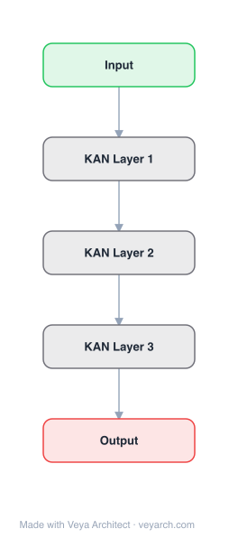

# Architecture: KAN

## Motivation

Multi-Layer Perceptrons (MLPs) are foundational building blocks of modern deep learning, but they have significant drawbacks: they consume almost all non-embedding parameters in Transformers, are less interpretable than attention layers, and have suboptimal neural scaling laws. MLPs place fixed activation functions on nodes ("neurons") with learnable linear weights on edges. KANs ask: are MLPs the best nonlinear regressors we can build?

Inspired by the **Kolmogorov-Arnold representation theorem**, KANs propose an alternative where learnable activation functions are placed on edges instead of fixed activations on nodes. This seemingly simple change makes KANs outperform MLPs in both accuracy and interpretability on small-scale AI + Science tasks.

## Core Idea

Kolmogorov-Arnold Networks replace fixed activation functions on nodes with learnable activation functions (parametrized as splines) on edges. KANs have no linear weight matrices at all — every weight parameter is replaced by a univariate function. KANs are combinations of splines and MLPs, leveraging splines' accuracy in low dimensions and MLPs' ability to learn compositional structures.

## Architecture

### Overview



<details>
<summary><b>Layer-by-layer (5 nodes)</b></summary>

| # | Layer | Type | Params |
|---|---|---|---|
| 1 | Input | `input` |  |
| 2 | KAN Layer 1 | `custom` | type: spline, n_in: 2, n_out: 3 |
| 3 | KAN Layer 2 | `custom` | type: spline, n_in: 3, n_out: 3 |
| 4 | KAN Layer 3 | `custom` | type: spline, n_in: 3, n_out: 1 |
| 5 | Output | `output` |  |

</details>
A KAN layer with `n_in` inputs and `n_out` outputs transforms input `x ∈ R^{n_in}` to output `x' ∈ R^{n_out}` via a matrix of learnable univariate functions `φ_{i,j}` (splines):

```
x'_j = Σ_{i=1}^{n_in} φ_{i,j}(x_i)
```

A depth-L KAN is constructed by stacking L KAN layers: `KAN(x) = (Φ_L ∘ ... ∘ Φ_2 ∘ Φ_1)(x)`. The shape is `[n_0, n_1, ..., n_L]` where `n_l` is the number of neurons in layer l. Unlike MLPs where `MLP(x) = (W_3 ∘ σ_2 ∘ W_2 ∘ σ_1 ∘ W_1)(x)` alternates linear and nonlinear, KAN layers are fully nonlinear (each edge is a learnable function).

### Components

1. **KAN Layer** — A matrix of learnable univariate functions `φ_{l,i,j}` parametrized as B-splines. Each function maps a scalar input to a scalar output. The layer computes: `x_{l+1,j} = Σ_i φ_{l,i,j}(x_{l,i})`. Nodes simply sum incoming signals without applying nonlinearity.

2. **Spline Parametrization** — Each edge function `φ(x)` is parametrized as a residual B-spline: `φ(x) = w_b b(x) + spline(x)`, where `b(x)` is a basis function (e.g., SiLU), `w_b` is a weight for the basis, and `spline(x)` is a B-spline with learnable coefficients on a grid.

3. **Grid Extension** — A technique to increase spline resolution by refining the grid. Instead of training from scratch with a fine grid, KANs can be trained with a coarse grid and then extended to a finer grid, enabling increasing accuracy without retraining.

4. **Network Simplification** — Techniques for interpretability:
   - **Sparsification**: L1 regularization on edge activations
   - **Pruning**: Remove edges with small contributions
   - **Symbolification**: Replace learned splines with symbolic functions (e.g., sin, exp, log)

### Data Flow

1. **Input**: `x ∈ R^{n_0}` — input vector
2. **Layer 1**: For each output neuron j: `x_{1,j} = Σ_{i=1}^{n_0} φ_{1,i,j}(x_{0,i})` — each edge applies a learnable spline function, nodes sum
3. **Layer 2 to L**: Repeat: `x_{l+1,j} = Σ_i φ_{l,i,j}(x_{l,i})`
4. **Output**: `KAN(x) = x_L ∈ R^{n_L}`

Each edge independently applies its learnable univariate function; each node sums all incoming edge outputs. No matrix multiplication is needed — only univariate function evaluations and summations.

### State / Memory

- **No hidden state**: KANs are feedforward networks with no recurrent or memory mechanisms.
- **Spline coefficients**: The learnable parameters are the B-spline coefficients on each edge. These are the "memory" — they encode the learned univariate functions.
- **Grid points**: The spline grid defines the resolution of each edge function. Grid extension can increase resolution without retraining.

## Design Decisions

1. **Learnable activations on edges** — The fundamental departure from MLPs. By making activation functions learnable (splines) and placing them on edges, KANs can approximate univariate functions to high accuracy, which is impossible with fixed activations.

2. **No linear weights** — KANs have no weight matrices at all. Every "weight" is a learnable function. This eliminates the need for separate linear and nonlinear layers.

3. **B-spline parametrization** — Splines are accurate for low-dimensional functions, easy to adjust locally, and can switch between resolutions. The residual form `φ(x) = w_b · b(x) + spline(x)` combines a basis function with a spline for stability.

4. **Grid extension** — Allows progressive refinement of function approximation without retraining from scratch. This is unique to splines and not possible with standard MLPs.

5. **Simplification for interpretability** — Sparsification, pruning, and symbolification allow extracting human-readable symbolic formulas from trained KANs, making them useful for scientific discovery.

6. **Kolmogorov-Arnold theorem** — The theoretical foundation: any continuous multivariate function can be decomposed into compositions of univariate functions and additions. This provides a principled basis for the architecture.

## Evolution

**Predecessors:**
- **MLP** (Rosenblatt, 1958; universal approximation theorem) — Fixed activations on nodes, linear weights on edges.
- **Kolmogorov-Arnold representation theorem** (Kolmogorov, 1957; Arnold, 1959) — The mathematical foundation for KANs.
- **Earlier KAN-like networks** — Various attempts to use the KA theorem for neural networks, but most stuck with the original depth-2 width-(2n+1) representation without modern training techniques.

**Successors:**
- **KAN 2.0** (Liu et al., 2024) — Extends KANs with multiplication nodes (MultKAN), a KAN compiler (kanpiler), and tree converter for scientific discovery.
- **KAN-SR** (Bühler & Guillén-Gosálbez, 2025) — KAN-guided symbolic regression framework.
- **TempoRA, KAN-based Transformers** — Various architectures replacing MLP blocks with KAN blocks.

## Characteristics

| Property | Value |
|----------|-------|
| Year | 2024 |
| Authors | Liu, Wang, Vaidya, Ruehle et al. |
| Category | DL/KAN |
| Source Paper | `KAN_Kolmogorov-Arnold_Networks_Wang_Vaidya_Ruehle_etal_2025.md` |
| PaperVault Path | `DL-Architectures/06-gan-kan/KAN_Kolmogorov-Arnold_Networks_Wang_Vaidya_Ruehle_etal_2025.md` |

## Limitations

1. **Training speed** — KANs are slower to train than MLPs due to the overhead of spline evaluations. Each edge requires evaluating a B-spline, which is more expensive than a matrix multiplication.
2. **Scaling to large models** — KANs have been primarily validated on small-scale AI + Science tasks. Scaling to billions of parameters (e.g., replacing MLP blocks in large Transformers) remains an open question.
3. **Curse of dimensionality for splines** — While KANs mitigate this through compositional structure, the underlying splines still suffer from COD in high dimensions.
4. **Limited empirical evidence at scale** — Most results are on function fitting and scientific discovery tasks; large-scale language or vision tasks have not been extensively validated.
5. **Hyperparameter sensitivity** — The grid size, number of layers, and simplification steps require careful tuning.

## Implementation Notes

See `implementation/` for a minimal runnable implementation. Key details:
- KAN layer: `x_{l+1,j} = Σ_i φ_{l,i,j}(x_{l,i})` where `φ` is a B-spline
- Edge function: `φ(x) = w_b · SiLU(x) + spline(x)` (residual form)
- Grid extension: train with coarse grid, extend to fine grid
- Simplification: L1 sparsification → pruning → symbolification
- Available at `pip install pykan` (github.com/KindXiaoming/pykan)

## Information Layers

- **Evidence:** Source paper available in `references/papers/` (Liu et al., 2024, "KAN: Kolmogorov-Arnold Networks")
- **Analysis:** KANs' key insight is that the Kolmogorov-Arnold representation theorem provides a more natural decomposition than the universal approximation theorem: instead of approximating a high-dimensional function with fixed activations and linear weights, decompose it into learnable univariate functions on edges. The combination of splines (accurate in low dimensions) and MLP-like compositional structure (avoids COD) gives KANs their advantages. The interpretability comes from the ability to visualize and symbolify each edge function independently.
- **Hypothesis:** If KANs can be scaled efficiently, they may replace MLP blocks in Transformers, potentially improving both accuracy and interpretability of large language models. The faster neural scaling laws (theoretically O(N^{-2/3}) vs MLP's O(N^{-1/3})) suggest significant potential at scale.
