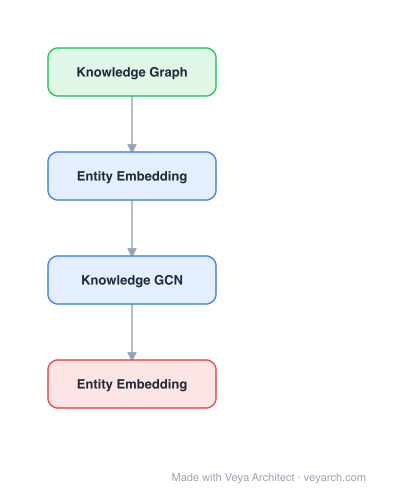

# Architecture: Knowledge Hypergraph

## Motivation

The paper addresses **link prediction in knowledge hypergraphs** — predicting unknown relationships among entities where relations are defined on any number of entities (n-ary relations), not just binary (head, tail) pairs. Knowledge graphs store facts as binary relations `relation(head, tail)`, but real-world knowledge is inherently more complex: over 1/3 of entities in Freebase participate in non-binary relations, and 61% of relations are non-binary. Existing embedding-based methods (TransE, TransH, ComplEx) are effective for binary knowledge graph completion but make the strong assumption that all relations are binary.

The paper shows that converting non-binary relations to binary ones via standard techniques — **reification** (creating new entities and binary relations) or **star-to-clique** (converting a k-ary tuple into pairwise edges) — does not yield satisfactory results when existing link prediction methods are applied. Reification introduces new entities at test time with no learned embeddings; star-to-clique loses information (e.g., it cannot distinguish "Air Canada flies from New York to Los Angeles" from the true "Air Canada flies from Montreal to New York"). The paper introduces HSimplE and HypE, two embedding-based methods that work **directly with knowledge hypergraphs** without conversion.

## Core Idea

Knowledge hypergraph prediction extending beyond binary relations to n-ary relations.

## Architecture

### Overview

<b>Layer-by-layer (4 nodes)</b>

| # | Layer | Type | Params |
|---|---|---|---|
| 1 | Knowledge Graph | `input` |  |
| 2 | Entity Embedding | `embed` |  |
| 3 | Knowledge GCN | `gcn_conv` |  |
| 4 | Entity Embedding | `output` |  |

HSimplE and HypE are embedding-based link prediction models for knowledge hypergraphs. Both are based on the idea that predicting the existence of a relation among a set of entities depends on the **position** of each entity in the relation (otherwise the relation would be symmetric). Both models learn entity embeddings and relation embeddings, and define a scoring function that uses the relation embedding, entity embeddings, and their positions. HSimplE shifts the entity embedding by a position-dependent value; HypE learns separate positional (convolutional) embeddings disentangled from entity representations, transforming the entity representation based on its position. Both are proven fully expressive.

### Components

- **Entity embeddings:** Each entity `e` has a learned embedding vector. In HSimplE, a single embedding per entity is shifted by a position-dependent value. In HypE, entity embeddings are separate from positional embeddings.
- **Relation embeddings:** Each relation `r` has a learned embedding vector used in the scoring function.
- **Position-dependent transformation (HSimplE):** For a given entity in position `i` of a relation, the entity embedding is shifted by a value that depends on `i`. This allows the same entity to contribute differently depending on its role in the relation, while still allowing information flow between positions (the shift is a function of the same entity embedding).
- **Positional convolutional embeddings (HypE):** Learns positional embeddings that are disentangled from entity representations. These positional embeddings are used to transform (via convolution) the representation of an entity based on its position in the relation. This makes HypE more robust to changes in the position of an entity within a tuple.
- **Scoring function:** For a tuple `(e_1, ..., e_k)` with relation `r`, the scoring function combines the relation embedding, the (position-transformed) entity embeddings, and outputs the probability that the tuple is true.

### Data Flow

1. **Input:** A knowledge hypergraph with n-ary relations (e.g., `flies_between(Air Canada, Montreal, New York)`).
2. **Entity and relation embedding lookup:** Retrieve learned embeddings for each entity and the relation in the query tuple.
3. **Position-dependent transformation:** Apply the position-specific shift (HSimplE) or positional convolution (HypE) to each entity embedding based on its position in the tuple.
4. **Scoring:** Compute the score for the tuple using the relation embedding and position-transformed entity embeddings.
5. **Prediction:** The score indicates the probability that the tuple is a true fact; high-scoring tuples are predicted as existing relationships.
6. **Training:** Margin-based or cross-entropy loss on observed (positive) and corrupted (negative) tuples; the model learns to score true tuples higher than false ones.

### State / Memory

Stateless at inference. The learned entity and relation embeddings are the persistent model state. There is no recurrent or dynamic memory; the scoring function is a feed-forward computation over embeddings.

## Design Decisions

- **Working directly on hypergraphs (no conversion):** The paper demonstrates that reification and star-to-clique conversions fail for link prediction (reification introduces unseen entities; star-to-clique loses information). Working directly on n-ary relations avoids both failure modes.
- **Position-dependent entity representation:** Relations are not symmetric — "Air Canada flies Montreal→NYC" differs from "Air Canada flies NYC→Montreal." Position-dependent transformations capture this asymmetry while allowing information flow between positions of the same entity.
- **Disentangled positional embeddings (HypE over HSimplE):** HypE separates positional embeddings from entity representations, making it more robust to position changes and allowing more flexible position-specific transformations via convolution.
- **Full expressiveness:** Both models are proven fully expressive — they can represent any valid knowledge hypergraph, unlike TransH/m-TransH which have known expressiveness limitations.

## Evolution

**Predecessors:**
- TransE (Bordes et al., 2013) — translational embedding for binary knowledge graphs.
- TransH (Wang et al., 2014) — relation-specific hyperplanes for binary relations.
- m-TransH (Wen et al., 2016) — extends TransH to knowledge hypergraphs but is not fully expressive.
- ComplEx (Trouillon et al., 2016) — complex-valued embeddings for binary relations.

**Successors:**
- HypE and HSimplE became baselines for subsequent knowledge hypergraph completion methods.
- Neural-symbolic approaches combining hypergraph embeddings with logic rules.
- Hypergraph neural networks for relational learning beyond embedding-based methods.

## Characteristics

| Property | Value |
|----------|-------|
| Year | 2019 |
| Authors | Fatemi et al. |
| Category | GNN/Hypergraph |
| Source Paper | `Knowledge_hypergraphs_prediction_beyond_binary_relations_Fatemi_Taslakian_2019.md` |
| PaperVault Path | `GNN/05-hypergraphs-topology/Knowledge_hypergraphs_prediction_beyond_binary_relations_Fatemi_Taslakian_2019.md` |

## Limitations

- **Fixed arity per relation:** Each relation has a fixed arity (number of entities); relations with variable arity require separate handling or padding.
- **Embedding-based (transductive):** Each entity needs a learned embedding; unseen entities at test time cannot be predicted without retraining or feature-based extensions.
- **Scalability to very large hypergraphs:** The embedding table grows with the number of entities; very large knowledge bases require memory-efficient or partitioned approaches.
- **No neural message passing:** The models are embedding-based (lookup + transform + score) rather than message-passing GNNs, potentially missing structural neighborhood information.
- **Position sensitivity:** While position-dependent transformations capture asymmetry, they assume a canonical ordering of positions within each relation, which may not always be natural.

## Implementation Notes

See `implementation/` for a minimal runnable implementation.

## Information Layers

- **Evidence:** Source paper available in `references/papers/`
- **Analysis:** The paper's key contribution is demonstrating that standard binary-to-n-ary conversion techniques (reification, star-to-clique) fundamentally fail for embedding-based link prediction, and providing principled alternatives (HSimplE, HypE) that work directly on hypergraphs. The position-dependent transformation is the core insight — it captures the asymmetry of n-ary relations while maintaining information flow. The full expressiveness proofs provide theoretical guarantees absent in prior work (m-TransH).
- **Hypothesis:** The transductive limitation could be addressed by combining entity features with embeddings, enabling zero-shot prediction on unseen entities. Message-passing extensions could incorporate neighborhood structure beyond the immediate tuple. The fixed-arity assumption could be relaxed with variable-arity scoring functions based on set transformers or Deep Sets.
