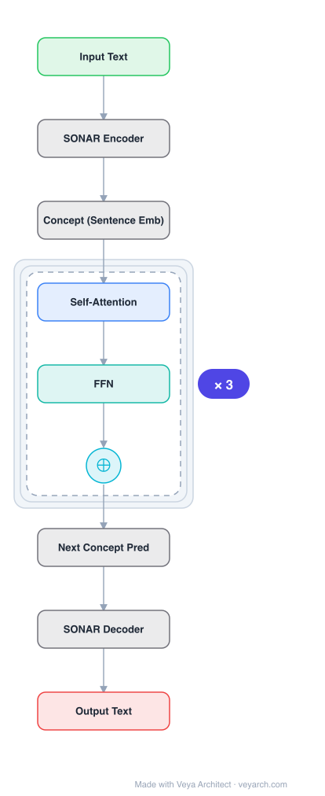

# Architecture: LCM (Large Concept Model)

## Motivation

LLMs process input and generate output at the token level, which is in sharp contrast to humans who operate at multiple levels of abstraction well beyond single words to analyze information and generate creative content. Current token-level LLMs struggle with hierarchical planning, long-form coherence, and cross-lingual generalization. The goal is to build an architecture that operates on an explicit higher-level semantic representation called a "concept" that is language- and modality-agnostic.

## Core Idea

A Large Concept Model (LCM) that operates on sentence-level representations ("concepts") rather than tokens. Concepts are language- and modality-agnostic representations in the SONAR sentence embedding space (supporting 200+ languages in text and speech). The LCM performs autoregressive sentence prediction in the embedding space, enabling hierarchical language modeling with impressive zero-shot multilingual generalization.

## Architecture

### Overview

<b>Layer-by-layer (9 nodes)</b>

| # | Layer | Type | Params |
|---|---|---|---|
| 1 | Input Text | `input` |  |
| 2 | SONAR Encoder | `custom` |  |
| 3 | Concept (Sentence Emb) | `custom` |  |
| 4 | Self-Attention | `attention` |  |
| 5 | FFN | `ffn` |  |
| 6 | ⊕ | `residual` |  |
| 7 | Next Concept Pred | `custom` |  |
| 8 | SONAR Decoder | `custom` |  |
| 9 | Output Text | `output` |  |

The LCM replaces token-level language modeling with concept-level (sentence-level) language modeling. It uses the SONAR sentence encoder/decoder to map between text/speech and a unified embedding space. The LCM core model operates autoregressively in this embedding space, predicting the next sentence embedding given previous sentence embeddings. Multiple architectures are explored: MSE regression, diffusion-based generation, and quantized SONAR space models.

### Components

1. **SONAR Encoder** — Maps input text or speech in 200+ languages to a fixed-dimensional sentence embedding ("concept"). This is a pre-trained multilingual sentence encoder.

2. **LCM Core Model** — The central language model that operates on concept (sentence embedding) sequences. Explored variants:
   - **MSE Regression**: Direct regression of next concept embedding via MSE loss
   - **Diffusion-based**: Diffusion model for generating next concept in embedding space
   - **Quantized SONAR**: Model operating in a quantized version of SONAR space (discrete concepts)

3. **SONAR Decoder** — Maps predicted concept embeddings back to text or speech in any of the 200+ supported languages.

4. **Sentence-level attention** — The LCM core uses transformer-based attention over sentence embeddings, not token embeddings.

### Data Flow

1. **Input**: Text/speech in any language → sentence segmentation
2. **SONAR Encoding**: Each sentence → SONAR embedding (concept)
3. **LCM Core**: Sequence of concept embeddings → autoregressive next-concept prediction
   - MSE: `c_{t+1} = LCM(c_1, c_2, ..., c_t)` (direct regression)
   - Diffusion: `c_{t+1} ~ LCM(c_1, c_2, ..., c_t)` (diffusion sampling)
   - Quantized: `c_{t+1} = Codebook[LCM(c_1, ..., c_t)]` (discrete concept)
4. **SONAR Decoding**: Predicted concept embedding → text/speech in target language
5. **Output**: Generated text/speech at sentence level

### State / Memory

- **Concept sequence context**: The LLM core maintains a context window of previous concept (sentence) embeddings. Since each concept represents a full sentence, the effective context in tokens is much larger than the number of concepts.
- **No token-level state**: Unlike token-level LLMs, the LCM does not maintain intra-sentence state during generation; each sentence is generated as a unit.
- **SONAR embedding space**: The fixed SONAR embedding space serves as a stable, pre-trained representation space that anchors concept generation.

## Design Decisions

1. **Sentence-level modeling** — Operating at the sentence level rather than token level provides:
   - Hierarchical abstraction (concepts > tokens)
   - Better long-form coherence (planning at sentence level)
   - Cross-lingual generalization (concepts are language-agnostic)

2. **SONAR embedding space** — Using an existing multilingual sentence embedding space (SONAR, 200+ languages) provides:
   - Language-agnostic representations
   - Modality-agnostic (text + speech)
   - Pre-trained, stable embedding space

3. **Multiple generation approaches** — Exploring MSE regression, diffusion, and quantized approaches allows comparison of different concept generation paradigms.

4. **Autoregressive sentence prediction** — Predicting the next sentence (concept) given previous sentences enables hierarchical planning: the model plans at the sentence level before generating individual tokens.

5. **Scaling to 7B parameters** — The diffusion-based architecture is scaled to 7B parameters and 2.7T training tokens, demonstrating feasibility at scale.

## Evolution

**Predecessors:**
- **Transformer** (Vaswani et al., 2017) — Base architecture for LCM core.
- **LLMs (GPT, LLaMA)** — Token-level language models.
- **SONAR** (Duquenne et al., 2023) — Multilingual sentence embedding space.
- **SentenceVAE** (An et al., 2024) — Prior sentence-level language model.
- **INSET** (Huang et al., 2020) — Sentence infilling with denoising autoencoder.
- **I-JEPA / V-JEPA** (Assran et al., 2024; Bardes et al., 2024) — Joint embedding predictive architecture for images/video.

**Successors:**
- Hierarchical language models with multiple abstraction levels.
- Multilingual concept-level models with larger concept vocabularies.
- Models operating at even higher abstraction levels (paragraph, document).

## Characteristics

| Property | Value |
|----------|-------|
| Year | 2024 |
| Authors | Barrault, Duquenne, Elbayad, et al. (FAIR at Meta) |
| Category | DL/Transformer |
| Source Paper | `Large_Concept_Models_Language_Modeling_in_a_Sentence_Represe_Alastruey_Andrews_Coria_2025.md` |
| PaperVault Path | `DL-Architectures/01-transformers/Large_Concept_Models_Language_Modeling_in_a_Sentence_Represe_Alastruey_Andrews_Coria_2025.md` |

## Limitations

1. **Sentence granularity** — Concepts are fixed at the sentence level; finer (phrase) or coarser (paragraph) granularity is not explored.
2. **SONAR dependency** — The model depends on the quality and coverage of the SONAR embedding space; errors in SONAR encoding/decoding propagate.
3. **Information loss** — Sentence-level modeling loses token-level information; intra-sentence structure is handled by the SONAR decoder, not the LCM.
4. **Generation speed** — Generating one sentence at a time may be slower than token-level generation for short outputs.
5. **Evaluation limitations** — Primarily evaluated on summarization and summary expansion; broader task evaluation is limited.
6. **Concept definition** — The assumption that a concept = a sentence is a simplification; real concepts may not align with sentence boundaries.

## Implementation Notes

See `implementation/` for a minimal runnable implementation. Key details:
- SONAR encoder: maps text/speech (200+ languages) → sentence embeddings
- LCM core: transformer operating on sentence embedding sequences
  - MSE regression: direct next-concept prediction
  - Diffusion: diffusion-based concept generation
  - Quantized: discrete concept codebook
- SONAR decoder: maps concept embeddings → text/speech
- Scaled to 1.6B and 7B parameters
- Training data: ~1.3T tokens (1.6B model), ~2.7T tokens (7B model)
- Tasks: summarization, summary expansion
- Zero-shot multilingual generalization to 200+ languages
- Training code at github.com/facebookresearch

## Information Layers

- **Evidence:** Source paper available in `references/papers/` (Barrault, Duquenne, Elbayad et al., 2024, "Large Concept Models: Language Modeling in a Sentence Representation Space")
- **Analysis:** The LCM represents a fundamental shift in language modeling: from token-level to concept-level. The key insight is that human language understanding is hierarchical — we plan at the idea/sentence level, not the token level. By operating on sentence embeddings, the LCM can plan at a higher level, potentially improving long-form coherence and cross-lingual generalization. The use of SONAR (200+ languages) enables impressive zero-shot multilingual transfer. The comparison of MSE, diffusion, and quantized approaches provides insight into how to best generate continuous representations.
- **Hypothesis:** The sentence-level abstraction may be the first step toward truly hierarchical language models with multiple abstraction levels (token → phrase → sentence → paragraph → document). The concept-level approach may be particularly beneficial for tasks requiring long-range planning (story generation, multi-document summarization, dialogue). The language-agnostic nature of concepts may enable better cross-lingual transfer than token-level models, as the model learns language-independent semantic structure.
