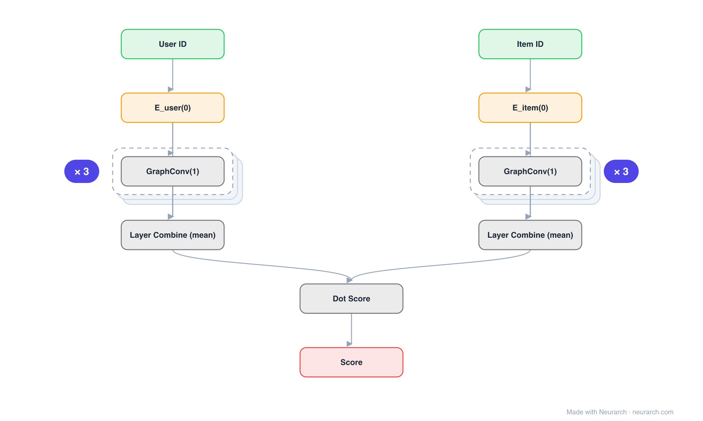

# Architecture: LightGCN

## Motivation

Graph convolution for collaborative filtering stripped to its minimum: no feature transforms, no nonlinearities, just neighborhood propagation over the user-item graph and a layer-wise average.

## Core Idea

Graph convolution for collaborative filtering stripped to its minimum: no feature transforms, no nonlinearities, just neighborhood propagation over the user-item graph and a layer-wise average.

## Architecture

### Overview

<b>Layer-by-layer (14 nodes)</b>

| # | Layer | Type | Params |
|---|---|---|---|
| 1 | User ID | `input` | shape: [1] |
| 2 | E_user(0) | `embedding` | vocabSize: 100000, embeddingDim: 64 |
| 3 | GraphConv(1) | `graphConv` | inFeatures: 64, outFeatures: 64, useTransform: false, useNonlinearity: false |
| 4 | GraphConv(2) | `graphConv` | inFeatures: 64, outFeatures: 64, useTransform: false, useNonlinearity: false |
| 5 | GraphConv(3) | `graphConv` | inFeatures: 64, outFeatures: 64, useTransform: false, useNonlinearity: false |
| 6 | Layer Combine (mean) | `mean` | dim: 0, numInputs: 4 |
| 7 | Item ID | `input` | shape: [1] |
| 8 | E_item(0) | `embedding` | vocabSize: 1000000, embeddingDim: 64 |
| 9 | GraphConv(1) | `graphConv` | inFeatures: 64, outFeatures: 64, useTransform: false, useNonlinearity: false |
| 10 | GraphConv(2) | `graphConv` | inFeatures: 64, outFeatures: 64, useTransform: false, useNonlinearity: false |
| 11 | GraphConv(3) | `graphConv` | inFeatures: 64, outFeatures: 64, useTransform: false, useNonlinearity: false |
| 12 | Layer Combine (mean) | `mean` | dim: 0, numInputs: 4 |
| 13 | Dot Score | `matmul` |   |
| 14 | Score | `output` |   |

This graph ships in Neurarch's in-app template library; the copy here passes shape propagation with zero errors.

### Design Notes

- An ablation result turned architecture: removing the transforms and activations from NGCF improved accuracy.
- Final embeddings average over propagation layers (layer combination), capturing multi-hop signals at different ranges.

## Design Decisions

> **Analysis** — Observations derived from studying the architecture.

- An ablation result turned architecture: removing the transforms and activations from NGCF improved accuracy.
- Final embeddings average over propagation layers (layer combination), capturing multi-hop signals at different ranges.

## Implementation Notes

- `model.json` contains the full structural graph with real dimensions and parameters.
- Open in [Neurarch](https://www.neurarch.com/) to visualize, edit, or export training code.
- Diagrams fold repeated identical blocks with a `× N` badge; `model.json` holds all nodes at real dimensions.

## Limitations

- This package focuses on the architectural structure. Training pipelines, 
dataset preparation, and production optimizations are out of scope.

## Evolution

> See `references/related/` for predecessor and successor architectures.

