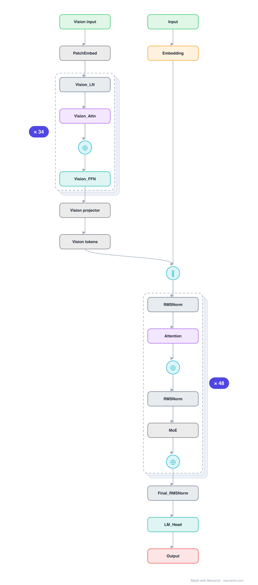

# Architecture: Llama 4 Scout

## Motivation

Meta's first MoE and first 10M-context model. Architecturally the interesting bits are top-1 routing over 16 fat experts and iRoPE's position-free layers; reception was mixed, but the design choices are worth studying.

## Core Idea

Meta's first MoE and first 10M-context model.

## Architecture

### Overview

*Identical repeated blocks are folded into one representative block with a `× N` badge, so the whole architecture fits on screen. `model.json` uses a NAXS block template + `repeat` directive: the identical repeated layers are defined once and expand to all 434 nodes (open it in Neurarch to see and edit every layer). Vector: [diagram.svg](assets/diagram.svg).*

| Hyperparameter | Value |
|---|---|
| Type | Decoder-only transformer, sparse MoE (causal LM) |
| Parameters | 109B total, 17B active |
| Layers | 48 |
| Hidden size | 5120 |
| Attention | Grouped-query: 40 query heads, 8 KV heads |
| Head dim | 128 |
| FFN | MoE: 16 routed experts, top-1 + 1 shared, expert dim 8,192 |
| Normalization | RMSNorm, pre-norm |
| Positions | iRoPE: RoPE on 36 of 48 layers, every 4th layer position-free (NoPE) |
| Vocabulary | 202,048 |
| Max context | 10,485,760 |

`model.json` is the full 48-layer graph (the repeated layers expressed via a NAXS block template + `repeat`), produced with the same import path the Neurarch app uses for "load from Hugging Face", with all hyperparameters from the official `config.json`.

### Design Notes

- Coarse MoE, the opposite of DeepSeek's recipe: 16 large experts with top-1 routing plus a shared expert, in every layer (interleave step 1).
- iRoPE for the 10M-token context claim: interleaved layers drop positional encoding entirely (12 of 48 are NoPE, verified from config), betting that attention-only layers generalize past the trained length.
- GQA 40:8 at 5120 hidden; 202048-token vocabulary; natively multimodal (a 34-layer vision tower feeds the same decoder; this entry shows the text stack).
- Hyperparameters verified via the unsloth mirror of the config (the meta-llama repo is gated).

### Parameter Check

Neurarch's per-layer parameter estimate over this graph: **102.55B**.
Hugging Face safetensors metadata reports **108.64B** for the real weights.
Deviation from the authoritative count (108.64B): **-5.6%**.

> The graph sum lands ~6% under the safetensors total, which includes the 34-layer vision tower this text-stack entry omits.

## Design Decisions

> **Analysis** — Observations derived from studying the architecture.

- Coarse MoE, the opposite of DeepSeek's recipe: 16 large experts with top-1 routing plus a shared expert, in every layer (interleave step 1).
- iRoPE for the 10M-token context claim: interleaved layers drop positional encoding entirely (12 of 48 are NoPE, verified from config), betting that attention-only layers generalize past the trained length.
- GQA 40:8 at 5120 hidden; 202048-token vocabulary; natively multimodal (a 34-layer vision tower feeds the same decoder; this entry shows the text stack).
- Hyperparameters verified via the unsloth mirror of the config (the meta-llama repo is gated).

## Implementation Notes

- `model.json` contains the full structural graph with real dimensions and parameters, using a NAXS block template + `repeat` for the identical repeated layers.
- Open in [Neurarch](https://www.neurarch.com/) to visualize, edit, or export training code.
- Diagrams fold repeated identical blocks with a `× N` badge; `model.json` defines each repeated layer once at real dimensions and expands to all nodes.

## Limitations

- This package focuses on the architectural structure. Training pipelines, 
dataset preparation, and production optimizations are out of scope.

## Evolution

> See `references/related/` for predecessor and successor architectures.

