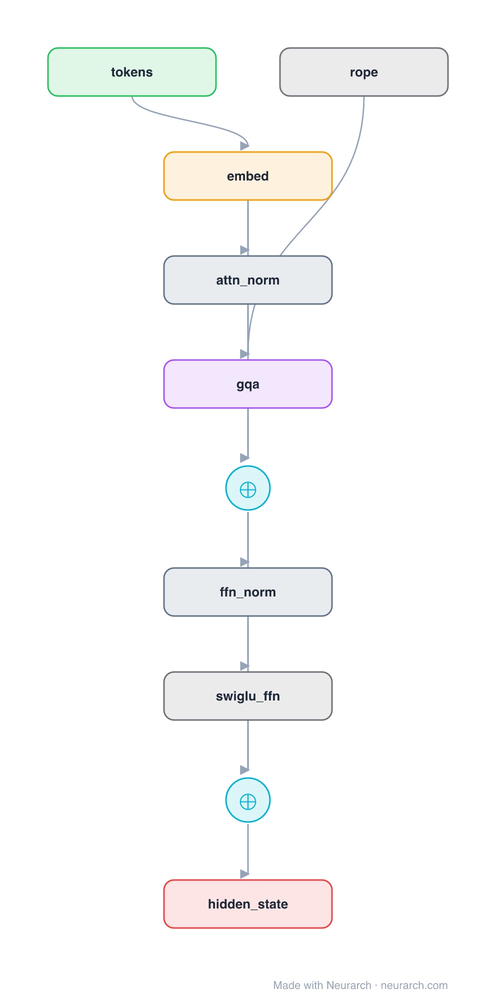

# Architecture: Llama-3 Decoder Block

## Motivation

A single Llama-3 decoder block at 8B dimensions, expanded to individual operations: RMSNorm, grouped-query attention with RoPE, residual add, RMSNorm, SwiGLU FFN, residual add. The companion to the full [llama3-8b](../llama3-8b/) entry.

## Core Idea

A single Llama-3 decoder block at 8B dimensions, expanded to individual operations: RMSNorm, grouped-query attention with RoPE, residual add, RMSNorm, SwiGLU FFN, residual add.

## Architecture

### Overview

<b>Layer-by-layer (10 nodes)</b>

| # | Layer | Type | Params |
|---|---|---|---|
| 1 | tokens | `input` | shape: [1, 2048] |
| 2 | embed | `embedding` | numEmbeddings: 128256, embeddingDim: 4096 |
| 3 | attn_norm | `rmsNorm` | normalizedShape: 4096 |
| 4 | gqa | `groupedQueryAttention` | embedDim: 4096, numHeads: 32, numKVHeads: 8 |
| 5 | rope | `rope` | dim: 128, maxSeqLen: 8192 |
| 6 | residual_1 | `add` |   |
| 7 | ffn_norm | `rmsNorm` | normalizedShape: 4096 |
| 8 | swiglu_ffn | `swiglu` | embedDim: 4096, intermediateSize: 14336 |
| 9 | residual_2 | `add` |   |
| 10 | hidden_state | `output` |   |

This graph ships in Neurarch's in-app template library; the copy here passes shape propagation with zero errors.

### Design Notes

- Shows the block internals that the full-model entry collapses: both residual streams, the pre-norm placement, and RoPE feeding the attention node.
- GQA 32 query heads over 8 KV heads; SwiGLU intermediate size 14336.
- Useful as a starting graph when you want to modify the block itself (try MoE, different norms, attention variants) and re-validate.

## Design Decisions

> **Analysis** — Observations derived from studying the architecture.

- Shows the block internals that the full-model entry collapses: both residual streams, the pre-norm placement, and RoPE feeding the attention node.
- GQA 32 query heads over 8 KV heads; SwiGLU intermediate size 14336.
- Useful as a starting graph when you want to modify the block itself (try MoE, different norms, attention variants) and re-validate.

## Implementation Notes

- `model.json` contains the full structural graph with real dimensions and parameters.
- Open in [Neurarch](https://www.neurarch.com/) to visualize, edit, or export training code.
- Diagrams fold repeated identical blocks with a `× N` badge; `model.json` holds all nodes at real dimensions.

## Limitations

- This package focuses on the architectural structure. Training pipelines, 
dataset preparation, and production optimizations are out of scope.

## Evolution

> See `references/related/` for predecessor and successor architectures.

