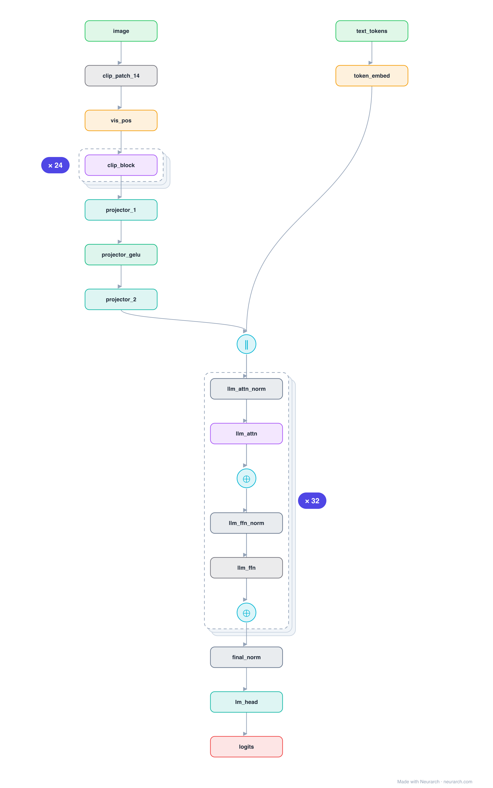

# Architecture: LLaVA-1.5-7B

## Motivation

The canonical recipe for making an LLM see: a frozen CLIP vision encoder, a tiny MLP projector that maps image-patch features into the LLM's token embedding space, and a Llama decoder that attends over image and text tokens jointly. Simple, and it defined the open multimodal-LLM playbook.

## Core Idea

The canonical recipe for making an LLM see: a frozen CLIP vision encoder, a tiny MLP projector that maps image-patch features into the LLM's token embedding space, and a Llama decoder that attends over image and text tokens jointly.

## Architecture

### Overview

*Identical repeated blocks are folded into one representative block with a `× N` badge, so the whole architecture fits on screen. `model.json` uses NAXS block templates + `repeat` directives and expands back to all 228 nodes (open it in Neurarch to see and edit every layer). Vector: [diagram.svg](assets/diagram.svg).*

| Hyperparameter | Value |
|---|---|
| Type | Multimodal LLM (vision + language) |
| Vision encoder | CLIP ViT-L/14-336 (frozen): 24 blocks, 1024 hidden |
| Projector | 2-layer MLP, 1024 → 4096 (the bridge) |
| LLM | Vicuna/Llama-7B: 32 decoder blocks, 4096 hidden |
| Fusion | Image tokens prepended to text tokens |
| Parameters | ~7B (mostly the LLM) |

`model.json` is the full graph, hand-built against the official config.json.

### Design Notes

- The whole trick is the projector: just a 2-layer MLP turning 576 image-patch vectors into 576 "visual tokens" the LLM can read; only it (and the LLM) are trained, the vision encoder stays frozen.
- Visual tokens are concatenated in front of the text tokens, so the unmodified Llama decoder treats the image as a prefix.
- This bridge-into-the-LLM pattern is what most open MLLMs (Qwen-VL, InternVL, ...) still follow.

### Parameter Check

Neurarch's per-layer parameter estimate over this graph: **7.06B**.

## Design Decisions

> **Analysis** — Observations derived from studying the architecture.

- The whole trick is the projector: just a 2-layer MLP turning 576 image-patch vectors into 576 "visual tokens" the LLM can read; only it (and the LLM) are trained, the vision encoder stays frozen.
- Visual tokens are concatenated in front of the text tokens, so the unmodified Llama decoder treats the image as a prefix.
- This bridge-into-the-LLM pattern is what most open MLLMs (Qwen-VL, InternVL, ...) still follow.

## Implementation Notes

- `model.json` contains the full structural graph with real dimensions and parameters, using NAXS block templates + `repeat` for repeated units.
- Open in [Neurarch](https://www.neurarch.com/) to visualize, edit, or export training code.
- Diagrams fold repeated identical blocks with a `× N` badge; `model.json` defines each repeated unit once at real dimensions and expands to all nodes.

## Limitations

- This package focuses on the architectural structure. Training pipelines, 
dataset preparation, and production optimizations are out of scope.

## Evolution

> See `references/related/` for predecessor and successor architectures.

