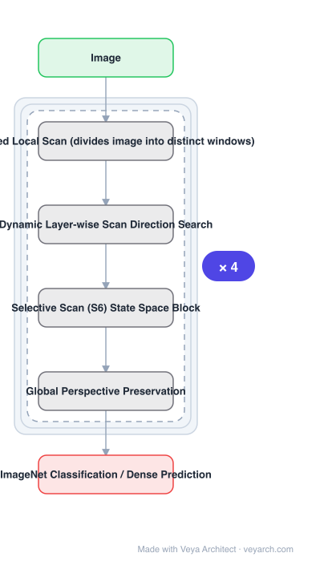

# Architecture: LocalMamba

## Motivation

SSMs, notably Mamba, progressed on long-sequence modelling in language, but in vision their application had **not markedly surpassed traditional CNNs and ViTs**. The diagnosed cause: traditional ViM approaches **flatten spatial tokens**, which **overlooks the preservation of local 2D dependencies** and thereby **elongates the distance between adjacent tokens**. The key to enhancing Vision Mamba, the paper posits, lies in **optimizing scan directions**.

## Core Idea

Two changes. First, a **windowed local scanning strategy**: divide images into distinct windows so local dependencies are captured while a global perspective is maintained. Second, a **dynamic method that independently searches the optimal scan choice for each layer**, motivated by the observation that **different network layers have varying preferences for scan patterns**.

## Architecture

### Overview

<b>Layer-by-layer (6 nodes)</b>

| # | Layer | Type | Params |
|---|---|---|---|
| 1 | Image | `input` |  |
| 2 | Windowed Local Scan (divides image into distinct windows) | `custom` |  |
| 3 | Dynamic Layer-wise Scan Direction Search | `custom` |  |
| 4 | Selective Scan (S6) State Space Block | `custom` |  |
| 5 | Global Perspective Preservation | `custom` |  |
| 6 | ImageNet Classification / Dense Prediction | `output` |  |

### Components

1. **Window division** — the image is split into distinct windows; scanning is organized within them so adjacent tokens stay close.
2. **Windowed local scan** — the local scanning strategy that captures local dependencies while maintaining a global perspective.
3. **Dynamic layer-wise scan search** — each layer's scan direction choice is searched independently, because scan preferences vary across layers.
4. **Selective scan (S6) block** — the underlying Mamba state-space block operating on the chosen scan.
5. **Plain and hierarchical model variants** — both are evaluated, showing the approach is not tied to one topology.

### Data Flow

Image → patch embedding → per-layer windowed scan (image divided into windows, tokens scanned along the layer's selected direction) → selective scan S6 block → next layer, with its own searched scan direction → task head.

### State / Memory

SSM recurrent state along each scan, as in Mamba. Windowing changes which tokens are adjacent in the scan order — that ordering, not memory capacity, is the quantity being optimized.

## Design Decisions

- **Fix scan direction, not the SSM** — the diagnosis is that ViM's weakness is the flattening, so the remedy belongs in the scan.
- **Windows, not global flattening** — keeps adjacent tokens adjacent, which is the stated defect of plain ViM.
- **Keep a global perspective alongside local windows** — local-only windows would trade one defect for another.
- **Search per layer rather than fix one direction globally** — justified by observed layer-dependent preferences; this is a stated contribution, not a detail.
- **Compare at equal FLOPs** — the +3.1% over Vim-Ti is reported at the same 1.5G FLOPs.

## Evolution

- **S4, LSSL, DSS** (predecessors): structured SSMs.
- **Mamba** (predecessor): selective scan with hardware-aware design.
- **Vim / Vision Mamba** (predecessor): SSM vision backbone, but flattens spatial tokens.
- **LocalMamba (2024)**: windowed local scan + dynamic per-layer scan search.
- **Siblings**: VMamba, MambaVision, Vision Mamba.
- **Contrast**: Vim-Ti — outperformed by 3.1% on ImageNet at the same 1.5G FLOPs.

## Characteristics

| Property | Value |
|---|---|
| Task | image classification / dense prediction |
| Core change | windowed local scanning instead of global flattening |
| Second change | dynamic per-layer scan direction search |
| Base block | selective scan (S6) |
| Variants | plain and hierarchical models |
| Gain | +3.1% ImageNet over Vim-Ti at same 1.5G FLOPs |

## Limitations

- Per-layer scan search adds a search stage and its cost to the design process.
- Window size and window-to-global balance are additional hyper-parameters.
- The searched configuration is dataset-dependent; transferring it may require re-searching.
- Improvements are measured against ViM baselines; the CNN/ViT gap that motivated the work is a separate question.

## Implementation Notes

Essentials: (1) divide the image into windows and scan within them — a single global flattening is precisely the defect the paper diagnoses, and it elongates the distance between adjacent tokens, (2) keep a global perspective alongside the local windows; going local-only just substitutes a different deficiency, (3) search the scan direction **per layer** rather than fixing one direction for the whole network — layer-dependent scan preference is an explicit observation behind the contribution, (4) evaluate both plain and hierarchical variants, since the claim is not tied to one topology, (5) compare at equal FLOPs against Vim-Ti, since the +3.1% figure only means something FLOP-matched.
