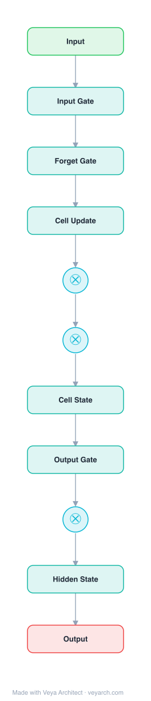

# Architecture: LSTM

## Motivation

Learning to store information over extended time intervals via recurrent backpropagation takes a very long time, mostly due to **insufficient, decaying error flow**. With conventional Back-Propagation Through Time (BPTT) or Real-Time Recurrent Learning (RTRL), error signals flowing backwards in time tend to either (1) blow up (leading to oscillating weights) or (2) vanish (making learning to bridge long time lags prohibitively slow or impossible). The temporal evolution of the backpropagated error exponentially depends on the size of the weights.

LSTM addresses this vanishing/exploding gradient problem in recurrent neural networks, enabling the learning of dependencies spanning 1000+ discrete time steps — tasks that had never been solved by previous recurrent network algorithms.

## Core Idea

Long Short-Term Memory (LSTM) maintains constant error flow through internal states of special units (the **constant error carrousel**, CEC), enforced by multiplicative **gate units** that learn to open and close access to the constant error flow. This prevents the vanishing gradient problem while allowing the network to selectively store, access, and forget information over long time intervals.

## Architecture

### Overview

<b>Layer-by-layer (11 nodes)</b>

| # | Layer | Type | Params |
|---|---|---|---|
| 1 | Input | `input` |  |
| 2 | Input Gate | `lstm` | type: sigmoid |
| 3 | Forget Gate | `lstm` | type: sigmoid |
| 4 | Cell Update | `lstm` | activation: tanh |
| 5 | ⊗ | `gate` | type: input_gate |
| 6 | ⊗ | `gate` | type: forget_gate |
| 7 | Cell State | `lstm` | activation: identity |
| 8 | Output Gate | `lstm` | type: sigmoid |
| 9 | ⊗ | `gate` | type: output_gate |
| 10 | Hidden State | `lstm` | activation: tanh |
| 11 | Output | `output` |  |

LSTM introduces a recurrent network architecture with special memory cells that maintain a constant error signal through time. The core innovation is the **constant error carrousel (CEC)** — a self-connected linear unit with fixed weight 1.0 and identity activation function, which allows gradients to flow backward indefinitely without vanishing or exploding. Multiplicative gates control read/write access to these memory cells, resolving the input weight conflict and output weight conflict problems.

### Components

1. **Memory cell (CEC)** — A self-connected unit with identity activation function `f(x) = x` and self-connection weight `w_jj = 1.0`. This is LSTM's central feature. The constant self-connection ensures that the error signal flowing through the cell remains constant (neither expanding nor vanishing), enabling long-term memory storage.

2. **Input gate** — A multiplicative gate that controls write operations to the memory cell. It learns to open when the cell should store new information and close when irrelevant inputs should be prevented from perturbing the stored content. This resolves the **input weight conflict** (where the same incoming weight must be used for both storing certain inputs and ignoring others).

3. **Output gate** — A multiplicative gate that controls read operations from the memory cell. It learns to open when the cell's content should be retrieved and close when the cell's content should not disturb other units. This resolves the **output weight conflict** (where the same outgoing weight must be used for both retrieving stored information and protecting other units from perturbation).

4. **(Later additions: forget gate and peephole connections)** — The original 1997 paper describes input and output gates. The forget gate (added by Gers et al., 2000) allows the cell to learn to reset its content when it becomes obsolete. Peephole connections allow gates to inspect the cell's internal state.

### Data Flow

1. **Input processing**: Input signals arrive at the memory cell and both gates.
2. **Input gate decision**: The input gate computes a value in [0, 1] that multiplicatively scales the input to the cell. When open (≈1), new information flows into the cell; when closed (≈0), the cell is protected from perturbation.
3. **Cell state update**: `s_t = s_{t-1} + input_gate_t · g(input_t)`, where the self-connection weight is 1.0 and the activation is the identity function. The cell state persists across time steps.
4. **Output gate decision**: The output gate computes a value in [0, 1] that multiplicatively scales the cell's output. When open, the cell's content is accessible; when closed, it's protected from disturbing other units.
5. **Output**: `h_t = output_gate_t · f(s_t)`, where f is typically the identity or a squashing function.

### State / Memory

- **Cell state (long-term memory)**: The self-connected CEC maintains information across potentially 1000+ time steps. The cell state `s_t` is the core memory mechanism — it persists information without decay.
- **Hidden state (short-term output)**: The gated output `h_t` controls what information from the cell state is currently exposed to the rest of the network.
- **Gate states**: The input and output gates have their own recurrent dynamics, learning context-sensitive access patterns.
- **No external memory**: All memory is internal to the recurrent state, local in space and time.

## Design Decisions

1. **Constant error carrousel (CEC)** — The self-connection with weight 1.0 and identity activation is the key design decision. It enforces constant error flow, directly addressing the vanishing gradient problem.

2. **Multiplicative gates** — Gates provide a context-sensitive mechanism for controlling access to memory cells, resolving the input/output weight conflicts that plague naive approaches. The multiplicative interaction allows gates to completely block or allow information flow.

3. **Truncated gradient computation** — Gradients are truncated at certain architecture-specific points, which does not affect long-term error flow through the CEC but prevents harmful short-term gradient interactions.

4. **Linear cell activation** — Using the identity function `f(x) = x` for the cell (rather than a squashing function) ensures that gradients flow through without attenuation.

5. **Local in space and time** — LSTM's computational complexity per time step and weight is O(1), making it efficient and scalable.

6. **Gate learning** — Gates learn through standard backpropagation, discovering when to open and close access to memory cells without manual engineering.

## Evolution

**Predecessors:**
- **Elman networks** (Elman, 1990) — Simple recurrent networks that suffer from vanishing gradients.
- **BPTT** (Williams and Zipser, 1989; Werbos, 1990) — Backpropagation through time, limited by vanishing gradients.
- **RTRL** (Robinson and Fallside, 1987) — Real-time recurrent learning, also limited by vanishing gradients.
- **Hochreiter's analysis** (1991) — Theoretical analysis of the vanishing gradient problem that motivated LSTM.

**Successors:**
- **GRU** (Cho et al., 2014) — Simplified LSTM with fewer gates (update gate, reset gate).
- **Peephole connections** (Gers & Schmidhuber, 2000) — Gates can directly inspect cell state.
- **Forget gate** (Gers et al., 2000) — Allows cells to learn to reset, enabling non-stationary task learning.
- **Transformers** (Vaswani et al., 2017) — Replaced recurrence with attention for many sequence tasks, though LSTMs remain relevant for streaming/real-time applications.
- **Mamba, RWKV, xLSTM** — Modern recurrent architectures inspired by LSTM's design principles.

## Characteristics

| Property | Value |
|----------|-------|
| Year | 1997 |
| Authors | Hochreiter & Schmidhuber |
| Category | DL/Sequence |
| Source Paper | `LSTM_Hochreiter_1997.md` |
| PaperVault Path | `DL-Architectures/02-sequence-models/LSTM_Hochreiter_1997.md` |

## Limitations

1. **Sequential computation** — Like all RNNs, LSTM processes sequences sequentially, limiting parallelization during training (unlike Transformers).
2. **Memory capacity limits** — Despite solving vanishing gradients, LSTMs have finite memory capacity; very long sequences can still exceed capacity.
3. **Gate complexity** — Multiple gates per cell increase parameter count and computational cost compared to simpler RNN units.
4. **Hyperparameter sensitivity** — The number and size of layers, gate initialization, and learning rate require careful tuning.
5. **Limited context window** — While far better than vanilla RNNs, LSTMs still struggle with very long-range dependencies compared to attention-based architectures.
6. **Training time** — Although faster than BPTT/RTRL on long time lag tasks, training on large datasets is still slower than parallelizable Transformer architectures.

## Implementation Notes

See `implementation/` for a minimal runnable implementation. Key implementation details:
- Cell state with self-connection weight 1.0 and identity activation
- Input gate: `i_t = σ(W_i · [x_t, h_{t-1}] + b_i)`
- Output gate: `o_t = σ(W_o · [x_t, h_{t-1}] + b_o)`
- Cell update: `s_t = s_{t-1} + i_t · g(W_c · [x_t, h_{t-1}] + b_c)`
- Hidden output: `h_t = o_t · f(s_t)`
- Computational complexity: O(1) per time step and weight

## Information Layers

- **Evidence:** Source paper available in `references/papers/` (Hochreiter & Schmidhuber, 1997, "Long Short-Term Memory")
- **Analysis:** LSTM's central insight — maintaining constant error flow through a self-connected linear unit — directly solves the vanishing gradient problem. The multiplicative gate mechanism elegantly resolves the input/output weight conflicts that prevent naive approaches from working. The design is remarkably general: gates learn context-sensitive access patterns without task-specific engineering.
- **Hypothesis:** The CEC principle (constant error flow through identity-activated self-connections) may generalize beyond gated architectures — any mechanism that preserves gradient magnitude through time could potentially serve as the basis for long-range sequence learning.
