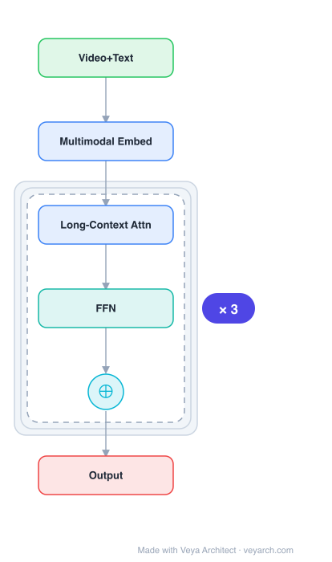

# Architecture: LWM (Large World Model)

## Motivation

Large language models (LLMs) have successfully served as a general-purpose interface across various natural language tasks. However, they struggle to natively process multimodal data such as images and audio. Being a basic part of intelligence, multimodal perception is a necessity for artificial general intelligence — both for knowledge acquisition and grounding to the real world. More importantly, unlocking multimodal input greatly widens the applications of language models to high-value areas such as multimodal machine learning, document intelligence, and robotics.

Prior multimodal approaches typically used task-specific architectures or required extensive finetuning. KOSMOS-1 was motivated by the goal of aligning perception with LLMs so that models can "see and talk" — natively perceiving general modalities, following instructions (zero-shot), and learning in context (few-shot), all within a unified Transformer-based architecture trained from scratch on web-scale multimodal corpora.

## Core Idea

Multimodal world model trained on long video sequences with RingAttention for million-token context.

## Architecture

### Overview

<b>Layer-by-layer (6 nodes)</b>

| # | Layer | Type | Params |
|---|---|---|---|
| 1 | Video+Text | `input` |  |
| 2 | Multimodal Embed | `embed` |  |
| 3 | Long-Context Attn | `attention` |  |
| 4 | FFN | `ffn` |  |
| 5 | ⊕ | `residual` |  |
| 6 | Output | `output` |  |

KOSMOS-1 is a Multimodal Large Language Model (MLLM) built on a Transformer-based causal language model backbone. Following the MetaLM philosophy, a Transformer decoder serves as a general-purpose interface to multimodal input. Text tokens and other modalities (e.g., images) are embedded into a unified vector space and fed into the decoder, which processes the sequence auto-regressively. The model is trained from scratch on web-scale multimodal corpora including monomodal text data, cross-modal image-caption pairs, and arbitrarily interleaved image-text documents.

### Components

1. **Transformer Decoder Backbone (Magneto)** — The core is Magneto, a Transformer variant with an extra LayerNorm added to each sublayer (multi-head self-attention and feed-forward network). Magneto provides better training stability and superior performance across modalities. It uses a theoretically derived initialization method for improved optimization, enabling effective scaling. The MLLM component has 24 layers, 2,048 hidden dimensions, 8,192 FFN intermediate size, and 32 attention heads (~1.3B parameters).

2. **Input Embedding Module** — Encodes both text tokens and continuous-signal modalities into vectors. For text, a lookup table maps tokens to embeddings. For images, a pretrained CLIP ViT-L/14 model (1,024 feature dimensions) serves as the vision encoder. Images are preprocessed to 224×224 resolution. The CLIP model is frozen except for the last layer during training.

3. **Resampler (Attentive Pooling)** — Reduces the number of image embeddings before feeding them into the Transformer decoder, making the model more efficient when processing visual input.

4. **XPOS Relative Position Encoding** — Employed for better long-context modeling. XPOS generalizes to different sequence lengths (train short, test long) and optimizes attention resolution for more precise position information capture. It is effective in both interpolation and extrapolation settings.

5. **Special Token Formatting** — Input is flattened as a sequence decorated with special tokens: `<s>` and `</s>` denote start/end of sequence; `<image>` and `</image>` indicate the beginning/end of encoded image embeddings. This unified format handles pure text (`<s> document </s>`) and interleaved image-text (`<s> paragraph <image> Image Embedding </image> paragraph </s>`).

6. **Softmax Classifier** — A linear layer upon the Transformer generates token probabilities over the vocabulary in an auto-regressive manner.

### Data Flow

1. **Input formatting**: Text tokens and image embeddings are assembled into a unified sequence decorated with special tokens (`<s>`, `</s>`, `<image>`, `</image>`).
2. **Embedding**: Text tokens are mapped via lookup table; images are encoded by the frozen CLIP ViT-L/14 encoder and reduced by the Resampler (attentive pooling).
3. **Positional encoding**: XPOS relative position encodings are applied to the embedded sequence.
4. **Causal decoding**: The Magneto Transformer decoder processes the sequence left-to-right with causal masking, producing next-token predictions conditioned on past context.
5. **Output generation**: A softmax classifier generates tokens over the vocabulary. Generation is auto-regressive — each step consumes previously generated symbols.
6. **Training**: The next-token prediction objective maximizes log-likelihood of tokens. Only discrete tokens (text) are accounted for in the training loss; image embeddings are input but not prediction targets.

### State / Memory

- **Auto-regressive cache**: During decoding, previously generated tokens serve as additional input, functioning as working memory.
- **No explicit external memory**: Unlike memory-augmented Transformers, KOSMOS-1 relies on the context window for information retention.
- **Cross-modal transfer**: The model demonstrates knowledge transfer from language to multimodal tasks and vice versa, suggesting the shared Transformer representation serves as a cross-modal memory.

## Design Decisions

1. **Magneto over standard Transformer** — Chosen for better training stability and superior performance across modalities. The extra LayerNorm per sublayer and theoretically derived initialization allow effective scaling without optimization pain.

2. **XPOS for relative position encoding** — Chosen over absolute or sinusoidal positional encodings because it generalizes to different lengths (train short, test long) and optimizes attention resolution. This is critical for a model that must handle variable-length multimodal input.

3. **Frozen CLIP encoder (except last layer)** — The vision encoder is pretrained CLIP ViT-L/14, frozen except for the last layer. This leverages strong pretrained visual representations while allowing some adaptation, reducing training cost.

4. **Resampler for image embedding reduction** — Attentive pooling reduces the number of image embeddings, making the model more efficient. This is important because raw image patches would consume too many sequence positions.

5. **Unified sequence format with special tokens** — Text and images are embedded into the same sequence space using special tokens (`<image>`, `</image>`). This allows a single Transformer decoder to handle arbitrary interleaving of modalities without modality-specific pathways.

6. **Web-scale multimodal training from scratch** — Training on monomodal text, cross-modal pairs, and interleaved data ensures the model robustly learns from diverse sources. Interleaved data naturally fits the multimodal language modeling task and enables few-shot ability.

7. **Language-only data for instruction calibration** — Instruction-following capability is calibrated across modalities by transferring language-only data, ensuring the model follows instructions regardless of input modality.

## Evolution

**Predecessors:**
- **MetaLM** — Established the philosophy of language models as general-purpose interfaces, with perception modules docked to the language model. KOSMOS-1 follows this framework directly.
- **CLIP** — Provided the pretrained vision encoder (ViT-L/14) used as the image embedding module.
- **Flamingo** — Concurrent multimodal LLM approach; KOSMOS-1 differs in training from scratch on web-scale interleaved data and using Magneto/XPOS.

**Successors:**
- **KOSMOS-2** — Extended KOSMOS-1 with grounding capability, enabling the model to perceive and reason about visual elements with spatial precision.
- **GPT-4V / GPT-4o** — Industry-scale multimodal LLMs that adopted similar principles of aligning perception with language models.
- The broader MLLM family (LLaVA, Qwen-VL, etc.) followed the paradigm KOSMOS-1 helped establish: unified Transformer decoder + vision encoder + web-scale multimodal training.

## Characteristics

| Property | Value |
|----------|-------|
| Year | 2023 |
| Authors | Lv et al. |
| Category | DL/Transformer |
| Source Paper | `Language_Is_Not_All_You_Need_Lv_Cui_Mohammed_etal_2023.md` |
| PaperVault Path | `DL-Architectures/01-transformers/Language_Is_Not_All_You_Need_Lv_Cui_Mohammed_etal_2023.md` |

## Limitations

1. **Resolution constraint** — Images are preprocessed to 224×224, limiting the ability to perceive fine-grained visual details or high-resolution content (e.g., small text in documents).

2. **Frozen vision encoder** — While freezing CLIP (except the last layer) reduces training cost, it limits the visual representation to what CLIP was pretrained on. The model cannot learn fundamentally new visual features beyond CLIP's capacity.

3. **No audio or video modality** — Despite being designed for "general modalities," KOSMOS-1 only implements vision + language. Extending to audio, video, or other modalities requires additional embedding modules.

4. **Auto-regressive decoding bottleneck** — While training is parallelizable, decoding remains sequential (one token at a time), limiting inference speed for long generations.

5. **Limited nonverbal reasoning** — The Raven IQ test results show promising but limited nonverbal reasoning capability, suggesting the model's perceptual reasoning lags behind its language capabilities.

6. **Hallucination in multimodal generation** — As with all MLLMs, the model can generate text that is inconsistent with the visual input, a problem not fully addressed.

## Implementation Notes

See `implementation/` for a minimal runnable implementation.

Key implementation details from the paper:
- MLLM: 24 layers, 2,048 hidden dims, 8,192 FFN intermediate, 32 attention heads (~1.3B params)
- Vision encoder: CLIP ViT-L/14, 1,024 feature dims, frozen except last layer
- Image resolution: 224×224
- Total parameters: ~1.6B
- Training: batch size 1.2M tokens (0.5M text + 0.5M image-caption + 0.2M interleaved), 300k steps (~360B tokens)
- Optimizer: AdamW with β = (0.9, 0.98)
- Implementation library: TorchScale
- Training data: The Pile + Common Crawl (text), LAION-2B/400M + COYO-700M + Conceptual Captions (image-caption), 71M interleaved web pages

## Information Layers

- **Evidence:** Source paper available in `references/papers/` — all architectural details (Magneto backbone, XPOS, CLIP encoder, Resampler, training data composition) are directly stated in the paper.
- **Analysis:** KOSMOS-1's key insight is that aligning perception with a Transformer-based language model — using a unified sequence format and web-scale multimodal training — enables zero-shot and few-shot multimodal capabilities without task-specific finetuning. The Magneto + XPOS choices address stability and length-generalization challenges inherent in multimodal training.
- **Hypothesis:** The cross-modal transfer observed (language → multimodal and vice versa) suggests that shared representations in the Transformer decoder encode modality-agnostic concepts, but the extent to which visual reasoning matches language reasoning remains an open question. The Raven IQ test results hint at emergent nonverbal reasoning that may improve with scale.
