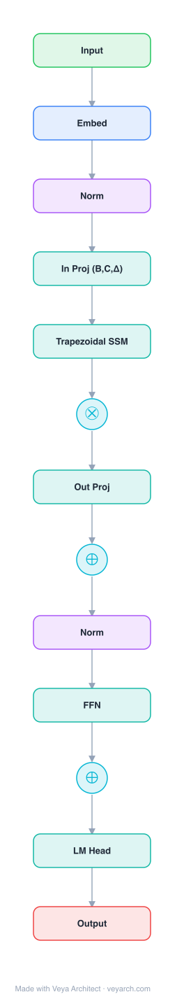

# Architecture: Mamba-3

## Motivation

The recent scaling of test-time compute for LLMs has made inference efficiency paramount, as the practical impact of AI systems depends critically on their ability to perform large-scale inference during deployment. While Transformer-based models are the standard, their quadratic compute and linear memory bottlenecks (KV cache) have spurred sub-quadratic alternatives. However, many recent linear-style models (Mamba-2, Gated DeltaNet) sacrifice quality and capabilities for efficiency. They lack state-tracking abilities (e.g., determining parity of bit sequences) and their decoding has low arithmetic intensity, leaving hardware idle.

Mamba-3 is motivated by an **inference-first perspective**: developing a model that excels across three axes — (i) quality, (ii) capability (state-tracking), and (iii) inference efficiency — guided by the classical state-space model (SSM) viewpoint.

## Core Idea

Improved sequence modeling using state-space principles: combining (1) more expressive trapezoidal discretization, (2) complex-valued state update rules for richer state tracking, and (3) multi-input multi-output (MIMO) formulation for better hardware parallelism during decoding, resulting in a stronger model that better exploits hardware parallelism.

## Architecture

### Overview

<b>Layer-by-layer (13 nodes)</b>

| # | Layer | Type | Params |
|---|---|---|---|
| 1 | Input | `input` |  |
| 2 | Embed | `embed` |  |
| 3 | Norm | `norm` |  |
| 4 | In Proj (B,C,Δ) | `linear` |  |
| 5 | Trapezoidal SSM | `ssm` | discretization: trapezoidal, state: complex, formulation: MIMO |
| 6 | ⊗ | `gate` |  |
| 7 | Out Proj | `linear` |  |
| 8 | ⊕ | `residual` |  |
| 9 | Norm | `norm` |  |
| 10 | FFN | `ffn` |  |
| 11 | ⊕ | `residual` |  |
| 12 | LM Head | `linear` |  |
| 13 | Output | `output` |  |

Mamba-3 builds on Mamba-2 with three core methodological changes inspired by the classical SSM toolbox (Kalman filtering, signal processing). The architecture combines trapezoidal discretization, complexified state updates, and MIMO formulation into a new mixer primitive. It also adopts QK-normalization (replacing the pre-output projection norm) and makes the short convolution optional, aligning more closely with the baseline Transformer architecture.

### Components

1. **Trapezoidal Discretization** — The continuous-time dynamical system is discretized using a trapezoidal methodology instead of zero-order hold (ZOH). The resulting recurrence is a more expressive superset of Mamba-2's recurrence and can be viewed as a convolution. Combined with applied biases on B, C, this empirically replaces the short causal convolution used in prior subquadratic models.

2. **Complexified State-Space Model** — By viewing the underlying SSM as complex-valued, Mamba-3 enables a more expressive state update compared to Mamba-2's real-valued updates. This complex update rule overcomes the lack of state-tracking ability common in linear models. The complex-valued update is equivalent to a data-dependent rotary embedding (RoPE-like), enabling efficient computation.

3. **Multi-Input, Multi-Output (MIMO) SSM** — To improve FLOP-efficiency during decoding, Mamba-3 shifts from outer-product-based state update (SISO) to matrix-multiplication-based state update (MIMO). This generalization from single-input single-output to multiple-input multiple-output increases expressivity and compute during state update without increasing state size, preserving inference speed.

4. **QK-Normalization** — Replaces the pre-output projection norm with the more common QK-normalization used in modern Transformer architectures.

5. **Optional short convolution** — The short convolution, a common component in many subquadratic models, is made optional in Mamba-3.

### Data Flow

1. **Input projection**: Input tokens are projected to produce input-dependent parameters B_t, C_t, Δ_t (with applied biases).
2. **Trapezoidal discretization**: (Δ_t, A, B_t) → (Ā_t, B̄_t) via trapezoidal discretization (more expressive than ZOH).
3. **Complex state update**: `h_t = Ā_t · h_{t-1} + B̄_t · x_t` where h and the update rule are complex-valued, enabling richer state tracking (equivalent to data-dependent rotary embeddings).
4. **MIMO output**: `y_t = C_t · h_t` with matrix-multiplication-based state update for better hardware utilization.
5. **Gating and residual**: Output is gated and added to the input via residual connection.

### State / Memory

- **Complex hidden state h_t**: A complex-valued finite-dimensional vector that compresses context history with richer state tracking capabilities (can solve parity-like tasks that real-valued SSMs cannot).
- **MIMO state**: The matrix-multiplication-based update allows multiple inputs to update the state simultaneously, increasing expressivity without increasing state size.
- **Constant memory during inference**: Like Mamba-2, requires only constant time per step during autoregressive inference.

## Design Decisions

1. **Trapezoidal over ZOH discretization** — Trapezoidal discretization yields a more expressive recurrence that is a superset of Mamba-2's, and when combined with B,C biases, empirically replaces the short causal convolution.

2. **Complex-valued state** — The complex update rule overcomes the state-tracking limitation of linear models. Its equivalence to data-dependent rotary embeddings (RoPE) allows efficient computation without explicit complex arithmetic.

3. **MIMO formulation** — Shifting from SISO to MIMO improves arithmetic intensity (FLOP-to-memory-traffic ratio) during decoding, keeping hardware busy. The extra expressivity comes without increasing state size.

4. **Inference-first design** — Unlike prior models developed from a training perspective, Mamba-3 is designed for hardware-efficient inference, addressing the low arithmetic intensity that leaves hardware idle.

5. **Architectural alignment with Transformers** — Adopting QK-normalization and making short convolution optional aligns Mamba-3 more closely with Transformer best practices.

## Evolution

**Predecessors:**
- **Mamba-1** (Gu & Dao, 2023) — Introduced selective state space models with input-dependent parameters.
- **Mamba-2** (Dao & Gu, 2024) — Improved training speed and simplicity but sacrificed expressiveness in the SSM parameterization, limiting quality.
- **Gated DeltaNet** (Yang et al., 2025) — Linear attention-style model with similar efficiency but limited state-tracking.
- **Classical SSM/Kalman filtering** (Kalman, 1960) — The signal processing foundations that inspire the MIMO generalization.

**Successors:**
- Future hybrid architectures combining Mamba-3 with attention layers.
- Potential extensions to multimodal settings.

## Characteristics

| Property | Value |
|----------|-------|
| Year | 2025 |
| Authors | Anonymous (under review) |
| Category | DL/Sequence |
| Source Paper | `Mamba_3_Improved_Sequenc_Modeling_Principles_2025.md` |
| PaperVault Path | `DL-Architectures/02-sequence-models/Mamba_3_Improved_Sequenc_Modeling_Principles_2025.md` |

## Limitations

1. **Still subquadratic** — While more efficient than Transformers, Mamba-3 still cannot match the dense routing quality of full attention on all tasks.
2. **Complexity of implementation** — The complex-valued state update and MIMO formulation add implementation complexity compared to simpler SSMs.
3. **Newer architecture** — Less mature ecosystem and fewer pre-trained models compared to Transformers.
4. **State capacity** — Despite complex states, the finite hidden state still imposes a compression limit for very long or information-dense sequences.
5. **Hardware dependency** — The efficient MIMO implementation relies on specific GPU memory hierarchy characteristics.

## Implementation Notes

See `implementation/` for a minimal runnable implementation. Key details:
- Trapezoidal discretization: more expressive superset of ZOH
- Complex-valued state update: equivalent to data-dependent RoPE
- MIMO: matrix-multiplication-based state update (vs SISO outer-product)
- QK-normalization replaces pre-output projection norm
- Short convolution is optional
- Inference: O(1) per token, constant memory

## Information Layers

- **Evidence:** Source paper available in `references/papers/` (2025, "Mamba-3: Improved Sequence Modeling Using State Space Principles")
- **Analysis:** Mamba-3's three improvements address specific weaknesses of Mamba-2: trapezoidal discretization increases expressiveness, complexification enables state-tracking (solving parity-like tasks), and MIMO improves hardware utilization during decoding. The inference-first perspective is a key paradigm shift — designing for arithmetic intensity rather than just asymptotic complexity.
- **Hypothesis:** The complex-valued state update rule, being equivalent to data-dependent rotary embeddings, suggests a deep connection between SSMs and positional encoding methods in Transformers. This connection may lead to unified architectures that combine the best of both paradigms.
