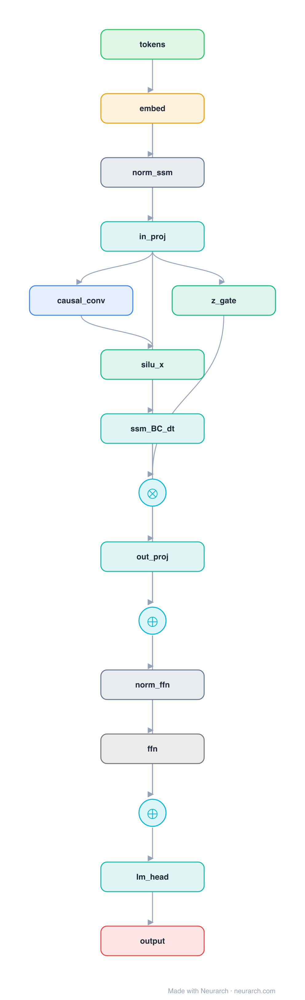

# Architecture: Mamba

## Motivation

Foundation models are almost universally based on the Transformer architecture and its core attention module. While self-attention is effective at routing information densely within a context window, it has fundamental drawbacks: an inability to model anything outside a finite window, and **quadratic scaling** with respect to sequence length. Many subquadratic-time architectures (linear attention, gated convolutions, recurrent models, structured state space models) have been developed to address this inefficiency, but they have not performed as well as attention on important modalities such as language.

Mamba identifies that a **key weakness** of prior subquadratic models is their inability to perform **content-based reasoning** — the ability to selectively propagate or forget information along the sequence depending on the current token. Prior structured state space models (SSMs) are linear time-invariant (LTI), meaning their dynamics are constant across all time steps, which prevents them from selectively filtering inputs.

## Core Idea

Selective state space models with input-dependent gating, enabling linear-time inference and linear-time training. By making SSM parameters functions of the input, the model can selectively propagate or forget information along the sequence length dimension depending on the current token, achieving Transformer-quality performance with linear scaling.

## Architecture

### Overview

<b>Layer-by-layer (16 nodes)</b>

| # | Layer | Type | Params |
|---|---|---|---|
| 1 | tokens | `input` | shape: [1, 1024] |
| 2 | embed | `embedding` | numEmbeddings: 50280, embeddingDim: 1024 |
| 3 | norm_ssm | `rmsNorm` | normalizedShape: 1024 |
| 4 | in_proj | `linear` | outFeatures: 4096, inFeatures: 1024 |
| 5 | causal_conv | `conv1d` | outChannels: 2048, kernelSize: 4, stride: 1, padding: 3, inChannels: 4096 |
| 6 | silu_x | `swish` |  |
| 7 | ssm_BC_dt | `linear` | outFeatures: 128, inFeatures: 4096 |
| 8 | z_gate | `swish` |  |
| 9 | gate_out | `multiply` |  |
| 10 | out_proj | `linear` | outFeatures: 1024, inFeatures: 128 |
| 11 | residual_1 | `add` |  |
| 12 | norm_ffn | `rmsNorm` | normalizedShape: 1024 |
| 13 | ffn | `swiglu` | embedDim: 1024, intermediateSize: 2048 |
| 14 | residual_2 | `add` |  |
| 15 | lm_head | `linear` | outFeatures: 50280, inFeatures: 1024 |
| 16 | output | `output` |  |

Mamba simplifies prior deep sequence model architectures by combining the design of SSM architectures (H3) with the MLP block of Transformers into a single homogeneous block. The architecture has **no attention and no MLP blocks** — instead, each block is a selective SSM with gated connections. The key innovation is making the SSM parameters (Δ, B, C) input-dependent (time-varying), which enables content-based selection while still allowing efficient computation via a hardware-aware parallel scan algorithm.

### Components

1. **Selective State Space Model (SSM)** — The core component. Unlike prior LTI SSMs where (Δ, A, B, C) are fixed, Mamba makes B, C, and Δ functions of the input:
   - `sB(x) = Linear_N(x)` — B is now input-dependent
   - `sC(x) = Linear_N(x)` — C is now input-dependent  
   - `sΔ(x) = Linear_D(Linear_1(x))`, with `τΔ = softplus` — Δ (the step size) is input-dependent
   - This makes the model **time-varying** (no longer LTI), enabling content-aware selection

2. **Discretization** — Continuous parameters (Δ, A, B) are transformed to discrete parameters (Ā, B̄) via zero-order hold (ZOH): `Ā = exp(ΔA)`, `B̄ = (ΔA)^{-1}(exp(ΔA) - I)·ΔB`

3. **Gated connections** — The architecture uses gated connections (similar to H3/Hyena) where the SSM output is multiplied by a gating branch, enabling multiplicative control over information flow.

4. **Hardware-aware parallel scan** — Since input-dependent parameters break the convolutional view, Mamba uses a parallel scan algorithm in recurrent mode that avoids materializing the expanded state, preventing IO access between GPU memory hierarchy levels.

### Data Flow

1. **Input projection**: Input token x is projected through linear layers to produce input-dependent parameters B_t, C_t, Δ_t.
2. **Discretization**: (Δ_t, A, B_t) → (Ā_t, B̄_t) via ZOH discretization.
3. **State update (recurrent)**: `h_t = Ā_t · h_{t-1} + B̄_t · x_t` — the hidden state is updated with input-dependent dynamics, allowing selective information storage.
4. **Output computation**: `y_t = C_t · h_t` — the output is computed from the current state with input-dependent read parameters.
5. **Gating**: The SSM output is multiplied by a gated branch (similar to a multiplicative gate), enabling the model to control what information passes through.
6. **Residual connection**: The gated output is added to the input (residual connection).

### State / Memory

- **Hidden state h_t**: A finite-dimensional vector (dimension N per channel, with D channels → total dimension DN) that compresses the entire context history. This is the model's "memory" — it must contain all necessary information from the context.
- **No KV cache**: Unlike Transformers, Mamba's recurrent form requires only constant-time per step during autoregressive inference, with no need to store previous elements.
- **Selective compression**: The input-dependent dynamics allow the model to selectively compress relevant information and discard irrelevant information, addressing the fundamental tradeoff between efficiency (small state) and effectiveness (rich state).

## Design Decisions

1. **Selection mechanism (input-dependent parameters)** — The core design decision: making B, C, Δ functions of the input enables content-aware reasoning. This is motivated by the observation that LTI models cannot solve selective copying or induction heads tasks, which require content-aware filtering.

2. **Breaking LTI** — Prior SSMs were LTI because it enabled efficient convolutional computation. Mamba deliberately breaks LTI to gain selectivity, accepting the loss of convolutional computation and replacing it with a hardware-aware parallel scan.

3. **Hardware-aware algorithm** — The parallel scan avoids materializing the expanded state (which would require O(BLDN) memory), instead keeping computation in GPU SRAM. This makes the implementation 3× faster on A100 GPUs compared to convolution-based SSMs.

4. **Simplified architecture (no attention, no MLP)** — Mamba combines the SSM and MLP blocks into a single homogeneous block, simplifying the architecture while maintaining or improving performance.

5. **Diagonal structure on A** — The A matrix uses diagonal structure (inherited from prior SSM work), reducing parameters and enabling efficient computation.

6. **Δ as step size with softplus** — The input-dependent Δ controls the "resolution" of the state update. Large Δ focuses on the current token (forgetting history); small Δ maintains long-range context. The softplus activation ensures positive values.

## Evolution

**Predecessors:**
- **S4** (Gu et al., 2021) — Structured state space sequence models, the foundation Mamba builds on. LTI, computed as convolutions.
- **H3** (Dao et al., 2023) — SSM architecture with gated connections that Mamba simplifies.
- **Hyena** (Poli et al., 2023) — Similar architecture with MLP-parameterized global convolution.
- **Transformer** (Vaswani et al., 2017) — The dominant architecture Mamba aims to match in quality while improving efficiency.

**Successors:**
- **Mamba-2** — Improved version with better hardware utilization and performance.
- **Mamba-3** — Further improvements to sequence modeling principles.
- **Jamba** — Hybrid Mamba-Transformer architectures combining both paradigms.
- **Various hybrid architectures** — Mamba blocks combined with attention layers for long-context language modeling.

## Characteristics

| Property | Value |
|----------|-------|
| Year | 2023 |
| Authors | Gu & Dao |
| Category | DL/Sequence |
| Source Paper | `Mamba_Linear_Time_Sequence_Modeling_with_Selective_State_Spa_Spaces_2025.md` |
| PaperVault Path | `DL-Architectures/02-sequence-models/Mamba_Linear_Time_Sequence_Modeling_with_Selective_State_Spa_Spaces_2025.md` |

## Limitations

1. **Recurrence during training** — Unlike Transformers which can fully parallelize across sequence length during training, Mamba's time-varying SSM requires a parallel scan (still linear time, but with sequential dependencies).
2. **State capacity** — The finite hidden state (dimension DN) must compress all context information; very long or information-dense sequences may exceed compression capacity.
3. **No explicit attention** — Some tasks may benefit from the dense routing that attention provides; pure Mamba may struggle with tasks requiring fine-grained token-to-token interactions.
4. **Copy-ahead limitation** — Time-varying dynamics mean the model cannot "look ahead" in the sequence during training (unlike bidirectional attention).
5. **Newer architecture** — Less mature ecosystem compared to Transformers; fewer optimized implementations and pre-trained models available.
6. **Hardware dependency** — The efficient implementation relies heavily on GPU memory hierarchy optimizations; performance on other hardware (TPUs, etc.) may vary.

## Implementation Notes

See `implementation/` for a minimal runnable implementation. Key implementation details:
- SSM parameters made input-dependent: B, C, Δ are functions of input x
- Discretization via ZOH: `Ā = exp(ΔA)`, `B̄ = (ΔA)^{-1}(exp(ΔA) - I)·ΔB`
- Parallel scan for efficient recurrent computation (avoiding materialized state)
- Diagonal A matrix structure
- Gated output with residual connection
- Inference: O(1) per token (no KV cache), O(n) total for sequence length n
- Training: O(n) time and memory (vs O(n²) for attention)

## Information Layers

- **Evidence:** Source paper available in `references/papers/` (Gu & Dao, 2023, "Mamba: Linear-Time Sequence Modeling with Selective State Spaces")
- **Analysis:** Mamba's central insight is that the efficiency-effectiveness tradeoff in sequence models is characterized by how well the state compresses context. LTI models (prior SSMs) are efficient but cannot selectively filter content. By making parameters input-dependent, Mamba gains selectivity while maintaining linear-time scaling through a hardware-aware scan. The design elegantly bridges the gap between RNNs (efficient, finite state) and Transformers (effective, dense routing) by giving the finite state the ability to selectively compress.
- **Hypothesis:** The selection principle (input-dependent dynamics) may be the key missing ingredient for subquadratic architectures to match Transformer quality. Any architecture that combines finite state with content-aware compression could potentially achieve similar results.
