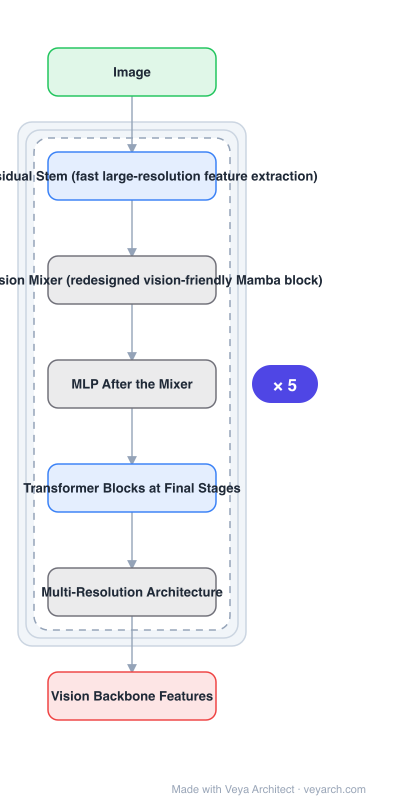

# Architecture: MambaVision

## Motivation

Mamba's success in NLP did not transfer cleanly to vision. Its formulation is better suited to causal sequence processing — it must process the entire sequence before making predictions — and the added complexity brings training difficulty and overfitting risk **without reliably improving accuracy**. The practical consequence: **ViT and CNN backbones still outperformed the best Mamba-based vision models**. Rather than abandon Mamba, MambaVision redesigns the block for vision and adds attention back where it actually helps.

## Core Idea

A **hybrid Mamba-Transformer backbone**. First, redesign the Mamba block into a vision-friendly **MambaVision Mixer**. Second, study integration patterns systematically and place **Transformer (self-attention) blocks at the final stages**, which measurably improves global context and long-range dependency capture, and increases image throughput versus both pure Mamba and ViT models. CNN residual blocks handle fast extraction of large-resolution features in a multi-resolution architecture.

## Architecture

### Overview

<b>Layer-by-layer (7 nodes)</b>

| # | Layer | Type | Params |
|---|---|---|---|
| 1 | Image | `input` |  |
| 2 | CNN Residual Stem (fast large-resolution feature extraction) | `conv2d` |  |
| 3 | MambaVision Mixer (redesigned vision-friendly Mamba block) | `custom` |  |
| 4 | MLP After the Mixer | `custom` |  |
| 5 | Transformer Blocks at Final Stages | `attention` |  |
| 6 | Multi-Resolution Architecture | `custom` |  |
| 7 | Vision Backbone Features | `output` |  |

### Components

1. **CNN-based residual stem / early stages** — fast feature extraction at larger resolutions.
2. **MambaVision Mixer** — the redesigned, vision-friendly Mamba block, followed by an MLP.
3. **Transformer blocks at the final stages** — self-attention where the study shows it pays off.
4. **Multi-resolution architecture** — decreasing resolution across stages, as in conventional hierarchical backbones.
5. **Integration-pattern study** — adding Transformer blocks in an iso-parameter manner to earlier, middle, or final layers, or every *l* layers; the analysis is part of the contribution.

### Data Flow

Image → CNN residual stem (large-resolution features) → early/middle stages of MambaVision Mixer + MLP blocks → final stages with Transformer self-attention blocks → backbone features → detection / instance segmentation / semantic segmentation heads.

### State / Memory

The Mamba mixer carries the SSM hidden state along its traversal; Transformer blocks at the end carry no state. The hybrid is a deliberate split: state-based mixing early, attention-based global reasoning late.

## Design Decisions

- **Redesign the Mamba block before integrating it** — the original formulation is named as vision-unfriendly (causal, must see the whole sequence).
- **Study integration patterns, do not guess** — earlier/middle/final/every-l were all evaluated iso-parametrically; the finding is specific: self-attention at the *final* stages.
- **Keep CNN residual blocks for high resolution** — a throughput decision matching FasterNet-style reasoning about the cost of large-resolution features.
- **Hybrid beats both parents on throughput** — stated as higher image throughput than pure Mamba *and* ViT models.
- **Claim first hybrid** — first effort to study and develop a Mamba + Transformer hybrid architecture for vision.

## Evolution

- **Mamba** (predecessor): state-space model for sequences.
- **VMamba / Vim / pure-Mamba vision models** (contrast): outperformed by ViT and CNN backbones.
- **MambaVision (2024)**: redesigned mixer + hybrid with self-attention at final stages.
- **Siblings**: Vim, LocalMamba.
- **Contrast**: pure-Mamba vision models and pure ViT backbones, both on accuracy-throughput Pareto front.

## Characteristics

| Property | Value |
|---|---|
| Task | general vision backbone |
| Block | MambaVision Mixer (redesigned Mamba) + MLP |
| Hybrid | Transformer self-attention blocks at final stages |
| Early stages | CNN residual blocks, fast large-resolution extraction |
| Result | new SOTA Pareto front, ImageNet-1K top-1 vs image throughput |
| Downstream | MS COCO detection/instance seg, ADE20 semantic seg |

## Limitations

- Hybrid design adds integration hyper-parameters (how many, where, every-l) to tune.
- Throughput advantage is measured on specific hardware; it may not hold where optimized Mamba kernels are unavailable.
- The paper's own framing admits Mamba alone did not beat ViT/CNN, so the mixer's standalone value is limited.
- Evaluated as a backbone on standard benchmarks; no claim about very high-resolution dense prediction.

## Implementation Notes

Essentials: (1) implement the redesigned MambaVision Mixer rather than a stock Mamba block — the stock formulation is the one identified as vision-unfriendly, (2) place self-attention blocks at the final stages; the paper's integration study is the evidence for this specific placement, and moving them earlier loses the reported benefit, (3) compare integration patterns iso-parametrically so the gain is not just more parameters, (4) keep CNN residual blocks in the early high-resolution stages for throughput, (5) report accuracy *and* image throughput together — the Pareto front is the claim, and accuracy alone does not show it.
