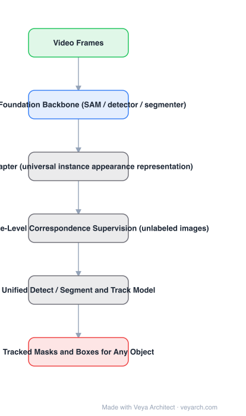

# Architecture: MASA

## Motivation

Tracking-any-object methods built around SAM treat SAM as an interactive mask initializer: DEVA, TAM and SAM-Track pair it with video object segmentation (XMem, DeAOT); SAM-PT pairs it with point trackers. All of them inherit limitations — poor mask propagation across domain gaps, and an inability to handle many diverse objects with rapid entry and exit, which is routine in autonomous driving. Video annotations are also expensive. MASA reframes the problem: **learn universal association modules** from SAM's instance segmentation knowledge, using images only.

## Core Idea

Two components. **MASA pipeline** — construct exhaustive supervision for dense instance-level correspondence from a rich collection of *unlabeled images*, so strong discriminative instance representations can be learned with no video annotation. **MASA adapter** — transform features from a frozen detection or segmentation backbone into generalizable instance appearance representations; its distillation branch also makes segmenting-everything far more efficient. A unified model then jointly detects/segments and tracks anything.

## Architecture

### Overview

<b>Layer-by-layer (6 nodes)</b>

| # | Layer | Type | Params |
|---|---|---|---|
| 1 | Video Frames | `input` |  |
| 2 | Frozen Foundation Backbone (SAM / detector / segmenter) | `attention` |  |
| 3 | MASA Adapter (universal instance appearance representation) | `custom` |  |
| 4 | Dense Instance-Level Correspondence Supervision (unlabeled images) | `custom` |  |
| 5 | Unified Detect / Segment and Track Model | `custom` |  |
| 6 | Tracked Masks and Boxes for Any Object | `output` |  |

### Components

1. **Frozen foundation backbone** — SAM (image encoder), or a detection/segmentation backbone such as a detector or segmenter; features are not fine-tuned.
2. **MASA adapter** — converts those frozen features into universal instance appearance representations suitable for association; includes a distillation branch.
3. **Dense instance-level correspondence supervision** — generated from unlabeled images via the MASA pipeline, giving association supervision without video labels.
4. **Unified detect / segment and track model** — one model that both detects/segments and tracks, rather than a cascade of separate components.
5. **Instance association** — matching over the learned representation at inference.

### Data Flow

Unlabeled images → SAM / detection-segmentation backbone (frozen) → MASA adapter → instance appearance representation; dense correspondence supervision from the MASA pipeline trains the adapter. At inference: video frames → same pipeline → association over representations → tracked masks/boxes.

### State / Memory

No recurrent tracking state is required — association is computed from the learned appearance representation, which is why it handles objects entering and leaving without a per-object filter lifecycle.

## Design Decisions

- **Learn association, do not assemble a pipeline** — the failure modes listed (domain gap in propagation, many objects, rapid entry/exit) are properties of the cascade, so the fix is a learned universal module.
- **Supervise from images only** — removes the video annotation requirement, which is the practical bottleneck.
- **Freeze the foundation model** — the adapter is what is trained; this keeps foundation-model knowledge intact and cheap.
- **Distillation branch for segmenting everything** — an efficiency byproduct of the adapter.

## Evolution

- **SORT / DeepSORT** (predecessors): box-level MOT with motion and appearance.
- **SAM-PT, DEVA, TAM, SAM-Track** (contrast): SAM combined with off-the-shelf VOS or point trackers.
- **MASA (2024)**: learned universal association from unlabeled images via a foundation-model adapter.
- **Siblings**: TAPIR (point-level tracking), ByteTrack / OC-SORT (box MOT), CoTracker.
- **Contrast**: interactive SAM + XMem/DeAOT pipelines, which propagate masks rather than learn association.

## Characteristics

| Property | Value |
|---|---|
| Task | tracking and segmenting any object |
| Supervision | dense instance-level correspondence from unlabeled images (no video labels) |
| Backbone | frozen foundation model (SAM / detector / segmenter) |
| Adapter | MASA adapter, universal instance appearance representation |
| Output | unified detection/segmentation + tracking |
| Target scenario | many objects with rapid entry and exit |

## Limitations

- Inherits the capabilities and biases of the frozen foundation backbone.
- Association is appearance-based; long occlusions with dramatic appearance change remain hard.
- Dense correspondence supervision is generated automatically, so its noise bounds association quality.
- Heavier than a plain box-level MOT tracker because it produces masks.

## Implementation Notes

Essentials: (1) keep the foundation backbone frozen and train only the adapter — fine-tuning defeats the efficiency and knowledge-transfer argument, (2) build the dense correspondence supervision from images; that is what removes the need for video labels, (3) train the adapter's distillation branch so segmenting-everything stays fast, (4) evaluate with objects entering and leaving rapidly, since that is the scenario the paper targets and average MOT metrics hide it, (5) compare against SAM+VOS pipelines on domain-shifted data, where propagation quality degrades.
