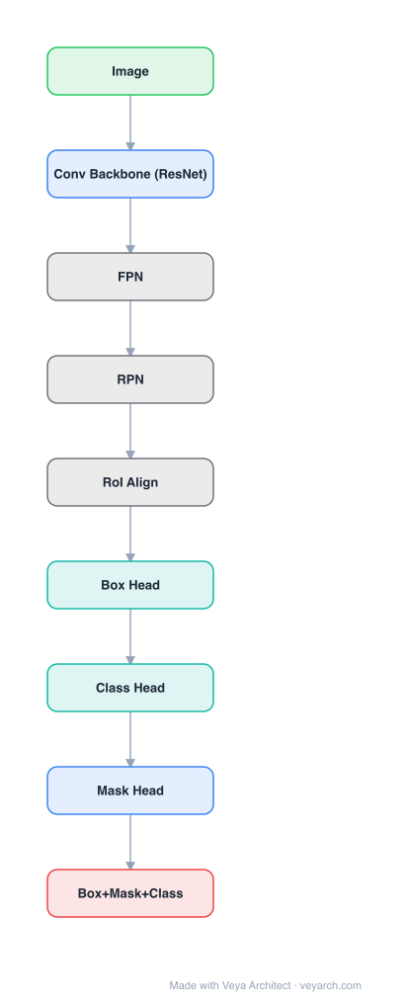

# Architecture: Mask R-CNN

## Motivation

Instance segmentation is challenging because it requires the correct detection of all objects in an image while also precisely segmenting each instance. It combines elements from object detection (classify and localize with bounding boxes) and semantic segmentation (classify each pixel). Existing frameworks (Fast/Faster R-CNN for detection, FCN for segmentation) addressed these tasks separately. The goal is to develop a comparably enabling framework for instance segmentation that is conceptually simple, flexible, and general.

## Core Idea

A framework that extends Faster R-CNN by adding a branch for predicting an object mask in parallel with the existing branch for bounding box recognition. Mask R-CNN efficiently detects objects while simultaneously generating high-quality segmentation masks for each instance, adding only a small overhead to Faster R-CNN and running at 5 fps.

## Architecture

### Overview

<b>Layer-by-layer (9 nodes)</b>

| # | Layer | Type | Params |
|---|---|---|---|
| 1 | Image | `input` |  |
| 2 | Conv Backbone (ResNet) | `conv2d` |  |
| 3 | FPN | `custom` |  |
| 4 | RPN | `custom` |  |
| 5 | RoI Align | `custom` |  |
| 6 | Box Head | `linear` |  |
| 7 | Class Head | `linear` |  |
| 8 | Mask Head | `conv2d` |  |
| 9 | Box+Mask+Class | `output` |  |

Mask R-CNN extends Faster R-CNN with a parallel mask prediction branch. The architecture has two main parts: (1) a convolutional backbone for feature extraction (ResNet or ResNeXt with optional FPN), and (2) a network head for bounding-box recognition and mask prediction applied to each RoI. The key innovation is RoIAlign, which fixes the misalignment in RoIPool by using bilinear interpolation to compute exact input-feature locations.

### Components

1. **Backbone Architecture** — Feature extraction over the entire image:
   - **ResNet-C4**: ResNet-50/101 with features from the 4th stage (C4)
   - **ResNet-FPN**: Feature Pyramid Network backbone (more effective)
   - Nomenclature: "network-depth-features" (e.g., ResNet-50-C4, ResNet-101-FPN)

2. **Region Proposal Network (RPN)** — From Faster R-CNN:
   - Generates candidate object regions (RoIs)
   - Shared with the detection backbone

3. **RoIAlign** — Critical innovation replacing RoIPool:
   - Uses bilinear interpolation to compute exact input-feature locations
   - Avoids quantization misalignment that hurts mask accuracy
   - Preserves spatial precision needed for pixel-level masks

4. **Network Head** — Applied to each RoI, with two parallel branches:
   - **Box branch**: Bounding box classification + regression (from Faster R-CNN)
   - **Mask branch**: Fully convolutional mask prediction (new)
   - For ResNet-C4: head includes 5th stage of ResNet (res5, 9 layers)
   - For FPN: more efficient head with fewer filters

5. **Mask Prediction Branch** — Fully convolutional network (FCN):
   - Predicts a per-pixel mask for each RoI
   - m×m mask output (e.g., 14×14 or 28×28)
   - One mask per class (not per class-agnostic), allowing class-specific masks
   - Straightforward structure (conv → conv → conv → conv → mask)

### Data Flow

1. **Input**: Image (resized to shorter edge 800 pixels)
2. **Backbone**: Extract feature maps (C4 or FPN pyramid)
3. **RPN**: Generate candidate RoIs (region proposals)
4. **RoIAlign**: Extract fixed-size features for each RoI using bilinear interpolation
5. **Parallel branches per RoI**:
   - **Box branch**: Classification (class) + Regression (box coordinates)
   - **Mask branch**: FCN → per-pixel mask prediction (m×m per class)
6. **Output**: Per-instance bounding boxes (class + coordinates) + segmentation masks

### State / Memory

- **No explicit memory mechanism**: Mask R-CNN is a feedforward architecture without recurrent state.
- **Feature maps**: Backbone feature maps and FPN pyramid levels are transient representations.
- **RoI features**: Fixed-size features extracted per RoI via RoIAlign.
- **Model parameters**: Backbone weights + RPN weights + head weights (box + mask branches).

## Design Decisions

1. **Parallel mask branch** — Adding mask prediction in parallel with box recognition:
   - Decouples classification/regression from mask prediction
   - Each task can use appropriate loss function
   - Small computational overhead (runs at 5 fps)

2. **RoIAlign over RoIPool** — Critical for mask quality:
   - RoIPool quantizes RoI coordinates, causing misalignment
   - RoIAlign uses bilinear interpolation for exact feature locations
   - Improves mask AP by 1-3 points
   - Essential for pixel-level accuracy

3. **Per-class masks** — Predicting one mask per class (not class-agnostic):
   - Class-specific masks capture class-specific shapes
   - Decoupled from class prediction (mask loss only on positive RoIs)
   - Sigmoid (not softmax) for per-pixel binary mask

4. **Fully convolutional mask branch** — FCN-style for mask prediction:
   - Preserves spatial layout (unlike fully-connected)
   - More natural for mask prediction
   - Can predict m×m masks

5. **FPN backbone** — Feature Pyramid Network for multi-scale features:
   - Top-down architecture with lateral connections
   - Builds in-network feature pyramid
   - RoI features extracted from appropriate pyramid levels
   - Excellent gains in both accuracy and speed

6. **Flexible framework** — Generalizable to other tasks:
   - Human pose estimation (keypoint detection)
   - Other instance-level recognition tasks

## Evolution

**Predecessors:**
- **R-CNN** (Girshick et al., 2014) — Region-based CNN for detection.
- **Fast R-CNN** (Girshick, 2015) — End-to-end trainable detection.
- **Faster R-CNN** (Ren et al., 2015) — RPN for region proposals.
- **FCN** (Long et al., 2015) — Fully convolutional networks for segmentation.
- **ResNet** (He et al., 2016) — Deep residual networks (backbone).
- **FPN** (Lin et al., 2017) — Feature Pyramid Network (backbone).

**Successors:**
- **Mask Scoring R-CNN** — Improved mask quality scoring.
- **YOLACT / YOLACT++ — Real-time instance segmentation.
- **SOLO / SOLOv2** — Segmenting objects by location.
- **DETR** (Carion et al., 2020) — Transformer-based detection.

## Characteristics

| Property | Value |
|----------|-------|
| Year | 2017 |
| Authors | He, Gkioxari, Dollár, Girshick (Facebook AI Research) |
| Category | DL/Vision |
| Source Paper | `Mask_R_CNN_He_Gkioxari_2017.md` |
| PaperVault Path | `DL-Architectures/07-theory-classics/Mask_R_CNN_He_Gkioxari_2017.md` |

## Limitations

1. **Two-stage architecture** — RPN + detection head is slower than single-stage detectors (YOLO).
2. **Fixed RoI count** — Processes a fixed number of RoIs per image, which may be suboptimal.
3. **Mask resolution** — Predicted masks are limited to m×m resolution, losing fine details.
4. **Backbone dependency** — Performance depends heavily on backbone choice (ResNet-FPN best).
5. **Training complexity** — Multiple loss terms (classification, box regression, mask) require careful balancing.
6. **No panoptic segmentation** — Designed for instance segmentation only; panoptic requires extensions.

## Implementation Notes

See `implementation/` for a minimal runnable implementation. Key details:
- Backbone: ResNet-50/101-C4 or ResNet-FPN
- RPN: Region proposals (shared with backbone)
- RoIAlign: Bilinear interpolation (not quantization) for feature extraction
- Head: Parallel box (class + regression) and mask (FCN) branches
- Mask branch: conv→conv→conv→conv→mask, m×m per class, sigmoid
- Box loss: Cross-entropy (class) + smooth L1 (box)
- Mask loss: Binary cross-entropy (per-pixel, per-class, on positive RoIs only)
- Training: 2 images/GPU, N sampled RoIs (1:3 positive:negative)
- Inference: 5 fps, COCO challenge winner (instance segmentation, detection, keypoints)
- Generalizable to keypoint detection (human pose)

## Information Layers

- **Evidence:** Source paper available in `references/papers/` (He et al., 2017, "Mask R-CNN")
- **Analysis:** Mask R-CNN's key insight is that instance segmentation can be elegantly decomposed into detection (bounding boxes) and segmentation (masks) with a parallel branch structure. The RoIAlign innovation is deceptively simple but critical: by avoiding quantization in RoI feature extraction, it preserves the spatial precision needed for pixel-level masks. The framework's generality (extending to keypoints) demonstrates that the parallel branch architecture is a natural fit for instance-level tasks. The 5 fps speed with high accuracy made it practical for real applications.
- **Hypothesis:** The success of the parallel branch structure suggests that detection and segmentation are complementary tasks that benefit from shared features but separate prediction heads. RoIAlign's importance suggests that spatial precision is more critical for masks than for boxes, where quantization errors are tolerable. The framework's extensibility to keypoints suggests that instance-level tasks share a common structure that can be exploited.
