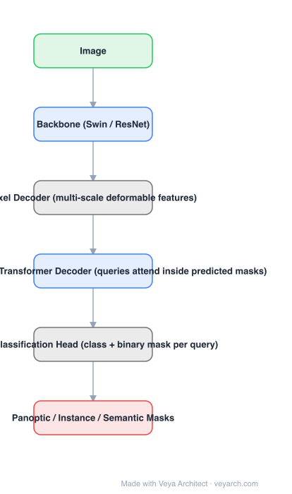

# Architecture: Mask2Former

## Motivation

Panoptic, instance and semantic segmentation differ only in what "a group of pixels" means, but each task had its own architecture: FCNs for semantic, mask-classification models for instance. That duplication costs research and hardware-optimization effort per task. Mask2Former's goal is one architecture for all three — and the obstacle is that a plain transformer decoder converges slowly because cross-attention attends globally over the entire feature map before the mask is known.

## Core Idea

**Masked attention**: constrain cross-attention in the decoder to the region of each query's *predicted* mask from the previous layer. Queries then extract localized features, which converges faster and produces better masks. Combined with DETR-style mask classification and multi-scale features, the same architecture handles all segmentation tasks.

## Architecture

### Overview

<b>Layer-by-layer (6 nodes)</b>

| # | Layer | Type | Params |
|---|---|---|---|
| 1 | Image | `input` |  |
| 2 | Backbone (Swin / ResNet) | `conv2d` |  |
| 3 | Pixel Decoder (multi-scale deformable features) | `custom` |  |
| 4 | Masked-Attention Transformer Decoder (queries attend inside predicted masks) | `attention` |  |
| 5 | Mask Classification Head (class + binary mask per query) | `custom` |  |
| 6 | Panoptic / Instance / Semantic Masks | `output` |  |

### Components

1. **Backbone** — Swin or ResNet, producing multi-scale features.
2. **Pixel decoder** — a lightweight decoder (multi-scale deformable attention) that builds a feature pyramid from the backbone features.
3. **Masked-attention transformer decoder** — a stack of decoder layers over object queries; each layer applies **masked attention**, restricting cross-attention to the foreground region of the previous layer's predicted mask.
4. **Mask classification head** — each query produces a class prediction and a binary mask embedding; masks come from the embedding dotted with the per-pixel feature map.
5. **Task-agnostic training** — the same architecture, loss and training procedure across panoptic, instance and semantic segmentation; only the dataset changes.
6. **Efficiency tricks** — masked features are gathered per-pixel from multi-scale features rather than computed densely, which keeps the decoder cheap.

### Data Flow

Image → backbone → pixel decoder (multi-scale features) → masked-attention decoder (queries attend inside predicted masks) → per-query class + mask embedding → masks ⟍ panoptic / instance / semantic output.

### State / Memory

No recurrent state. The decoder's per-layer mask prediction is the intermediate structure that makes masked attention possible — the mask from layer *n* gates attention in layer *n+1*.

## Design Decisions

- **Constrain attention by the mask** — the mechanism that fixes slow convergence of DETR-style segmentation decoders.
- **Mask classification, not per-pixel classification** — the formulation that unifies instance-level and semantic tasks.
- **Multi-scale masked features** — small objects need high-resolution features; masked attention is applied per scale to keep it cheap.
- **One recipe for all tasks** — no task-specific heads, losses or training schedules, which is the actual claim of "universal".

## Evolution

- **FCN (2015)** (contrast): per-pixel classification, semantic only.
- **Mask R-CNN / DETR** (predecessors): instance-level and set prediction respectively.
- **MaskFormer (2021)**: mask classification for universal segmentation, but with standard cross-attention.
- **Mask2Former (2021)**: adds masked attention + multi-scale features + efficiency changes.
- **Siblings**: SegFormer, OneFormer, kMaX-DeepLab, Panoptic SegFormer.
- **Successors**: OneFormer (task-conditioned), SAM / SAM 2 / SAM 3 (promptable segmentation).

## Characteristics

| Property | Value |
|---|---|
| Task | panoptic / instance / semantic segmentation (universal) |
| Backbone | Swin or ResNet |
| Decoder | masked-attention transformer decoder |
| Key mechanism | cross-attention restricted to predicted mask regions |
| Output | per-query class + binary mask |
| Results (publication) | 57.8 PQ COCO panoptic, 50.1 AP COCO instance, 57.7 mIoU ADE20K |

## Limitations

- Costlier than a specialized real-time model; the transformer decoder is not cheap for high-resolution inputs.
- Trained separately per task and dataset despite being one architecture.
- Query count is fixed, so scenes with more objects than queries need tuning.
- Image-only, no temporal consistency unless extended (video variants exist separately).

## Implementation Notes

Essentials: (1) build the pixel decoder to output a proper multi-scale feature pyramid, (2) implement masked attention as cross-attention with an attention mask derived from the previous layer's resized mask prediction — this is the component that cannot be skipped, (3) apply it per scale in a round-robin over decoder layers, (4) use DETR-style bipartite matching over class + mask, (5) verify on all three tasks with the *same* training recipe: if you need task-specific changes, the universality claim is not being tested.
