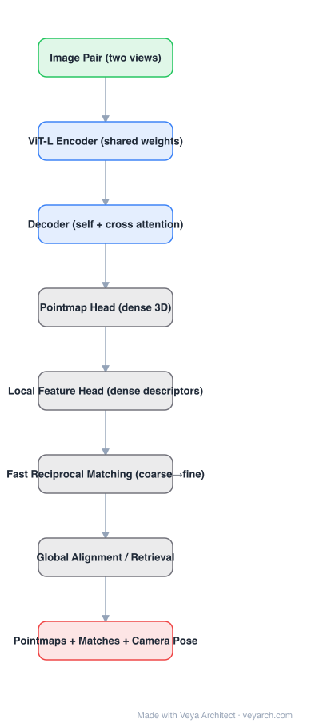

# Architecture: MASt3R

## Motivation

DUSt3R made 3D reconstruction from an uncalibrated pair simple and strong, but it has no notion of **correspondence**: there is no per-pixel descriptor, so tasks like visual localization or matching two arbitrary images fall back to expensive optimization over pointmaps. MASt3R adds the missing primitive — a local feature head — while keeping the 3D regression branch that makes DUSt3R accurate.

## Core Idea

Train **two heads on one shared siamese encoder-decoder**: the pointmap head regresses dense 3D (the DUSt3R objective), and a **local feature head** predicts a dense descriptor per pixel. At inference, matching is then a cheap **reciprocal nearest-neighbour** search over those descriptors instead of a global optimization: coarse-to-fine kNN, keep mutually-consistent pairs, and read the pose off the matched 3D points.

## Architecture

### Overview

<b>Layer-by-layer (8 nodes)</b>

| # | Layer | Type | Params |
|---|---|---|---|
| 1 | Image Pair (two views) | `input` |  |
| 2 | ViT-L Encoder (shared weights) | `conv2d` |  |
| 3 | Decoder (self + cross attention) | `attention` |  |
| 4 | Pointmap Head (dense 3D) | `custom` |  |
| 5 | Local Feature Head (dense descriptors) | `custom` |  |
| 6 | Fast Reciprocal Matching (coarse→fine) | `custom` |  |
| 7 | Global Alignment / Retrieval | `custom` |  |
| 8 | Pointmaps + Matches + Camera Pose | `output` |  |

### Components

1. **Siamese encoder (ViT-L, shared weights)** — encodes both images into tokens in a common space.
2. **Cross-attention decoder** — transformer blocks alternating self-attention within a view and cross-attention between views; produces per-view token features.
3. **Pointmap head** — dense 3D regression, as in DUSt3R, with a confidence head weighting the loss.
4. **Local feature head** — a second head producing pixel-wise descriptors that behave like learned local features (reliable for matching even where geometry is ambiguous).
5. **Fast reciprocal matching** — coarse-to-fine kNN over descriptors with a reciprocal criterion; replaces DUSt3R's global alignment for the pose-recovery step.
6. **Global alignment (optional)** — for multi-view reconstruction, pairwise outputs are still aligned by optimization; MASt3R-SfM adds retrieval/image-pair selection on top.

### Data Flow

Image pair → shared ViT-L encoder → cross-attention decoder → {pointmaps + confidences, dense descriptors} → reciprocal matching → correspondences → pose / point cloud; optionally → global alignment for many views.

### State / Memory

No recurrent state. For multi-view pipelines the intermediate state is a pairwise graph of matches and pointmaps consumed by the alignment step.

## Design Decisions

- **Two objectives, one backbone** — the geometric regression and the descriptor objective reinforce each other; the 3D supervision regularizes the descriptors.
- **Reciprocal matching instead of learned matching** — no dedicated matcher network, no optimal-transport solver; matching is a kNN with a mutual-consistency filter, which is why it is almost two orders of magnitude faster in the reported comparisons.
- **Keep DUSt3R's calibration-free property** — no intrinsics, no poses as input.
- **Confidence weighting** — the same per-pixel confidence mechanism handles ambiguous regions (sky, textureless surfaces).

## Evolution

- **DUSt3R** (predecessor): pointmap regression, no matching primitive.
- **MASt3R**: adds the local feature head and reciprocal matching; extends use to visual localization.
- **MASt3R-SfM**: full SfM pipeline built on pairwise MASt3R output (retrieval, pair selection, global alignment).
- **Spann3R / Fast3R**: remove the pairwise bottleneck by conditioning on many views in one pass.
- **VGGT**: a single feed-forward model that outputs cameras, depth, point maps, and tracks without any matching step.

## Characteristics

| Property | Value |
|---|---|
| Task | two-view 3D reconstruction + image matching / visual localization |
| Encoder | ViT-Large, shared weights |
| Decoder | transformer with alternating self-/cross-attention |
| Heads | pointmap (+ confidence) and local feature |
| Matching | coarse-to-fine reciprocal kNN (≈2 orders faster than optimization-based) |
| Input assumptions | none on intrinsics or poses |

## Limitations

- Still fundamentally pairwise; many-view scenes require a separate alignment or a downstream SfM pipeline.
- Descriptors are learned with the 3D objective, so matching quality on non-overlapping or repeated-pattern pairs is imperfect.
- Metric scale is not recovered from a single pair without extra information.
- Two-view cost grows with resolution because of cross-attention over patch tokens.

## Implementation Notes

The minimal version: shared ViT-L encoder → cross-attention decoder → two heads, with a joint loss (confidence-weighted 3D regression + an InfoNCE-style matching loss on descriptors). At inference, implement coarse-to-fine reciprocal kNN and recover pose from matched 3D points; keep global alignment as a separate optimization step for more than two views.
