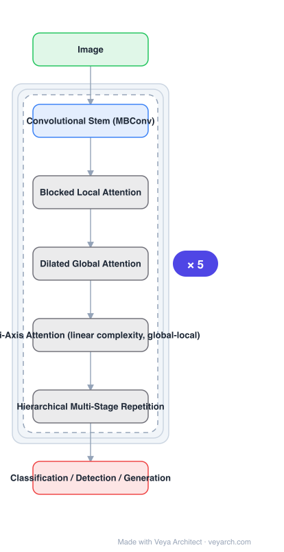

# Architecture: MaxViT

## Motivation

Transformers had gained significant attention in vision, but **the lack of scalability of self-attention with respect to image size** had limited their adoption in state-of-the-art vision backbones. Local/windowed attention fixes the cost but gives up globality — and most such backbones do not achieve global interaction until late, low-resolution stages.

## Core Idea

**Multi-axis attention**, with two aspects: **blocked local** attention and **dilated global** attention. Together they give global-local spatial interactions at **arbitrary input resolutions with only linear complexity**. Blend this with convolution as a new architectural element, then repeat the basic block over multiple stages — the resulting MaxViT "sees" globally throughout the entire network, including earlier high-resolution stages.

## Architecture

### Overview

<b>Layer-by-layer (7 nodes)</b>

| # | Layer | Type | Params |
|---|---|---|---|
| 1 | Image | `input` |  |
| 2 | Convolutional Stem (MBConv) | `conv2d` |  |
| 3 | Blocked Local Attention | `custom` |  |
| 4 | Dilated Global Attention | `custom` |  |
| 5 | Multi-Axis Attention (linear complexity, global-local) | `custom` |  |
| 6 | Hierarchical Multi-Stage Repetition | `custom` |  |
| 7 | Classification / Detection / Generation | `output` |  |

### Components

1. **Convolutional stem (MBConv)** — provides locality and efficiency in early processing; the attention model is blended with convolution rather than used alone.
2. **Blocked local attention** — one aspect of multi-axis attention; local interaction inside blocks.
3. **Dilated global attention** — the other aspect; global interaction via dilation, at linear cost.
4. **Multi-axis attention** — the combination, giving global-local spatial interaction at arbitrary resolution with linear complexity.
5. **Hierarchical multi-stage repetition** — a simple backbone made by repeating the basic building block over multiple stages.

### Data Flow

Image → convolutional stem → repeated multi-axis blocks per stage (blocked local attention, then dilated global attention, with the convolutional element) → hierarchical stage downsampling → task head for classification, detection or generation.

### State / Memory

No recurrent state. The complexity claim is the central one: global interaction is obtained at linear, not quadratic, cost in image size, which is what makes global attention affordable in early high-resolution stages.

## Design Decisions

- **Two complementary attention aspects, not one** — blocked local plus dilated global covers the interaction range that either alone misses.
- **Linear complexity by construction** — required for attention to be usable at early, high-resolution stages.
- **Blend with convolution** — a stated new architectural element; attention alone is not the design.
- **Keep it simple and hierarchical** — a single basic block repeated over stages, rather than a specialized topology.
- **Global everywhere, including early stages** — called out as notable, since it is where windowed backbones are local-only.
- **Show breadth plus generative capability** — classification, detection, aesthetic assessment, and ImageNet generative modeling, to argue the block is a universal vision module.

## Evolution

- **ConvNets** (predecessor family).
- **ViT** (predecessor): fully transformer, costly at high resolution.
- **Window/local attention backbones** (contrast): local-only, so not global in early stages.
- **MaxViT (2022)**: multi-axis attention blended with convolution, hierarchical.
- **Siblings**: Swin V2, PVT, CSWin, MViTv2.
- **Contrast**: backbones whose global interaction only begins at low resolution.

## Characteristics

| Property | Value |
|---|---|
| Task | classification / detection / generation |
| Core attention | multi-axis (blocked local + dilated global) |
| Complexity | linear in image size |
| Early stages | global interaction, not local-only |
| Blending | attention mixed with convolution |
| ImageNet | 86.5% top-1 without extra data; 88.7% with ImageNet-21K |

## Limitations

- Dilated global attention is a sparse sampling of the global field; it approximates rather than computes full global attention.
- Stride/dilation settings per stage add hyper-parameters to tune.
- Generative modeling results are demonstrated on ImageNet; generality to other generative settings is not established.
- Linear complexity still leaves a constant factor; very high resolution remains costly in practice.

## Implementation Notes

Essentials: (1) implement **both** aspects of multi-axis attention — blocked local and dilated global — since the mechanism is their combination and either alone is a different, weaker design, (2) verify linear complexity and arbitrary-resolution operation by sweeping input resolution; a single-resolution benchmark cannot show the property that motivates the design, (3) keep the convolutional stem and blending — the attention model is meant to be mixed with convolution, and a pure-attention variant is not the proposed architecture, (4) confirm global interaction is present in early high-resolution stages, which is the specific property claimed over windowed backbones, (5) repeat one basic block across stages rather than designing per-stage variants; simplicity is part of the proposal.
