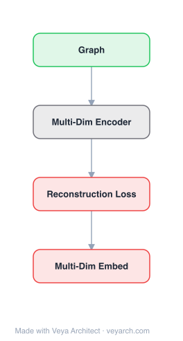

# Architecture: Multi-dimensional Network Embedding

## Motivation

Most network embedding algorithms (DeepWalk, LINE, node2vec) are designed for networks with **one type of node and one dimension of relations**. However, real-world complex systems have **multiple types of nodes and multiple dimensions of relations**: e-commerce networks have users and items connected by "view" and "purchase" relations (two dimensions); social networks have friend connections and various interaction types; transportation networks connect cities via train, highway, and airplane. Additionally, some nodes exhibit **hierarchical structure**: authors belong to affiliations, items belong to categories, employees belong to departments. Existing methods cannot naturally handle multi-dimensional networks with hierarchical structure — they either flatten all dimensions into a single graph (losing dimension-specific information) or ignore hierarchical relationships. MINES (Multi-dImensional Network Embedding with hierarchical Structure) fills this gap by capturing both independent information from each dimension and dependent information across dimensions, while incorporating hierarchical structure into a coherent embedding model.

## Core Idea

Multi-dimensional network embedding with hierarchical structure.

## Architecture

### Overview

<b>Layer-by-layer (4 nodes)</b>

| # | Layer | Type | Params |
|---|---|---|---|
| 1 | Graph | `input` |  |
| 2 | Multi-Dim Encoder | `custom` |  |
| 3 | Reconstruction Loss | `loss` |  |
| 4 | Multi-Dim Embed | `output` |  |

MINES is a framework for learning node representations in networks with multiple dimensions of relations and hierarchical node structure. The architecture has three key components: (1) **Dimension-specific modeling** — each dimension of relations is modeled to capture independent (dimension-specific) information; (2) **Cross-dimension modeling** — dependent information across dimensions is captured, allowing dimensions to mutually inform each other; (3) **Hierarchical structure modeling** — parent-child relationships (e.g., items to categories, authors to affiliations) are incorporated, propagating information between hierarchical levels. The framework jointly optimizes all three components, producing embeddings that reflect both multi-dimensional relational structure and hierarchical organization. The model is validated on real-world e-commerce networks where users interact with items via multiple relation types and items belong to product categories.

### Components

1. **Dimension-Specific Embedding** — Per-dimension representations:
   - For each dimension k, a separate embedding captures the proximity structure within that dimension
   - Each dimension's adjacency matrix A^(k) defines a distinct relation type (e.g., view, purchase)
   - Dimension-specific embeddings preserve first-order and second-order proximity within each dimension
   - Captures independent information unique to each relation type

2. **Cross-Dimension Dependency Modeling** — Inter-dimension information:
   - Models dependent information across dimensions — correlations between different relation types
   - For example, users who purchase an item likely also viewed it; purchase and view dimensions are correlated
   - Cross-dimension modeling captures these dependencies, allowing dimensions to mutually reinforce
   - Implemented via shared latent factors or cross-dimension regularization

3. **Hierarchical Structure Modeling** — Parent-child relationships:
   - Nodes can have parent nodes (e.g., items → categories, authors → affiliations)
   - Hierarchical structure is modeled by propagating information between parent and child levels
   - Parent node embeddings are learned alongside child node embeddings
   - Children sharing a parent are encouraged to have similar embeddings (category-level regularization)
   - Captures the organizational structure that flat embeddings miss

4. **Joint Optimization Framework** — Unified objective:
   - L = Σ_k L_dim^(k) + λ₁ · L_cross + λ₂ · L_hierarchical
   - L_dim^(k): dimension-specific proximity preservation loss for dimension k
   - L_cross: cross-dimension dependency modeling loss
   - L_hierarchical: hierarchical structure regularization loss
   - λ₁, λ₂ balance cross-dimension and hierarchical contributions
   - Optimized via gradient descent

### Data Flow

1. **Input:** Multi-dimensional network with K dimensions (each with adjacency A^(k)), hierarchical structure (parent-child relationships), node types
2. **Dimension-Specific Embedding:** For each dimension k, learn embeddings preserving proximity within A^(k)
3. **Cross-Dimension Modeling:** Model dependencies between dimensions (e.g., via shared latent factors or cross-dimension regularization)
4. **Hierarchical Propagation:** Propagate information between parent and child nodes in the hierarchy
5. **Joint Optimization:** Minimize the unified loss L = Σ_k L_dim^(k) + λ₁·L_cross + λ₂·L_hierarchical via gradient descent
6. **Output:** Low-dimensional node embeddings that capture multi-dimensional relational structure and hierarchical organization

### State / Memory

- **No recurrent state:** MINES is a feedforward embedding model trained via gradient descent; no temporal memory mechanism.
- **Learned parameters:** Dimension-specific embedding matrices, cross-dimension dependency parameters, and hierarchical structure parameters are the persistent learned state.
- **Memory scaling:** Memory scales as O(K·N·d) for dimension-specific embeddings plus hierarchical parameters, where K is the number of dimensions.

## Design Decisions

1. **Separate dimension modeling** — Rather than merging all dimensions into a single adjacency matrix, MINES maintains separate per-dimension embeddings. This preserves dimension-specific information (e.g., purchase patterns differ from view patterns) that would be lost in a flattened representation.

2. **Cross-dimension dependency** — Dimensions are not modeled independently; cross-dimension dependencies are explicitly captured. This recognizes that real-world relation types are correlated (e.g., viewing precedes purchasing) and leverages these correlations for better embeddings.

3. **Hierarchical structure integration** — Parent-child relationships are incorporated directly into the embedding objective, rather than being ignored or handled post-hoc. This captures organizational structure (e.g., items in the same category should have related embeddings) that flat methods miss.

4. **Joint optimization** — All three components (dimension-specific, cross-dimension, hierarchical) are optimized jointly, allowing them to mutually inform each other. This avoids the suboptimality of a staged approach where dimensions are embedded first and hierarchy is added later.

5. **E-commerce validation** — The framework is validated on real-world e-commerce data, grounding the multi-dimensional and hierarchical claims in a concrete, practical application where these structures naturally arise.

## Evolution

**Predecessors:**
- **DeepWalk** (Perozzi et al., 2014) — Skip-gram on random walks; single-dimension, no hierarchy.
- **LINE** (Tang et al., 2015) — First/second-order proximity; single-dimension, no hierarchy.
- **node2vec** (Grover & Leskovec, 2016) — Biased random walks; single-dimension, no hierarchy.
- **Metapath2vec** (Dong et al., 2017) — Heterogeneous network embedding via meta-path random walks; handles heterogeneous nodes but not multi-dimensional relations with hierarchy.
- **Multi-dimensional network analysis** (Berlingerio et al., 2011) — Measures for multidimensional networks; not embedding.

**Successors:**
- **MNE** (Zhang et al., 2018) — Multi-network embedding with stable node identities.
- **R-GCN** (Schlichtkrull et al., 2018) — Relational graph convolutional networks for multi-relational data; GNN-based approach to multi-dimensional networks.
- **HIN2Vec** (Fu et al., 2017) — Heterogeneous information network embedding via meta-path exploration.

## Characteristics

| Property | Value |
|----------|-------|
| Year | 2018 |
| Authors | Ma, Ren, Jiang, Tang, Yin (Michigan State University, JD.com) |
| Category | GNN/Embedding |
| Source Paper | `Multi_dimensional_network_embedding_with_hierarchical_struct_Structure_2018.md` |
| PaperVault Path | `GNN/02-network-embedding/Multi_dimensional_network_embedding_with_hierarchical_struct_Structure_2018.md` |

## Limitations

1. **Transductive** — MINES learns per-node embeddings and cannot generate embeddings for unseen nodes without retraining, limiting applicability to dynamic networks.
2. **Fixed dimension set** — The number of relation dimensions must be known at training time; adding new dimensions requires retraining.
3. **Fixed hierarchy** — The hierarchical structure must be known and fixed at training time; dynamic hierarchies (e.g., categories changing) require retraining.
4. **Scalability** — Maintaining K separate dimension-specific embeddings increases memory and computation by a factor of K compared to single-dimension methods.
5. **No deep architecture** — MINES uses shallow embedding models (proximity preservation), not deep neural networks. Complex nonlinear interactions between dimensions and hierarchy may not be fully captured.
6. **Limited to two-level hierarchy** — The hierarchical modeling primarily handles parent-child (two-level) relationships; deeper hierarchies (e.g., item → subcategory → category → department) may require extensions.

## Implementation Notes

See `implementation/` for a minimal runnable implementation.

## Information Layers

- **Evidence:** Source paper available in `references/papers/` (Ma, Ren, Jiang, Tang, Yin, 2018, "Multi-Dimensional Network Embedding with Hierarchical Structure," WSDM '18)
- **Analysis:** MINES addresses a genuinely important gap — most NRL methods assume single-dimensional, flat networks, but real-world networks are inherently multi-dimensional and hierarchical. The decomposition into dimension-specific, cross-dimension, and hierarchical components is principled and covers the key structural aspects. The e-commerce validation is practical and relevant. The main limitation is the shallow architecture — the proximity preservation approach cannot capture complex nonlinear interactions between dimensions and hierarchy that deep models (e.g., GNNs with relational layers) might. The fixed dimension and hierarchy assumptions limit applicability to evolving networks. Later methods like R-GCN would address multi-relational graphs with neural architectures, but MINES remains significant for explicitly identifying and formalizing the multi-dimensional + hierarchical structure problem.
- **Hypothesis:** The cross-dimension dependency modeling's effectiveness implies that relation dimensions are not independent — they share latent factors that reflect underlying user/item behavior patterns. This suggests that multi-dimensional network structure can be decomposed into dimension-specific and shared components, with the shared component capturing cross-cutting behavioral regularities. The hierarchical structure's contribution implies that organizational context (categories, affiliations) provides a "soft constraint" on embeddings that regularizes learning when direct link evidence is sparse — items in the same category are expected to be similar even without direct links. This hierarchical regularization may be particularly valuable for cold-start nodes with few links.
