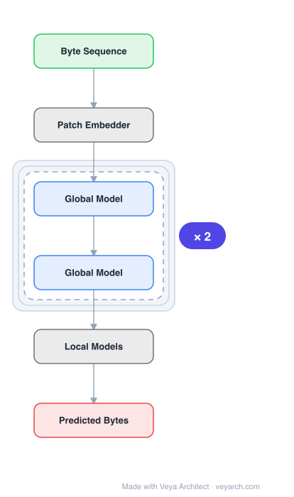

# Architecture: MegaByte

## Motivation

Autoregressive transformers are spectacular models for short sequences but scale poorly to long sequences such as high-resolution images, podcasts, code, or books. Large transformer decoders typically use only several thousand tokens of context due to the quadratic cost of self-attention and the cost of large feedforward networks per position. This severely limits the set of tasks where LLMs can be applied, particularly for byte-level modeling of million-byte sequences.

## Core Idea

A multiscale decoder architecture that segments sequences into patches and uses a local submodel within patches and a global model between patches. This enables sub-quadratic self-attention, much larger feedforward layers for the same compute, and improved parallelism during decoding — unlocking tokenization-free autoregressive sequence modeling at scale.

## Architecture

### Overview

<b>Layer-by-layer (6 nodes)</b>

| # | Layer | Type | Params |
|---|---|---|---|
| 1 | Byte Sequence | `input` |  |
| 2 | Patch Embedder | `custom` |  |
| 3 | Global Model | `attention` |  |
| 4 | Global Model | `attention` |  |
| 5 | Local Models | `custom` |  |
| 6 | Predicted Bytes | `output` |  |

MegaByte segments byte sequences into fixed-sized patches (analogous to tokens). The model consists of three parts: (1) a patch embedder, (2) a global model that processes patches, and (3) local models that autoregressively predict each byte within a patch. The global model operates on patch-level representations with sub-quadratic attention, while local models handle byte-level prediction within patches.

### Components

1. **Patch Embedder** — Converts raw bytes within each patch into a patch-level representation. Maps P bytes to a single embedding.

2. **Global Model** — A large transformer that processes patch-level sequences. Since patches are much shorter than the original byte sequence (by factor P), the global model's self-attention is sub-quadratic in the original sequence length. The global model can have much larger feedforward layers since it operates per-patch rather than per-byte.

3. **Local Models** — Small autoregressive models that predict each byte within a patch, conditioned on the global model's output for that patch. Each local model predicts P bytes sequentially, using the global representation as context.

### Data Flow

1. **Input**: Byte sequence of length L → segmented into L/P patches of size P
2. **Patch Embedding**: Each patch of P bytes → single patch embedding
3. **Global Model**: Patch embeddings → global representations (with sub-quadratic self-attention over patches)
4. **Local Models**: For each patch, global representation → autoregressive byte-by-byte prediction within the patch
5. **Output**: Predicted bytes for the entire sequence

**Key efficiency gains:**
- Global self-attention: O((L/P)²) instead of O(L²)
- Feedforward computation: per-patch (P× reduction) instead of per-byte
- Decoding parallelism: bytes within a patch can be predicted in parallel (only inter-patch is sequential)

### State / Memory

- **No explicit memory mechanism**: MegaByte is a feedforward architecture without recurrent state.
- **KV cache (global model)**: During inference, the global model caches key-value pairs for patches, enabling efficient autoregressive patch-level generation.
- **Local model state**: Local models are autoregressive within patches but do not carry state across patches.

## Design Decisions

1. **Patch-based multiscale architecture** — Separating global (inter-patch) and local (intra-patch) modeling allows each to be optimized independently: the global model for long-range dependencies, local models for byte-level prediction.

2. **Sub-quadratic self-attention** — By operating at the patch level, the global model's self-attention complexity is reduced from O(L²) to O((L/P)²).

3. **Larger feedforward layers** — Since feedforward computation is per-patch rather than per-byte, the same compute budget allows much larger feedforward layers, improving model capacity.

4. **Parallelism during decoding** — Bytes within a patch can be predicted simultaneously (conditioned on the global representation), improving decoding throughput by factor P.

5. **Tokenization-free** — Operates directly on raw bytes, eliminating the need for tokenizers and enabling modeling of any data modality (text, images, audio, code).

## Evolution

**Predecessors:**
- **Transformer** (Vaswani et al., 2017) — Base architecture.
- **PerceiverAR** (Hawthorne et al., 2022) — Prior multiscale approach.
- **Byte-level models** — Prior attempts at byte-level language modeling.

**Successors:**
- Influenced patch-based architectures in vision (ViT) and multimodal models.
- Modern byte-level models and multiscale transformers.

## Characteristics

| Property | Value |
|----------|-------|
| Year | 2023 |
| Authors | Yu, Simig, Flaherty, Aghajanyan, Zettlemoyer, Lewis (Meta AI) |
| Category | DL/Transformer |
| Source Paper | `MegaByte_Meta_Yu_Tay_Jones_etal_2023.md` |
| PaperVault Path | `DL-Architectures/01-transformers/MegaByte_Meta_Yu_Tay_Jones_etal_2023.md` |

## Limitations

1. **Patch size trade-off** — Larger patches improve efficiency but may lose fine-grained modeling; smaller patches are more expressive but less efficient.
2. **Local model capacity** — Small local models may limit byte-level prediction quality within patches.
3. **Fixed patch boundaries** — Fixed-size patches may not align with natural data boundaries (e.g., word boundaries in text).
4. **Training complexity** — The multiscale architecture adds training complexity compared to standard transformers.
5. **Byte-level perplexity** — Despite improvements, byte-level models still face higher perplexity than subword models on some tasks.

## Implementation Notes

See `implementation/` for a minimal runnable implementation. Key details:
- Patch size P (e.g., P=4 or P=8)
- Global model: large transformer over patch embeddings
- Local models: small transformers for byte-level prediction within patches
- Sub-quadratic attention: O((L/P)²) for global model
- Parallel decoding within patches
- Tokenization-free: operates on raw bytes
- Competitive with subword models on long-context language modeling
- State-of-the-art density estimation on ImageNet (byte-level)

## Information Layers

- **Evidence:** Source paper available in `references/papers/` (Yu et al., 2023, "MEGABYTE: Predicting Million-byte Sequences with Multiscale Transformers")
- **Analysis:** MegaByte's key insight is that byte-level modeling can be made practical by separating global and local concerns. The patch-based multiscale approach addresses both the quadratic attention bottleneck and the per-position feedforward cost bottleneck. The parallelism within patches is a significant decoding speedup. The tokenization-free approach is architecturally elegant and enables unified modeling across modalities.
- **Hypothesis:** The multiscale separation principle may generalize beyond byte-level modeling: any sequence model could benefit from separating global structure modeling from local detail prediction. The optimal patch size likely depends on the data modality and the natural scale of dependencies.
