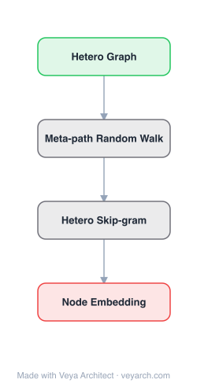

# Architecture: metapath2vec

## Motivation

Real-world networks are often heterogeneous — containing multiple types of nodes (e.g., authors, papers, venues) and multiple types of edges (e.g., writes, published-in, cited-by). Existing network embedding methods like DeepWalk, node2vec, and LINE are designed for homogeneous networks with a single node type and single edge type. When applied to heterogeneous networks, they treat all nodes and edges identically, producing indistinguishable representations for semantically different node types. This ignores the rich semantic information encoded in node/edge types. metapath2vec addresses this by formalizing meta-path-based random walks that respect node and edge types, and by extending the skip-gram model to handle heterogeneous neighborhoods, enabling simultaneous modeling of structural and semantic correlations in heterogeneous networks.

## Core Idea

Heterogeneous network embedding using meta-path-based random walks and heterogeneous skip-gram.

## Architecture

### Overview

<b>Layer-by-layer (4 nodes)</b>

| # | Layer | Type | Params |
|---|---|---|---|
| 1 | Hetero Graph | `input` |  |
| 2 | Meta-path Random Walk | `custom` |  |
| 3 | Hetero Skip-gram | `custom` |  |
| 4 | Node Embedding | `output` |  |

metapath2vec consists of two components: (1) meta-path-based random walks that generate heterogeneous neighborhoods preserving network semantics, and (2) a heterogeneous skip-gram model that learns embeddings by predicting a node's heterogeneous context. The key innovation is that random walks follow predefined meta-paths (e.g., Author-Paper-Author-Paper-Venue) that encode semantically meaningful relationships, and the skip-gram objective is modified to respect node types. The extension, metapath2vec++, further improves this by using heterogeneous negative sampling — sampling negative examples from the same node type as the positive context — enabling the model to simultaneously capture structural proximity and semantic distinctions between node types.

### Components

1. **Meta-Path-Based Random Walk** — Generates heterogeneous context sequences:
   - A meta-path is a path scheme defined on node types, e.g., APA (Author-Paper-Author) or APVPA (Author-Paper-Venue-Paper-Author)
   - Meta-paths encode semantically meaningful relationships in the heterogeneous network
   - Random walks follow the meta-path pattern: at each step, the walk transitions to a neighbor of the type specified by the meta-path
   - Walks are biased to follow the meta-path's node-type sequence, ensuring the generated context respects heterogeneous semantics
   - Multiple meta-paths can be used, each capturing a different semantic relationship

2. **Heterogeneous Skip-Gram (metapath2vec)** — Extension of skip-gram for heterogeneous networks:
   - Given a center node v (of type t), predict its context nodes (of potentially different types)
   - Objective: maximize Σ log σ(zᵥᵀ · zᵤ) + Σ log σ(-zᵥᵀ · zₙ)
   - The softmax denominator sums over ALL nodes regardless of type
   - This means the model can predict context nodes of any type, but does not distinguish between types in the negative sampling

3. **Heterogeneous Negative Sampling (metapath2vec++)** — Key improvement:
   - Negative samples are drawn from the SAME node type as the positive context node
   - This forces the model to discriminate between nodes of the same type, not just between types
   - Enables simultaneous modeling of structural correlations (within-type proximity) and semantic correlations (cross-type relationships)
   - The softmax is type-specific: for a context node of type t, normalization is over nodes of type t only

4. **Embedding Lookup** — Shared embedding matrix for all node types:
   - Each node (regardless of type) has a d-dimensional embedding vector
   - The same embedding space is shared across types, allowing cross-type comparison
   - metapath2vec++ produces more separable type-specific clusters in the embedding space

### Data Flow

1. **Input**: Heterogeneous network G = (V, E, T) with node types T_V and edge types T_E
2. **Meta-Path Definition**: Specify meta-path(s) (e.g., APA, APVPA) based on domain knowledge
3. **Random Walk Generation**: For each node, perform meta-path-guided random walks to generate heterogeneous context sequences
4. **Skip-Gram Training (metapath2vec)**: Train skip-gram on walk sequences with standard negative sampling over all nodes
5. **Skip-Gram Training (metapath2vec++)**: Train skip-gram with heterogeneous negative sampling (type-specific)
6. **Output**: |V| × d embedding matrix where nodes of different types are distinguishable yet comparable

### State / Memory

- **Meta-path definitions**: Specified by the user based on domain knowledge; stored as type sequences.
- **Random walk sequences**: Generated on-the-fly during training; transient. Walk length and number of walks per node control context coverage.
- **Embedding matrix**: |V| × d, shared across all node types; persistent and the primary output.
- **Negative sampling table**: Pre-computed frequency-based sampling distribution; for metapath2vec++, separate tables per node type.
- **No recurrent state**: The skip-gram model is feedforward; each (center, context) pair is processed independently.

## Design Decisions

1. **Meta-path-guided walks over free random walks** — Constraining walks to follow meta-paths:
   - Ensures generated context respects the semantic relationships in the heterogeneous network
   - Prevents walks from drifting into semantically irrelevant node types
   - Domain expert specifies which relationships matter (e.g., APA for collaboration, APVPA for shared venue)

2. **metapath2vec++ heterogeneous negative sampling** — Sampling negatives from the same type:
   - Standard negative sampling (metapath2vec) draws from all nodes, making it easy to distinguish types but hard to discriminate within types
   - Type-specific negative sampling forces the model to learn fine-grained within-type distinctions
   - Results in more meaningful embeddings where both structural and semantic correlations are captured

3. **Shared embedding space across types** — All node types share one embedding space:
   - Enables cross-type similarity search (e.g., finding venues similar to an author's profile)
   - Alternative: separate spaces per type would lose cross-type comparability
   - The shared space with type-aware negative sampling balances comparability and discriminability

4. **Scalability via negative sampling** — Using negative sampling instead of full softmax:
   - O(d) per training step instead of O(|V| × d)
   - Enables training on networks with millions of nodes
   - metapath2vec++ adds minimal overhead (type lookup in sampling table)

5. **Meta-path as domain knowledge injection** — Meta-paths encode which relationships matter:
   - Allows the user to guide the embedding toward task-relevant semantics
   - Different meta-paths yield different embeddings optimized for different downstream tasks
   - Trade-off: requires domain expertise to select good meta-paths

## Evolution

**Predecessors:**
- **DeepWalk** (Perozzi et al., 2014) — Homogeneous random walk + skip-gram; metapath2vec extends to heterogeneous networks.
- **node2vec** (Grover & Leskovec, 2016) — Flexible biased walks for homogeneous networks; metapath2vec adapts the walk idea to heterogeneous settings.
- **LINE** (Tang et al., 2015) — 1st and 2nd order proximity for homogeneous networks.
- **PathSim** (Sun et al., 2011) — Meta-path-based similarity search; metapath2vec learns embeddings that subsume meta-path-based similarity.
- **PTE** (Tang et al., 2015) — Predictive text embedding for semi-supervised heterogeneous text networks; metapath2vec is unsupervised and outputs multi-type embeddings.

**Successors:**
- **HIN2Vec** (Fu et al., 2017) — Neural network model for heterogeneous network embedding via meta-path prediction.
- **HERec** (Shi et al., 2018) — Heterogeneous network embedding with recommender systems focus.
- **HGT** (Hu et al., 2020) — Heterogeneous Graph Transformer; deep learning approach to heterogeneous graphs.

## Characteristics

| Property | Value |
|----------|-------|
| Year | 2017 |
| Authors | Dong, Chawla, Swami |
| Category | GNN/Embedding |
| Source Paper | `metapath2vec_Scalable_Representation_Learning_for_Heterogene_Heterogeneous_2017.md` |
| PaperVault Path | `GNN/02-network-embedding/metapath2vec_Scalable_Representation_Learning_for_Heterogene_Heterogeneous_2017.md` |

## Limitations

1. **Requires domain knowledge for meta-paths** — The user must specify meaningful meta-paths; poor choices lead to suboptimal embeddings. No automatic meta-path selection mechanism.
2. **Single meta-path per walk** — Each walk follows one meta-path; combining multiple meta-paths requires separate walk sets or heuristic weighting.
3. **No attribute integration** — metapath2vec uses only network structure and node types; cannot incorporate node attributes (e.g., text, images).
4. **Transductive** — Cannot generate embeddings for unseen nodes without retraining; the walk structure is fixed to the training graph.
5. **Meta-path length sensitivity** — Very long meta-paths introduce noise; very short ones miss multi-hop semantics. The optimal length depends on the network.
6. **Homogeneous skip-gram limitation (metapath2vec only)** — The base metapath2vec uses standard negative sampling over all types, producing less distinguishable type-specific representations compared to metapath2vec++.

## Implementation Notes

See `implementation/` for a minimal runnable implementation. Key details:
- Input: heterogeneous network with typed nodes and edges
- Define meta-path(s) (e.g., APA, APVPA for academic networks)
- Generate meta-path-guided random walks (walk length ~100, 10 walks per node)
- Train skip-gram with negative sampling (metapath2vec) or heterogeneous negative sampling (metapath2vec++)
- Embedding dimension d = 128, negative samples k = 5
- Evaluated on AMiner academic network (node classification, clustering, similarity search)
- metapath2vec++ outperforms metapath2vec, DeepWalk, LINE, PTE on all tasks
- Visualizations show metapath2vec++ produces clear type-specific clusters while maintaining cross-type relationships
- Scalable to networks with millions of nodes via negative sampling

## Information Layers

- **Evidence:** Source paper available in `references/papers/` (Dong, Chawla, Swami, 2017, "metapath2vec: Scalable Representation Learning for Heterogeneous Networks," KDD 2017)
- **Analysis:** metapath2vec's key insight is that heterogeneous networks require type-aware context generation and type-aware negative sampling. Meta-path-guided random walks ensure that the context respects the semantic relationships encoded in node types, while heterogeneous negative sampling (metapath2vec++) forces the model to learn within-type discrimination rather than trivially separating types. The visualizations in the paper demonstrate that metapath2vec++ produces embeddings where same-type nodes cluster together while cross-type relationships remain meaningful — a balance that homogeneous methods cannot achieve. The framework is notable for its scalability: negative sampling keeps training cost linear in the number of nodes, making it applicable to large academic and social networks.
- **Hypothesis:** The meta-path abstraction suggests that heterogeneous network semantics can be decomposed into typed relationship sequences, each capturing a different facet of node similarity. The superiority of metapath2vec++ over metapath2vec implies that type-aware negative sampling is essential — without it, the model learns type identity rather than within-type structure. This principle likely generalizes: any embedding method for typed data should use type-aware negative sampling. The reliance on user-specified meta-paths is both a strength (domain knowledge injection) and a weakness (requires expertise); automatic meta-path discovery or learned walk policies could address this limitation.
