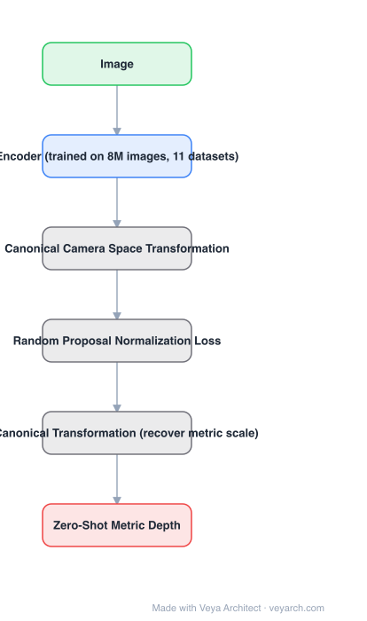

# Architecture: Metric3D

## Motivation

Zero-shot monocular depth had two problems, and the second one is the one Metric3D targets. Scene diversity was being handled by large-scale relative/affine-invariant training (MiDaS, LeReS, HDN) — but those methods **cannot recover metric information by design**. Predicting accurate metric depth under *various camera settings* was unsolved, because an image's apparent geometry depends on the camera that captured it (the paper's illustration: the same scene under a 650mm-equivalent telephoto looks flattened). That camera dependence is what blocks scaling up to many datasets.

## Core Idea

**Canonical camera space**: transform all training data so it looks like it came from one canonical camera, train there, then apply a **de-canonical transformation** at inference to recover metric scale. Camera models are never encoded into the network, so it drops into existing architectures. A **random proposal normalization loss** supervises local geometry on randomly cropped patches.

## Architecture

### Overview

<b>Layer-by-layer (6 nodes)</b>

| # | Layer | Type | Params |
|---|---|---|---|
| 1 | Image | `input` |  |
| 2 | Encoder (trained on 8M images, 11 datasets) | `attention` |  |
| 3 | Canonical Camera Space Transformation | `custom` |  |
| 4 | Random Proposal Normalization Loss | `custom` |  |
| 5 | De-Canonical Transformation (recover metric scale) | `custom` |  |
| 6 | Zero-Shot Metric Depth | `output` |  |

### Components

1. **Encoder** — trained at scale: 8 million images from 11 datasets covering indoor/outdoor scenes and tens of thousands of different cameras.
2. **Canonical camera space transformation** — two options: adjust the image appearance to simulate the canonical camera, or transform the ground-truth labels for supervision. Both remove camera variance from the learning problem.
3. **Random proposal normalization loss** — the scale-shift invariant loss applied to several *randomly cropped patches* per image instead of the whole image; whole-image normalization squeezes fine-grained depth differences, so the patch version emphasizes local geometry and per-image distribution.
4. **De-canonical transformation** — at inference, the canonical-space prediction is converted back to metric depth for the actual image.
5. **No camera encoding in the network** — the transformation happens in data/geometry, not in the architecture, which is why the method is architecture-agnostic.

### Data Flow

Image → canonical camera transformation (train only) → encoder → canonical-space depth → de-canonical transformation → metric depth. Random proposal normalization loss supervises patches during training.

### State / Memory

No recurrent state. The canonical/de-canonical transform pair is a geometric wrapper around the network, not a module inside it.

## Design Decisions

- **Treat camera variation as the blocker** — the diagnosis is that camera diversity, not scene diversity, prevented metric training at scale.
- **Canonicalize outside the network** — keeps the method applicable to existing architectures without modifying them.
- **Patch-level scale-shift loss** — whole-image normalization loses local depth differences; random patches keep them.
- **Scale up data aggressively** — 8M images is the point: canonicalization is what makes that data usable.

## Evolution

- **MiDaS / LeReS / HDN** (contrast): affine-invariant, generalize, no metric scale by design.
- **DIW / OASIS relative-depth datasets** (contrast): relative relations only, lose geometric structure.
- **Metric3D (2023)**: canonical camera space + random proposal normalization loss.
- **Siblings**: UniDepth (predicts the camera), Depth Pro (estimates focal length), Depth Anything (relative at scale).
- **Successors**: Metric3D v2; metric heads added on top of relative-depth foundation models.

## Characteristics

| Property | Value |
|---|---|
| Task | zero-shot metric 3D from a single image |
| Mechanism | canonical / de-canonical camera space transformation |
| Loss | random proposal normalization (patch-level scale-shift invariant) |
| Data | 8M images, 11 datasets, tens of thousands of cameras |
| Camera encoding | none in the network (geometry-level transform) |
| Result | won the 2nd Monocular Depth Estimation Challenge; reduces monocular SLAM scale drift |

## Limitations

- The canonical camera is a single choice; extreme cameras may be poorly matched by it.
- De-canonicalization needs some camera information at inference (or the assumption that the transform is well-conditioned for the input).
- Single-image metric depth remains ill-posed in ambiguous scenes regardless of training scale.
- Supervised at 8M scale — compute-heavy to reproduce.

## Implementation Notes

Essentials: (1) implement both canonical transformation variants (appearance adjustment and label transformation) and pick per dataset, (2) apply the loss on randomly cropped patches, not the whole image — that is what preserves local geometry, (3) keep camera parameters out of the network input; the method should work with an unmodified architecture, (4) verify downstream: feed predicted metric depths into monocular SLAM and check scale drift decreases, (5) evaluate zero-shot across datasets with different cameras, which is the scenario the canonicalization exists for.
