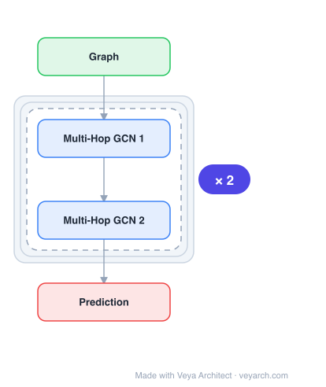

# Architecture: MHGCN (Multiplex Heterogeneous Graph Neural Network)

## Motivation

Heterogeneous graph neural networks have gained popularity for tackling network analysis tasks on heterogeneous data. However, most existing works focus on general heterogeneous networks and assume only one type of edge between two nodes, ignoring the multiplex characteristics (multiple edge types) between multi-typed nodes. Additionally, the over-smoothing issue of GNNs limits models to capturing only local structure signals, hardly learning global relevant information. MHGCN (also referred to as BPHGNN) addresses these challenges by collaboratively learning node representations across different multiplex structures with adaptive importance from local and global perspectives.

## Core Idea

A multiplex heterogeneous graph neural network that models behavior patterns through depth and breadth behavior pattern aggregation. MHGCN learns node representations across different multiplex structures among nodes with adaptive importance learning from both local and global perspectives, capturing depth behavior patterns (multi-hop) and breadth behavior patterns (multi-edge-type) in multiplex heterogeneous networks.

## Architecture

### Overview

<b>Layer-by-layer (4 nodes)</b>

| # | Layer | Type | Params |
|---|---|---|---|
| 1 | Graph | `input` |  |
| 2 | Multi-Hop GCN 1 | `gcn_conv` |  |
| 3 | Multi-Hop GCN 2 | `gcn_conv` |  |
| 4 | Prediction | `output` |  |

MHGCN/BPHGNN operates on multiplex heterogeneous networks where nodes of different types are connected by multiple types of edges. The model uses depth behavior pattern aggregation (capturing multi-hop relationships) and breadth behavior pattern aggregation (capturing multi-edge-type relationships) with adaptive importance weighting. This dual approach addresses both the multiplex characteristics (breadth) and the over-smoothing issue (depth) simultaneously.

### Components

1. **Multiplex Heterogeneous Network** — Input data structure:
   - Multiple node types (heterogeneous)
   - Multiple edge types between nodes (multiplex)
   - Different edge types represent different relationships/behaviors

2. **Depth Behavior Pattern Aggregation** — Multi-hop aggregation:
   - Captures global structure signals (addresses over-smoothing)
   - Aggregates information from multi-hop neighbors
   - Learns depth behavior patterns across the network
   - Adaptive importance weighting for different depths

3. **Breadth Behavior Pattern Aggregation** — Multi-edge-type aggregation:
   - Captures multiplex characteristics (multiple edge types)
   - Aggregates information from different relationship types
   - Learns breadth behavior patterns across edge types
   - Adaptive importance weighting for different edge types

4. **Adaptive Importance Learning** — Dynamic weighting:
   - Learns the importance of different multiplex structures
   - Different structures contribute differently to node embeddings
   - Adaptive (not fixed) importance weights
   - Both local and global perspectives

### Data Flow

1. **Input**: Multiplex heterogeneous network (nodes, multiple edge types)
2. **Breadth aggregation**: Aggregate across different edge types (breadth behavior patterns)
3. **Depth aggregation**: Aggregate across multiple hops (depth behavior patterns)
4. **Adaptive weighting**: Learn importance of different structures
5. **Node embedding**: Combine aggregated features with adaptive weights
6. **Output**: Node representations for downstream tasks (classification, clustering, etc.)

### State / Memory

- **No explicit memory mechanism**: MHGCN is a feedforward GNN architecture.
- **Network structure**: The multiplex heterogeneous graph defines the computation structure.
- **Adaptive weights**: Importance weights for different structures are learnable parameters.
- **Multi-hop features**: Depth aggregation requires storing intermediate hop representations.

## Design Decisions

1. **Multiplex modeling** — Multiple edge types:
   - Standard heterogeneous GNNs assume one edge type between nodes
   - Real-world networks have multiple relationship types (multiplex)
   - Different edge types carry different semantic meanings
   - Breadth aggregation captures this multiplexity

2. **Depth + breadth aggregation** — Addressing two challenges:
   - Depth: multi-hop aggregation addresses over-smoothing (global information)
   - Breadth: multi-edge-type aggregation addresses multiplexity
   - Dual approach captures both local and global, both single and multi-type

3. **Adaptive importance** — Learning structure importance:
   - Different multiplex structures have different importance for different nodes
   - Fixed weights would be suboptimal
   - Adaptive learning enables node-specific structure weighting
   - Both local and global perspectives considered

4. **Behavior pattern modeling** — Capturing interaction patterns:
   - Depth behavior patterns: how information flows across multiple hops
   - Breadth behavior patterns: how different relationship types interact
   - Together they capture the full behavior pattern of a node

## Evolution

**Predecessors:**
- **Heterogeneous GNNs** (HAN, HGT, RGCN) — Multiple node/edge types but single edge type between nodes.
- **Multiplex network embedding** (MNE, DMGI) — Multiple edge types but limited depth.
- **Graph Neural Networks** (GCN, GAT) — Single type, limited depth (over-smoothing).

**Successors:**
- **Multiplex heterogeneous graph transformers** — Attention-based multiplex modeling.
- **Dynamic multiplex networks** — Time-varying multiplex structures.
- **Multi-behavior recommendation** — Application of multiplex modeling.

## Characteristics

| Property | Value |
|----------|-------|
| Year | 2023 |
| Authors | Fu, Zheng, Huang, Yu, Dong (Ocean University of China, SJTU, HKU) |
| Category | DL/GNN |
| Source Paper | `Multiplex_Heterogeneous_Graph_Neural_Network_with_Behavior_P_Qingdao_China_2023.md` |
| PaperVault Path | `GNN/03-gnn-architectures/Multiplex_Heterogeneous_Graph_Neural_Network_with_Behavior_P_Qingdao_China_2023.md` |

## Limitations

1. **Complexity** — Modeling multiplex structures with depth and breadth aggregation is computationally complex.
2. **Hyperparameter tuning** — Adaptive importance learning requires careful tuning.
3. **Scalability** — Multi-hop depth aggregation can be expensive for large networks.
4. **Multiplex data requirement** — Requires data with explicit multiple edge types; not all datasets have this.
5. **Interpretability** — Adaptive weights may be hard to interpret.
6. **Over-smoothing mitigation** — While depth aggregation addresses over-smoothing, very deep models may still suffer.

## Implementation Notes

See `implementation/` for a minimal runnable implementation. Key details:
- Input: multiplex heterogeneous network (multiple node types, multiple edge types)
- Depth behavior pattern aggregation: multi-hop message passing (global signals)
- Breadth behavior pattern aggregation: multi-edge-type message passing (multiplex signals)
- Adaptive importance: learnable weights for different structures
- Local and global perspectives: both captured
- Datasets: IMDB, Alibaba-s, Alibaba, DBLP, Taobao (6 real-world networks)
- Tasks: node classification (Macro-F1, Micro-F1), node clustering
- Significant superiority over state-of-the-art approaches
- Improvements: 4-15% over baselines on various metrics
- Also referred to as BPHGNN (Behavior Pattern based Heterogeneous Graph Neural Network)

## Information Layers

- **Evidence:** Source paper available in `references/papers/` (Fu et al., 2023, "Multiplex Heterogeneous Graph Neural Network with Behavior Pattern Modeling")
- **Analysis:** MHGCN's key insight is that real-world networks are both heterogeneous (multiple node/edge types) and multiplex (multiple edge types between the same pair of nodes). Standard heterogeneous GNNs handle heterogeneity but not multiplexity. The dual depth + breadth aggregation elegantly addresses two distinct challenges: over-smoothing (depth) and multiplexity (breadth). The adaptive importance learning is crucial — different structures matter differently for different nodes and tasks. The significant improvements (4-15%) over strong baselines demonstrate that multiplex modeling provides substantial value beyond standard heterogeneous modeling.
- **Hypothesis:** The multiplex characteristic may be fundamental to many real-world networks — social networks (different relationship types), e-commerce (different interaction types), biological networks (different interaction modes). The depth + breadth framework may generalize to other graph architectures (transformers, attention mechanisms). The adaptive importance learning may reveal which structural aspects are most informative for different tasks, providing insights into network structure.
