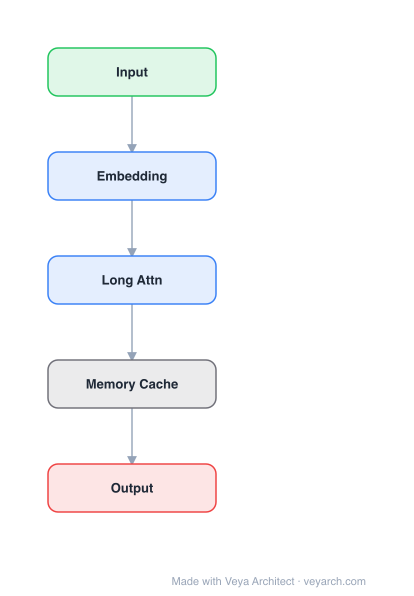

# Architecture: MILE

## Motivation

Graph embedding methods rarely scale to large datasets (e.g., graphs with over 1 million nodes) due to computational complexity and memory requirements. Random-walk-based methods like DeepWalk and Node2Vec require large amounts of CPU time to generate sufficient walks. Matrix factorization methods like GraRep and NetMF require constructing enormous objective matrices—a medium-size graph with 100K nodes can require hundreds of GB of memory. Real-world graphs can have billions of nodes (e.g., Google knowledge graph: 570M entities, Facebook: 1.39B users).

No existing effort examines how to scale up graph embedding in a generic way. MILE makes the first attempt to close this gap by designing a general-purpose framework that treats existing embedding methods as black boxes, scaling them to larger datasets while potentially improving embedding quality by incorporating a holistic view of the graph.

## Core Idea

Multi-level framework for scalable graph embedding via coarsening and refinement.

## Architecture

### Overview

<b>Layer-by-layer (5 nodes)</b>

| # | Layer | Type | Params |
|---|---|---|---|
| 1 | Input | `input` |  |
| 2 | Embedding | `embed` |  |
| 3 | Long Attn | `attention` |  |
| 4 | Memory Cache | `custom` |  |
| 5 | Output | `output` |  |

MILE is a multi-level framework for scalable graph embedding that reduces graph size through repeated coarsening, computes embeddings on the coarsest graph using an existing embedding method, and refines the embeddings back to the original graph through a learned graph convolution network.

The framework contains three key phases: (1) graph coarsening using a hybrid matching technique to maintain the backbone structure, (2) base embedding on the coarsest graph using any existing method, and (3) embedding refinement via a novel graph convolution network that learns to propagate embeddings from coarse to fine graphs. MILE is agnostic to the underlying embedding technique and can be applied to DeepWalk, Node2Vec, GraRep, NetMF, and others without modification.

### Components

- **Graph coarsening**: Repeatedly coarsens the original graph into smaller ones using a hybrid matching strategy combining Structural Equivalence Matching (SEM) and Normalized Heavy Edge Matching (NHEM). SEM matches structurally equivalent nodes (nodes sharing the same neighbors), while NHEM matches nodes connected by heavy edges (high-weight edges). The matching matrix M_{i,i+1} maps nodes from level i to level i+1, and the coarsened adjacency matrix A_{i+1} = M_{i,i+1}^T · A_i · M_{i,i+1}.

- **Base embedding**: Applies an existing graph embedding method (e.g., DeepWalk, Node2Vec, GraRep, NetMF) on the coarsest graph. This is inexpensive because the coarsest graph is much smaller than the original.

- **Refinement model**: A learned graph convolution network that refines embeddings from the coarsest graph back to the original graph. The refinement leverages dependencies inherent to the graph structure and the embedding method. It is trained on a particular learning task designed on the coarsest graph.

- **Matching matrix**: The matrix M that maps between coarsening levels, encoding which original nodes are merged into which coarse nodes.

### Data Flow

1. **Input**: Original graph G_0 = (V, E) with adjacency matrix A_0.
2. **Coarsening phase**: Repeatedly apply hybrid matching (SEM + NHEM) to produce coarsened graphs G_1, G_2, ..., G_L, where each G_{i+1} is smaller than G_i. The matching matrices M_{i,i+1} record the node correspondences.
3. **Base embedding**: Apply an existing embedding method f(·) on the coarsest graph G_L to produce base embeddings E_L.
4. **Refinement phase**: For each level from L down to 0, the learned graph convolution network refines the embeddings: E_{i} = Refinement(E_{i+1}, A_i, M_{i,i+1}), propagating embeddings from coarse to fine using the graph structure.
5. **Output**: Final embeddings E_0 for the original graph, of comparable or better quality than directly applying f(·) to G_0, but at a fraction of the cost.

### State / Memory

Stateless in the traditional sense—the coarsening and refinement are feed-forward processes. However, the matching matrices M_{i,i+1} at each coarsening level serve as structural memory, encoding how nodes were merged and enabling the refinement to propagate embeddings back to the original graph. The refinement model itself is a learned graph convolution that captures dependencies between graph structure and embedding quality.

## Design Decisions

- **Agnostic to embedding method**: MILE treats existing embedding methods as black boxes, making it universally applicable without modifying the base methods. This is a key design choice that distinguishes it from HARP, which requires modifying the embedding method's initialization.

- **Hybrid matching strategy**: Combining SEM (structural equivalence) and NHEM (heavy edge matching) maintains the backbone structure of the graph during coarsening, preserving important topological features.

- **Learned refinement over fixed interpolation**: Rather than using a fixed refinement procedure (e.g., linear interpolation), MILE learns a graph convolution network for refinement. This allows the model to capture data- and embedding-sensitive dependencies, which the paper shows is key to effectiveness.

- **Coarsening on the coarsest graph**: Computing embeddings on the coarsest graph captures global structure and is computationally inexpensive, while refinement propagates this global view back to individual nodes.

- **Multi-level (not single-level) coarsening**: Repeated coarsening enables scaling to very large graphs (9M nodes, 40M edges) by reducing the graph size by orders of magnitude before embedding.

## Evolution

**Predecessors:**
- DeepWalk (Perozzi et al., 2014) — random walk-based embedding
- Node2Vec (Grover & Leskovec, 2016) — biased random walks
- GraRep (Cao et al., 2015) — matrix factorization for global structural info
- NetMF (Qiu et al., 2018) — unified matrix factorization framework
- LINE (Tang et al., 2015) — first/second-order proximity
- SDNE (Wang et al., 2016) — deep learning for non-linear structure
- HARP (Chen et al., 2017) — hierarchical representation learning (closest work, but requires modifying embedding methods)
- Multi-level community detection algorithms (Metis, MLR-MCL) — conceptual inspiration

**Successors:**
- MILE's coarsening-refinement paradigm influenced subsequent scalable graph embedding methods
- The learned refinement approach inspired graph pooling/unpooling architectures in GNNs

## Characteristics

| Property | Value |
|----------|-------|
| Year | 2018 |
| Authors | Unknown |
| Category | GNN/Embedding |
| Source Paper | `MILE_A_Multi_Level_Framework_for_Scalable_Graph_Embedding_Columbus_Ohio_2018.md` |
| PaperVault Path | `GNN/02-network-embedding/MILE_A_Multi_Level_Framework_for_Scalable_Graph_Embedding_Columbus_Ohio_2018.md` |

## Limitations

- The coarsening quality depends on the hybrid matching strategy; poor matchings can lose important structural information.
- The refinement model must be trained, adding a training phase on top of the base embedding.
- The framework is designed for undirected graphs; extension to directed graphs requires modifications.
- Very dense graphs may not coarsen effectively, as there are fewer opportunities for node merging.
- The refinement model's capacity is fixed; for extremely large graphs, a single refinement step may not capture all the structural dependencies.
- While MILE scales to 9M nodes, graphs with billions of nodes may still require distributed computing.
- The quality improvement is not guaranteed for all embedding methods and datasets; in some cases quality may decrease.

## Implementation Notes

See `implementation/` for a minimal runnable implementation.

## Information Layers

- **Evidence:** Source paper available in `references/papers/`
- **Analysis:** MILE's key insight is that graph embedding can be decoupled into a global structure capture phase (on the coarsest graph) and a local refinement phase (propagating back). The learned refinement is critical—fixed interpolation cannot capture the complex dependencies between graph structure and embedding quality.
- **Hypothesis:** The quality improvements observed in some cases suggest that the coarsest graph captures global structure that is lost when embedding directly on the original graph (where local structure dominates). The refinement model effectively injects this global view back into individual node embeddings.
