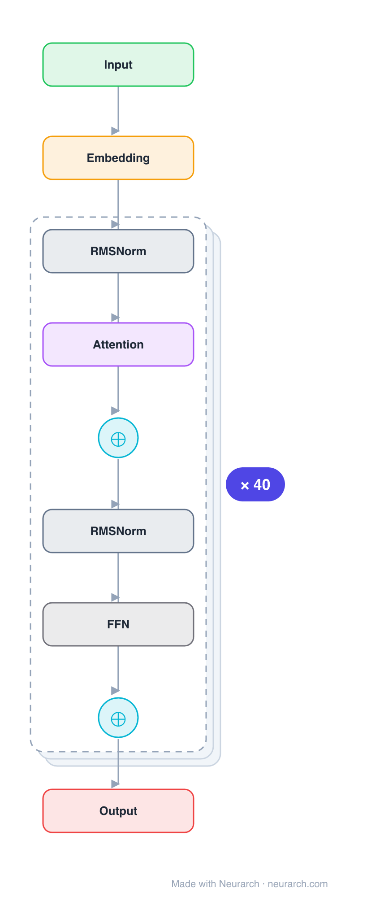

# Architecture: MiniCPM-2B

## Motivation

OpenBMB's flagship small LLM, a 2.4B deep-and-thin decoder that punches above its weight via muP-style scaling (scale_emb, scaled residuals, tied embeddings) found by extensive scaling-law sweeps.

## Core Idea

OpenBMB's flagship small LLM, a 2.

## Architecture

### Overview

*Identical repeated blocks are folded into one representative block with a `× N` badge, so the whole architecture fits on screen. `model.json` uses a NAXS block template + `repeat` directive: the identical repeated layers are defined once and expand to all 243 nodes (open it in Neurarch to see and edit every layer). Vector: [diagram.svg](assets/diagram.svg).*

| Hyperparameter | Value |
|---|---|
| Type | Decoder-only transformer (causal LM) |
| Parameters | 2.7B total (2.4B non-embedding) |
| Layers | 40 |
| Hidden size | 2304 |
| Attention | Multi-head: 36 heads |
| Head dim | 64 |
| FFN | SwiGLU, intermediate size 5,760 |
| Normalization | RMSNorm, pre-norm |
| Positions | RoPE (rotary dim 64) |
| Vocabulary | 122,753 |
| Max context | 4,096 |

`model.json` is the full 40-layer graph (the repeated layers expressed via a NAXS block template + `repeat`), produced with the same import path the Neurarch app uses for "load from Hugging Face", with all hyperparameters from the official `config.json`.

### Design Notes

- Deep-and-thin: 40 layers at only 2304 hidden, the opposite trade-off from most 2B-class models.
- muP-style stability tricks baked into the architecture: embedding output scaled by scale_emb = 12, residual branches scaled by scale_depth / sqrt(num_layers), and tied input/output embeddings.
- Plain multi-head attention (36 heads, 64-dim each); the KV-cache saving tricks were left out at this scale.
- A 122753-token vocabulary, very large for a 2B model, reflecting its Chinese-first design.

### Parameter Check

Neurarch's per-layer parameter estimate over this graph: **2.72B**.
Deviation from the authoritative count (2.72B): **+0.2%**.

> MiniCPM ties input and output embeddings; the official 2.4B figure excludes the 283M-parameter embedding table, while the graph sum counts it once.

## Design Decisions

> **Analysis** — Observations derived from studying the architecture.

- Deep-and-thin: 40 layers at only 2304 hidden, the opposite trade-off from most 2B-class models.
- muP-style stability tricks baked into the architecture: embedding output scaled by scale_emb = 12, residual branches scaled by scale_depth / sqrt(num_layers), and tied input/output embeddings.
- Plain multi-head attention (36 heads, 64-dim each); the KV-cache saving tricks were left out at this scale.
- A 122753-token vocabulary, very large for a 2B model, reflecting its Chinese-first design.

## Implementation Notes

- `model.json` contains the full structural graph with real dimensions and parameters, using a NAXS block template + `repeat` for the identical repeated layers.
- Open in [Neurarch](https://www.neurarch.com/) to visualize, edit, or export training code.
- Diagrams fold repeated identical blocks with a `× N` badge; `model.json` defines each repeated layer once at real dimensions and expands to all nodes.

## Limitations

- This package focuses on the architectural structure. Training pipelines, 
dataset preparation, and production optimizations are out of scope.

## Evolution

> See `references/related/` for predecessor and successor architectures.

