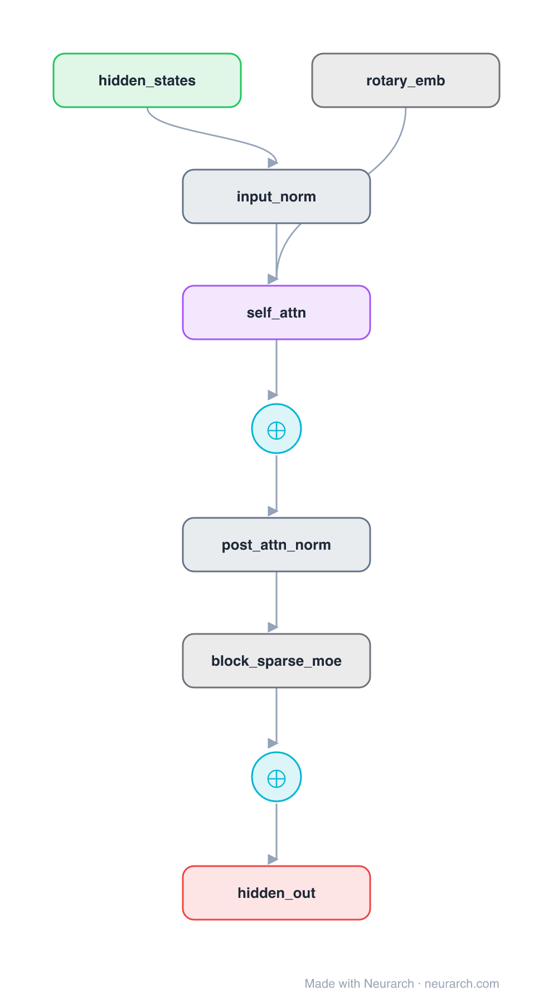

# Architecture: Mixtral MoE Block

## Motivation

The Mixtral 8x7B decoder block: the Mistral-7B block with its dense FFN swapped for a sparse mixture of 8 expert FFNs, top-2 routed per token.

## Core Idea

The Mixtral 8x7B decoder block: the Mistral-7B block with its dense FFN swapped for a sparse mixture of 8 expert FFNs, top-2 routed per token.

## Architecture

### Overview

<b>Layer-by-layer (9 nodes)</b>

| # | Layer | Type | Params |
|---|---|---|---|
| 1 | hidden_states | `input` | shape: [1, 4096, 4096] |
| 2 | input_norm | `rmsNorm` | normalizedShape: 4096 |
| 3 | self_attn | `groupedQueryAttention` | embedDim: 4096, numHeads: 32, numKVHeads: 8 |
| 4 | rotary_emb | `rope` | dim: 128 |
| 5 | attn_residual | `add` |   |
| 6 | post_attn_norm | `rmsNorm` | normalizedShape: 4096 |
| 7 | block_sparse_moe | `moeLayer` | embedDim: 4096, numExperts: 8, topK: 2, expertDim: 14336 |
| 8 | moe_residual | `add` |   |
| 9 | hidden_out | `output` |   |

This graph ships in Neurarch's in-app template library; the copy here passes shape propagation with zero errors.

### Design Notes

- Sparse MoE layer: 8 experts, top-2 routing, so roughly 13B of 47B total parameters are active per token.
- Everything around the MoE layer is the Mistral-7B recipe: GQA 32:8 with RoPE, RMSNorm pre-norm, dual residual streams.
- The canonical open-weight example of decoupling parameter count from inference FLOPs.

## Design Decisions

> **Analysis** — Observations derived from studying the architecture.

- Sparse MoE layer: 8 experts, top-2 routing, so roughly 13B of 47B total parameters are active per token.
- Everything around the MoE layer is the Mistral-7B recipe: GQA 32:8 with RoPE, RMSNorm pre-norm, dual residual streams.
- The canonical open-weight example of decoupling parameter count from inference FLOPs.

## Implementation Notes

- `model.json` contains the full structural graph with real dimensions and parameters.
- Open in [Neurarch](https://www.neurarch.com/) to visualize, edit, or export training code.
- Diagrams fold repeated identical blocks with a `× N` badge; `model.json` holds all nodes at real dimensions.

## Limitations

- This package focuses on the architectural structure. Training pipelines, 
dataset preparation, and production optimizations are out of scope.

## Evolution

> See `references/related/` for predecessor and successor architectures.

