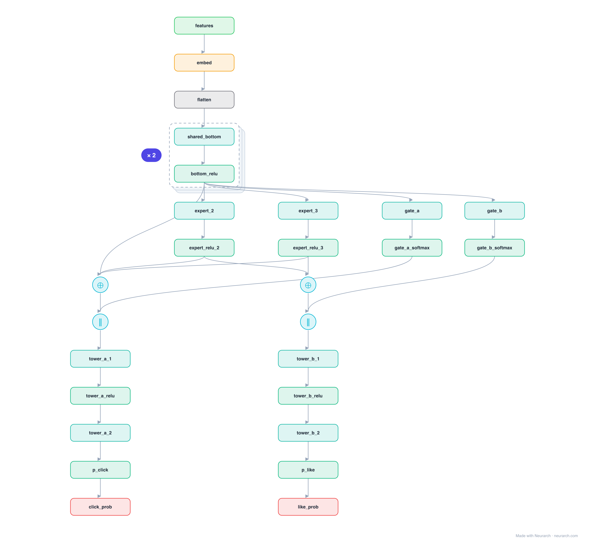

# Architecture: MMoE

## Motivation

Multi-gate Mixture-of-Experts: instead of one shared bottom feeding every task (which forces conflicting objectives to share a representation), MMoE gives each task a softmax gate that mixes a shared pool of experts its own way. The default multi-task ranker behind feed and video systems that optimize several objectives at once.

## Core Idea

Multi-gate Mixture-of-Experts: instead of one shared bottom feeding every task (which forces conflicting objectives to share a representation), MMoE gives each task a softmax gate that mixes a shared pool of experts its own way.

## Architecture

### Overview

*Identical repeated blocks are folded into one representative block with a `× N` badge, so the whole architecture fits on screen. `model.json` keeps all 29 nodes (open it in Neurarch to see and edit every layer). Vector: [diagram.svg](assets/diagram.svg).*

| Hyperparameter | Value |
|---|---|
| Type | Multi-task ranking |
| Experts | Shared bottom feeds N expert MLPs |
| Gates | Per-task softmax gate over the experts |
| Towers | One MLP head per objective |
| Key idea | Soft expert sharing avoids multi-task negative transfer |

`model.json` is the full graph, hand-built against the official config.json.

### Design Notes

- Every task reads the same experts but through its own gate, so tasks that disagree can lean on different experts without a hard split.
- Reference topology: the per-task gate softmax is shown joining the expert mixture; in the paper the gate weights are the mixture coefficients.
- Compare [ple](../ple/), which hardens the soft gating into explicit task-specific vs shared expert groups.

### Parameter Check

This entry is a **structural reference**: its parameter mix is not recomputed by the per-layer estimator, so it carries no deviation gate. See the hyperparameter table above for the authoritative total / active parameter counts.

## Design Decisions

> **Analysis** — Observations derived from studying the architecture.

- Every task reads the same experts but through its own gate, so tasks that disagree can lean on different experts without a hard split.
- Reference topology: the per-task gate softmax is shown joining the expert mixture; in the paper the gate weights are the mixture coefficients.
- Compare [ple](../ple/), which hardens the soft gating into explicit task-specific vs shared expert groups.

## Implementation Notes

- `model.json` contains the full structural graph with real dimensions and parameters.
- Open in [Neurarch](https://www.neurarch.com/) to visualize, edit, or export training code.
- Diagrams fold repeated identical blocks with a `× N` badge; `model.json` holds all nodes at real dimensions.

## Limitations

- This package focuses on the architectural structure. Training pipelines, 
dataset preparation, and production optimizations are out of scope.

## Evolution

> See `references/related/` for predecessor and successor architectures.

