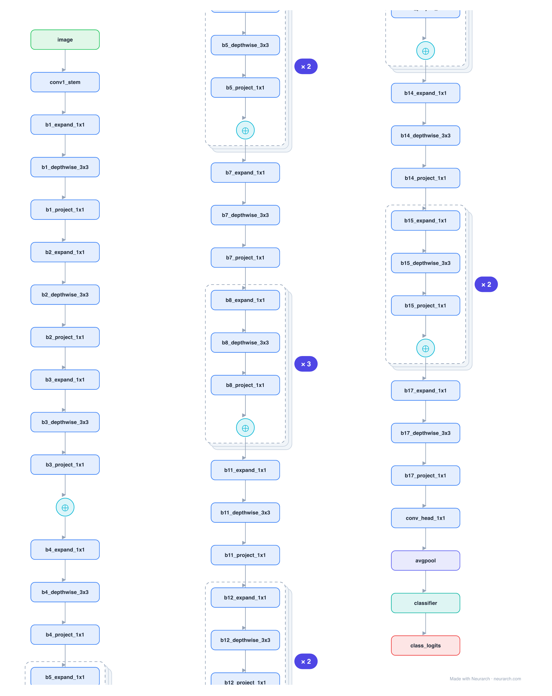

# Architecture: MobileNetV2

## Motivation

The on-device vision workhorse. Its inverted residual block expands to a wide intermediate, does a cheap depthwise 3x3 there, then projects back down through a linear bottleneck, packing accuracy into 3.5M parameters and the staple of mobile / CoreML model zoos.

## Core Idea

The on-device vision workhorse.

## Architecture

### Overview

*Identical repeated blocks are folded into one representative block with a `× N` badge, so the whole architecture fits on screen. `model.json` uses NAXS block templates + `repeat` directives and expands back to all 67 nodes (open it in Neurarch to see and edit every layer). Vector: [diagram.svg](assets/diagram.svg).*

| Hyperparameter | Value |
|---|---|
| Type | Efficient convolutional network |
| Parameters | 3.5M |
| Stem | 3x3/2 conv (32 channels) |
| Body | 17 inverted-residual blocks |
| Inverted residual | expand 1x1 → depthwise 3x3 → project 1x1 (linear bottleneck) |
| Head | 1x1 conv (1280) → global avg pool → FC-1000 |
| Input | 3x224x224 |

`model.json` is the full graph, hand-built against the official config.json.

### Design Notes

- Inverted residual: unlike ResNet (wide → narrow → wide), MobileNetV2 goes narrow → wide → narrow, and the skip connects the narrow bottlenecks (where the information lives).
- Linear bottleneck: the projection has no ReLU, because ReLU destroys information in low-dimensional space.
- Depthwise-separable convs (the 3x3 acts per-channel) are what make it cheap; full graph with every block expanded.

### Parameter Check

Neurarch's per-layer parameter estimate over this graph: **3.5M**.

## Design Decisions

> **Analysis** — Observations derived from studying the architecture.

- Inverted residual: unlike ResNet (wide → narrow → wide), MobileNetV2 goes narrow → wide → narrow, and the skip connects the narrow bottlenecks (where the information lives).
- Linear bottleneck: the projection has no ReLU, because ReLU destroys information in low-dimensional space.
- Depthwise-separable convs (the 3x3 acts per-channel) are what make it cheap; full graph with every block expanded.

## Implementation Notes

- `model.json` contains the full structural graph with real dimensions and parameters, using NAXS block templates + `repeat` for repeated units.
- Open in [Neurarch](https://www.neurarch.com/) to visualize, edit, or export training code.
- Diagrams fold repeated identical blocks with a `× N` badge; `model.json` defines each repeated unit once at real dimensions and expands to all nodes.

## Limitations

- This package focuses on the architectural structure. Training pipelines, 
dataset preparation, and production optimizations are out of scope.

## Evolution

> See `references/related/` for predecessor and successor architectures.

